# **DPAS: A Prompt, Accurate and Safe I/O Completion Method for SSDs**

**Dongjoo Seo,** *University of California, Irvine;* **Jihyeon Jung and Yeohwan Yoon,**  *Kookmin University;* **Ping-Xiang Chen,** *University of California, Irvine;* **Yongsoo Joo and Sung-Soo Lim,** *Kookmin University;* **Nikil Dutt,** *University of California, Irvine*

*https://www.usenix.org/conference/fast26/presentation/seo*

**This paper is included in the Proceedings of the 24th USENIX Conference on File and Storage Technologies.**

**February 24–26, 2026 • Santa Clara, CA, USA**

ISBN 978-1-939133-53-3

**Open access to the Proceedings of the 24th USENIX Conference on File and Storage Technologies is sponsored by**

# DPAS: A Prompt, Accurate and Safe I/O Completion Method for SSDs

Dongjoo Seo1, Jihyeon Jung2, Yeohwan Yoon2, Ping-Xiang Chen1 Yongsoo Joo2, Sung-Soo Lim2, and Nikil Dutt1

1University of California, Irvine 2Kookmin University

#### **Abstract**

Modern SSDs demand faster I/O completion methods. While polling is a potential alternative to interrupts, it suffers under CPU contention. Hybrid polling mitigates this by sleeping early and polling later, yet it cannot keep up with rapidly varying I/O latencies and incurs context-switch overheads. We introduce PAS, an accurate latency tracking method for hybrid polling that adjusts sleep duration using the two most recent I/Os, and DPAS, which dynamically switches among polling, interrupts, and PAS to overcome the inherent drawbacks of hybrid polling. Experiments show that PAS reduces CPU usage by 21 percentage points compared to Linux hybrid polling for 4 KB random reads, and DPAS improves YCSB performance by 9% on a 3D XPoint SSD and 5% on a TLC NAND SSD, even under simultaneous CPU contention and I/O interference.

#### 1 Introduction

Interrupts have long been the default mechanism for detecting storage I/O completion. With modern SSDs delivering ultralow I/O latencies [4,8], the hidden costs of interrupts, such as context switching, cache pollution, and the CPU power state transitions [38], become significant. Polling eliminates these costs and has been shown effective for storage-class memory and ultra-low latency (ULL) SSDs [10,12,38]. Nonetheless, polling monopolizes the CPU, leading to substantial performance degradation under CPU contention.

Hybrid polling was introduced to mitigate the high CPU cost of pure polling [16, 21, 29]. It initially puts the CPU to sleep for part of the I/O processing interval and wakes it to poll during the remainder. Ideally, the wake-up moment would coincide exactly with I/O completion, but realizing this demands foreknowledge of the completion time. When the

system wakes prematurely (undersleeping), it wastes CPU cycles; when it wakes late (oversleeping), the latency observed by applications increases. Consequently, an accurate prediction of the I/O completion moment is crucial for minimizing the temporal gap between wake-up and actual completion.

Existing hybrid polling methods [16, 26, 34] determine the sleep duration from periodically updated I/O-time statistics. However, such epoch-based policies lose accuracy during abrupt latency changes. Furthermore, they fail to differentiate between device delays and oversleep errors because they rely exclusively on measured I/O duration. This lack of differentiation leads to "latency shelving" under CPU contention, where OS-induced scheduling delays are misinterpreted as device latency, causing the heuristics to persist with incorrect sleep durations rather than recovering immediately. Finally, even when undersleeping occurs, hybrid polling still incurs the context-switch overhead associated with invoking the timersleep primitive, which further degrades I/O performance.

These limitations motivate PAS and DPAS. PAS adds a novel latency-tracking mechanism for hybrid polling that adjusts each sleep duration using the outcomes of the two most recent I/Os. By explicitly evaluating its own sleep decisions on a per-I/O basis, PAS can separate genuine increases in device processing time from oversleeps caused by prediction errors. We further extend PAS to handle concurrent I/Os and to adapt its tracking sensitivity dynamically. Next, given the inherent constraints of hybrid polling in volatile environments, we introduce DPAS, which dynamically switches among polling, interrupts, and PAS to leverage their complementary advantages. DPAS uses robust, empirically validated thresholds to detect contention and timer anomalies, preventing the thrashing often observed in heuristic-based approaches.

We implemented PAS and DPAS on Linux and evaluated them on three types of SSDs. Microbenchmark results show that PAS reduces CPU usage by 21 percentage points over Linux hybrid polling for 4 KB random reads. Furthermore, under simultaneous CPU contention and I/O interference, DPAS improves YCSB workload performance by 9% on a 3D

\*Now with Samsung Semiconductor, Inc. (dongjoo.seo1@samsung.com).

†Now with grepp.co. (ethan@grepp.co).

&lt;sup>‡Now with FADU Inc. (yhyoon@fadutec.com).

§Corresponding author (ysjoo@kookmin.ac.kr).

Figure 1: Comparison of I/O completion detection methods. CS (context switching) includes times spent on context switches and executing interrupt handler functions.

XPoint SSD and 5% on a TLC NAND SSD over interrupts.

We summarize our contributions as follows. First, we present a state-of-the-art I/O latency tracking method for hybrid polling. Second, we show that polling, hybrid polling, and interrupts each have inherent weaknesses, so no single method consistently outperforms the others across all scenarios. Third, we introduce a simple yet novel dynamic mode-switching technique that combines the strengths of polling, interrupts, and PAS. Finally, we validate our parameter choices through a rigorous sensitivity analysis and demonstrate the approach's effectiveness on both enterprise and consumer SSDs.

# **Background**

#### 2.1 **Problem Definition of Hybrid Polling**

Interrupts and polling complement each other in CPU usage and I/O latency, and hybrid polling combines their benefits, achieving lower latency with reduced CPU cost. Figure 1 compares the three approaches. In Figure 1(a), an interrupt fires at I/O completion, causing a context switch that adds delay to the application-perceived latency. Figure 1(b) shows classic polling, which can immediately resume the user process without context switching. Figure 1(c) illustrates hybrid polling: the CPU initially sleeps, then wakes to poll until the I/O operation completes. This hides the wake-up context-switch delay, while still shortening the active-polling interval.

Accurately estimating I/O completion time is crucial to the effectiveness of hybrid polling. Ideally, hybrid polling wakes up exactly when the I/O completes, eliminating polling

Figure 2: Comparison of sleep-estimation methods. The trace shows write I/O latencies from a ULL SSD [8] while running the YCSB benchmarks [14]. The two hybrid polling methods, 1/2 mean and 3/4 mean, use attenuation rates of 0.5 and 0.75; the *min* uses the minimum I/O time from the last epoch.

overhead without increasing latency. In practice, however, two types of sleep results can occur:

- 1. Undersleeping: the sleep duration is too short (Figure 1(c)). Polling time is not reduced enough, so CPU usage remains higher than desired.
- 2. Oversleeping: the sleep duration is too long (Figure 1(d)). Hybrid polling wakes up after I/O completion, which adds to the latency perceived by the application.

The goal of hybrid polling is to minimize both undersleeping and oversleeping, but avoiding oversleeping should be given priority, because excessive latency can easily negate the performance gains that polling provides.

#### **Linux Hybrid Polling** 2.2

The Linux implementation of hybrid polling (LHP) [16] estimates sleep duration by keeping I/O statistics in 16 buckets: half for reads and half for writes. Each I/O is placed in one of eight size-based buckets: 1, 2-3, 4-7, 8-15, 16-31, 32-63, 64-127, and 128 sectors or more. The statistics are updated every 100 ms to capture changes in SSD I/O behavior. LHP sets the sleep duration to half the mean I/O latency from the last sampling epoch (the 1/2 · mean in Figure 2). This 50% attenuation acts as a safety margin that protects against oversleeping when I/O latency varies widely; it cuts CPU consumption by roughly half compared with classic polling.

LHP leaves room for improvement in three key attributes: **Promptness.** LHP struggles to track abrupt changes in I/O latency because its updates are tied to fixed epochs. As shown in Epochs (c)-(d), any latency shift is not reflected in the sleep duration until the following epoch begins. Shortening the epoch length would improve promptness [26], but it does not eliminate the fundamental limitation of epoch-based sam-

Accuracy. The 50% attenuation in LHP provides a safety margin that prevents oversleeping, but it reduces accuracy. Epoch (b) shows that the 1/2 mean estimate wakes the CPU

significantly earlier than the actual I/O completion, demonstrating that a fixed 50% margin can be unnecessarily large when I/O latency is stable.

Safety. In contrast, Epoch (e) shows that even a 50% safety margin is insufficient when I/O latency variation is high, as in Epoch (d). The sleep duration derived from Epoch (d) leaves virtually no safety margin for LHP in Epoch (e), making it prone to oversleeping.

#### 2.3 Alternative Methods

HyPI [\[34\]](#page-15-3) improves sleep estimation of LHP by applying different attenuation rates for different I/O sizes. However, it relies on offline profiling for each target system, and cannot adjust to variations in runtime I/O latency. In Epoch (b) of Figure [2,](#page-2-1) a 75% attenuation rate of 3/4 ·mean yields a better estimate than 1/2 · mean, but as I/O variation increases, it causes severe oversleeping in Epochs (d)–(e).

EHP [\[26\]](#page-15-2) replaces the mean with the minimum I/O time of the last epoch (*min*) and shortens the epoch length from 100 ms to 10 ms. In Figure [2,](#page-2-1) *min* yields an accurate sleep estimate when I/O time variation is low, as in Epoch (b). Although EHP eliminates the need for an attenuation safety margin, it can be overly conservative. In Epoch (c), a single early-completing I/O dictates the sleep duration for Epoch (d), leading to excessive undersleeping. EHP also inherits the epoch-based limitations of hybrid polling, making it prone to loss of latency-tracking accuracy, especially when latencies differ significantly between consecutive epochs.

Critically, LHP, HyPI, and EHP rely exclusively on the total measured I/O time. This measurement aggregates intrinsic device latency with any software-induced oversleep caused by prediction errors or scheduling delays. Because these methods cannot differentiate between the two, they misinterpret oversleep as elevated device latency. Consequently, they incorrectly inflate the sleep target for subsequent I/Os, locking the system into a state of persistent excessive sleeping, which we term "latency shelving." The attenuation used by LHP mitigates this effect, but restoring accurate I/O-latency tracking can still require several epochs, as illustrated in Figure [20\(](#page-11-0)a).

LinnOS [\[18\]](#page-14-7) employs a neural network to predict whether the upcoming I/O latency will be "fast" or "slow." This binary speculation does not provide the precise time estimates required for hybrid polling.

#### 2.4 Switching Between Modes

Prior work has shown that mixing I/O completion methods can improve performance. Select-ISR [\[40\]](#page-15-4) and CINT [\[35\]](#page-15-5) pick the completion method based on predefined application classes: Select-ISR polls for latency-sensitive applications and uses interrupts for throughput-sensitive ones, while CINT delivers standard interrupts for urgent requests and coalesces interrupts for non-urgent ones. HyPI [\[34\]](#page-15-3) and EHP [\[26\]](#page-15-2) rely on a fixed I/O-size cutoff: I/Os smaller than the threshold use hybrid polling, while larger ones fall back to plain interrupts. An additional study [\[13\]](#page-14-8) toggles between classic and hybrid polling according to CPU utilization, but finding an optimal threshold across diverse applications remains difficult. Moreover, these methods rely on static thresholds or pre-defined application classes. They lack runtime mechanisms to detect transient OS scheduler delays, rendering them vulnerable to performance degradation during unexpected spikes in CPU contention.

### 3 Proposed I/O Completion Method

#### 3.1 I/O Latency Tracking (PAS)

We set the following design goals for an ideal I/O latency tracking method:

- It immediately responds to changes in I/O behavior instead of waiting until the next sampling epoch.
- It tightly tracks the lower envelope of the continuously changing I/O time values, as depicted in Figure [2.](#page-2-1)
- It separates oversleep due to genuine device slowdown from that caused by prediction error.

To satisfy these goals, we introduce PAS (Prompt, Accurate and Safe). We named the method to reflect its three core capabilities: Prompt responsiveness to latency changes, Accurate tracking of the latency envelope, and Safe sleep management under uncertainty. Instead of measuring the actual I/O time, PAS utilizes binary sleep results (undersleeping or oversleeping) from the two most recent I/Os. These results can be obtained by a modified poll function in the OS kernel without any explicit signal from the device: after waking, if the I/O has not yet completed, the sleep was too short (UNDER); otherwise, it was too long (OVER). From the pair of results, PAS updates a sleep-adjustment factor for each I/O; this factor is multiplied by the current sleep duration to generate the next one. We interpret the result pairs as follows:

- (UNDER, UNDER): sleep is still too short; increase it.
- (OVER, OVER): sleep remains too long; decrease it.
- (UNDER, OVER): the latency envelope was crossed from below; slightly decrease it.
- (OVER, UNDER): the latency envelope was crossed from above; slightly increase it.

Building on these observations, we design PAS using the same bucket structure as LHP to categorize I/Os by size and read/write direction. PAS updates the control variables in each bucket according to the workflow in Figure [3,](#page-4-0) as follows:

Step ⃝1 : PAS starts in case 4, initializing the sleep results of the penultimate and last I/Os (*sr*\_*pnlt*, *sr*\_*last*) to (OVER, UNDER), and setting the sleep duration *duration* to 0.1 *µ*s, a sufficiently small value that avoids initial oversleeping while

Figure 3: The workflow and pseudocode of PAS.

PAS ramps up to the actual I/O latency.

Steps (2), (3): After an I/O is submitted, PAS updates the sleep-adjustment factor *adjust* based on the pair  $(sr\_pnlt, sr\_last)$ . If both results are the same (cases 1 and 2), the current sleep is considered excessive; *adjust* is accelerated by adding the fixed increment UP for undersleeping or subtracting the decrement DN for oversleeping. If the results differ (cases 3 and 4), the sleep duration has just reached the true I/O latency; *adjust* is reset to 1 and a single DN (for the UNDER  $\rightarrow$  OVER transition) or UP (for the OVER  $\rightarrow$  UNDER transition) is applied in the opposite direction.

**Steps** (4), (5): PAS computes a new sleep duration by multiplying the previous *duration* by the updated *adjust*, then sleeps for this *duration* using hrtimer, the high-resolution timer in the Linux kernel [2].

**Steps** o, o: After waking, PAS moves  $sr\_last$  to  $sr\_pnlt$  and calls the kernel's modified poll function, which returns a binary sleep result: UNDER if the I/O is still pending and OVER if the I/O has already completed. This result is stored in  $sr\_last$  and will be used in the next adjustment cycle.

Figure 4 shows the sleep-duration adaptation of PAS with (UP,DN)=(0.05,0.1). From I/Os #1–#3, the sleep duration is increased until it reaches the true I/O latency (18  $\mu$ s), causing the first oversleeping at I/O #3. Using the results of I/Os #2 and #3, PAS observes the pattern (UNDER, OVER) on I/O #4 and immediately shortens the sleep duration to stay near the lower latency envelope. After I/O #4, PAS finely adjusts the sleep duration to remain close to the actual I/O latency.

#### 3.2 Simulation for Early-Stage Evaluation

To evaluate PAS in its early stage, we built a simple spreadsheet-based simulator, PAS-Sim. The simulator lets us study PAS behavior in a noise-free, deterministic environment to validate its algorithmic convergence. PAS-Sim receives (i) a sequence of I/O latency values and (ii) a pair of parameters (UP,DN). We ran a YCSB benchmark on a Samsung 983 ZET 480 GB SSD [8] and collected write-I/O latencies for

Table 1: Calculated  $T_{over}$  and  $T_{under}$  for various (UP,DN) pairs. Cells with  $T_{over} < 0.05$  are shaded gray; among them, the cell (0.01,0.1) has the smallest  $T_{under}$ .

|                    | UP DN | 0.001 | 0.01 | 0.1  | 0.99 |
|--------------------|-------|-------|------|------|------|
| $T_{over}$         | 0.001 | 0.08  | 0.02 | 0.01 | 0.00 |
|                    | 0.01  | 0.28  | 0.09 | 0.03 | 0.01 |
|                    | 0.1   | 0.53  | 0.25 | 0.12 | 0.05 |
|                    | 1     | 1.35  | 0.80 | 0.53 | 0.38 |
| T under | 0.001 | 0.26  | 0.32 | 0.37 | 0.89 |
|                    | 0.01  | 0.10  | 0.16 | 0.26 | 0.84 |
|                    | 0.1   | 0.03  | 0.07 | 0.15 | 0.79 |
|                    | 1     | 0.01  | 0.02 | 0.07 | 0.65 |

requests spanning 8–15 sectors. From this dataset, we extracted a sub-trace with pronounced latency variation, which also appears in Figure 2. For each I/O in the trace, PAS-Sim updates the PAS control variables, determines the sleep result, and computes the following metrics:

- $t_{under}$ ,  $t_{over}$ : sum of under- and oversleeping durations.
- $t_{trace}$ : total sum of the I/O latency values.
- $T_{under}$ ,  $T_{over}$ : normalized metrics,  $t_{under}/t_{trace}$  and  $t_{over}/t_{trace}$ .

 $T_{under}$  estimates the CPU overhead caused by polling, while  $T_{over}$  quantifies the performance penalty due to oversleeping. **Exploring configuration space.** We observe how  $T_{under}$  and  $T_{over}$  change with different combinations of (UP, DN). Because these parameters control the adaptation rate rather than absolute latency values, we can determine a robust, device-agnostic configuration. Starting with (UP, DN) = (0.001, 0.001), we increase each by  $10 \times$  until reaching 1. We limit the maximum value of DN to 0.99, as setting it to 1 makes adjust zero in case 3 of Figure 3. Rows 2–5 of Table 1 show the calculated  $T_{over}$  values. Cells with  $T_{over}$  less than 0.05 are filled with gray. We copy the color map to Rows 6–9 to find the lowest  $T_{under}$  among those gray cells. The cell (0.01,0.1) is therefore found, with a DN/UP ratio of 10. We use this as the baseline configuration of PAS going forward. I/O latency tracking behavior. Figure 5 illustrates how PAS adapts to changes in I/O latency values. Interval (a) shows a stable latency of about 38  $\mu$ s with a few spikes exceeding 40  $\mu$ s. PAS accurately tracks the lower envelope during this interval, effectively limiting both under- and oversleeping. Interval (b) shows sudden and unstable I/O responses from the SSD. With a DN/UP ratio of 10, PAS cautiously increases sleep duration until oversleeping is detected, then rapidly reduces it to avoid severe oversleeping, though this comes at the cost of increased undersleeping. In interval ©, the SSD response stabilizes again. PAS promptly adjusts its sleep duration without causing excessive under- or oversleeping.

Figure 4: An example of adjusting sleep duration with two sleep results.

Figure 5: Comparison of sleep-duration values for PAS and the alternative methods described in Section [2.](#page-2-2)

Figure 6: Effect of varying the DN/UP ratio. UP is fixed at 0.01, while DN is swept from 1×UP to 20×UP.

DN/UP ratio. We examine the effect of varying the DN/UP ratio on *Tunder* and *Tover* by increasing DN from 1 × UP to 20×UP, while keeping UP fixed at 0.01. Figure [6\(](#page-5-2)a) shows that increasing the DN/UP ratio from 1 to 4 quickly lowers *Tover*. However, once the DN/UP ratio reaches 4, *Tover* exhibits minimal change. In contrast, *Tunder* continues to grow as the DN/UP ratio increases. Figures [6\(](#page-5-2)b) and [6\(](#page-5-2)c) compare PAS performance using (UP,DN) = (0.01,0.01) and (0.01,0.2).

#### 3.3 Dynamic Sensitivity Adjustment

So far, the parameters (UP,DN) are predetermined and remain fixed during runtime. However, fixing (UP,DN) (i.e., PAS sensitivity) can be suboptimal because it does not adapt to changes in I/O behavior. For example, in interval ⃝a of Figure [5,](#page-5-1) latency variation is minimal; tighter latency tracking could be achieved by further reducing the magnitude of (UP,DN). To address this limitation, we extend PAS so that

Figure 7: Extended PAS with dynamic sensitivity and concurrent I/O support.

its sensitivity is adjusted dynamically according to the observed level of I/O latency variation.

Step ⃝6 in Figure [7](#page-5-3) shows how PAS adapts its sensitivity for each I/O request using two new parameters, HEATUP and COOLDN. When the two most recent sleep results are either (UNDER, UNDER) or (OVER, OVER), PAS assumes its latency-tracking sensitivity is too low, and multiplies both UP and DN by (1+HEATUP), where HEATUP > 0. If the two results differ (i.e., (UNDER, OVER) or (OVER, UNDER)), PAS treats this as a sign of excessive sensitivity, and scales both UP and DN by (1−COOLDN), where 0 < COOLDN < 1, reducing the chance of over-adjustment. To limit the configuration space, the UP:DN ratio is fixed at 1:10, and the UP value is bounded within the range [0.001, 0.01] to prevent excessive sensitivity changes.

We use PAS-Sim to evaluate PAS with three HEATUP values, fixing COOLDN at 0.1. In interval ⃝b of Figure [8\(](#page-6-0)a), PAS adjusts sleep duration sluggishly in response to a sudden I/O latency change. Conversely, in interval ⃝a of Figure [8\(](#page-6-0)c), PAS appears overly sensitive. Figure [8\(](#page-6-0)b) shows that setting HEATUP to 0.05 offers a reasonable balance between these extremes. We therefore empirically set (HEATUP, COOLDN) to (0.05, 0.1) for all experiments in Section [4,](#page-7-0) to test whether PAS performs well without per-device tuning.

Figure 8: Dynamic sensitivity tests with varying HEATUP values (COOLDN fixed at 0.1).

#### 3.4 Support for Concurrent I/Os

PAS keeps one set of statistical variables per SSD (per-device mode), assuming that I/Os are serialized. In practice, SSDs often serve multiple I/O requests at once. When concurrency occurs, PAS can face challenges that degrade performance.

Problems of PAS with concurrent I/O. First, PAS may rely on outdated sleep results when previous I/Os have not yet completed. Figure [9\(](#page-7-1)a) shows this in a four-core CPU system. I/O #3 oversleeps, and ideally I/O #4 should see the sleep results (*sr*\_*pnlt* = UNDER,*sr*\_*last* = OVER) from I/Os #2 and #3. Because those I/Os are still running, I/O #4 instead uses the most recent available results (UNDER, UNDER), which are stale. The first comes from Step ⃝1 of Figure [3,](#page-4-0) and the second is from I/O #1. I/Os #4 and #5 similarly update their sleep durations based on the same stale values. As a result, PAS fails to detect the oversleeping in I/Os #3–#5, leading to an exponential increase in sleep duration.

Second, PAS may lose important sleep results when it receives multiple successive updates from concurrently completed I/Os. In Figure [9\(](#page-7-1)a), the completions of I/Os #4 and #5 overwrite the earlier (UNDER, OVER) results from I/Os #2 and #3. Consequently, when PAS adjusts the sleep durations for I/Os #6–#9, it sees only the latest (OVER, OVER) from I/Os #4 and #5, preventing it from resetting *adjust* to 1−DN as it normally would after a direction switch. Oversleeping therefore continues unchecked until I/O #10, causing a buildup of oversleeping time. The same problem recurs when PAS misses the (OVER, UNDER) results from I/Os #10 and #11, which leads to excessive undersleeping in I/Os #14–#17.

Third, concurrent I/Os pose another issue for PAS in perdevice mode. PAS control variables are shared across all CPUs, so they must be locked to prevent incorrect updates. This locking serializes the I/Os and degrades performance. Proposed solution. To address these problems, we propose a per-core mode that assigns a separate set of PAS variables

to each core, at the expense of increased memory usage. As shown in Figure [9\(](#page-7-1)b), each PAS instance accesses only the sleep results of I/Os issued by its own CPU and updates its own *adjust* variable.

Even in per-core mode, PAS may still encounter concurrent I/Os when multiple threads share a CPU. To handle this, Steps ⃝3 and ⃝9 in Figure [7](#page-5-3) are added. Only the first I/O that completes among those using the same sleep duration is allowed to submit its sleep result to PAS. Likewise, only the first I/O issued after a new sleep result becomes available has the right to update the sleep duration; subsequent I/Os simply use the updated value. Figure [9\(](#page-7-1)c) illustrates an example with four threads on CPU0. I/Os #1, #6, #10, #13 and #17 submit sleep results, while I/Os #5, #9, #13 and #17 update the sleep duration. I/Os #1–#4 share the initial sleep duration of 15 *µ*s; I/O #1 completes first and submits its result. I/O #5 is the first to see this new result and updates *adjust* from 1.0 to 1.05, producing a new sleep duration of 15.75 *µ*s. This updated value is used by all subsequent I/Os until I/O #9 encounters the next sleep result, submitted by I/O #6.

### 3.5 Dynamic Mode Switching (DPAS)

Limitations of PAS. PAS shares two inherent limits with other hybrid polling methods. First, the kernel timer adds a noticeable increase to the I/O latency perceived by applications, likely due to indirect task-switching overhead such as cache eviction and working-set reloading. These overheads are not shown explicitly in Figure [1\(](#page-2-0)c), which implies that hybrid polling cannot be slower than classic polling, since it wakes up earlier. On an Optane SSD [\[3\]](#page-14-10), we measured 134 KIOPS with classic polling and 129 KIOPS with LHP using a fixed 1 *µ*s sleep duration that guarantees no oversleep, which corresponds to a 4% performance degradation.

Second, when the CPU is heavily overloaded, the OS scheduler may fail to wake the thread on time, resulting in a severe oversleep regardless of the requested sleep duration. Crucially, PAS differs from LHP in how it reacts to these OS-induced delays. While LHP misinterprets the delay as a slow device and increases the sleep duration (latency shelving), PAS correctly identifies it as an oversleep error (OVER). Consequently, PAS reacts by aggressively reducing the requested sleep duration. Under sustained contention, this feedback loop drives the sleep duration down to zero—a state we term "timer failure." In this state, PAS degrades into a high-overhead busy-wait loop that invokes the timer primitive repeatedly without actually sleeping, often performing worse than LHP or interrupts. Proposed solution. We propose per-core dynamic mode switching and integrate it into PAS, creating Dynamic PAS (DPAS). This name reflects the method's ability to dynamically switch among classic polling, PAS, and interrupt modes in response to system contention. To control these transitions, DPAS monitors timer failures and I/O-queue depth. It detects timer failures accurately by observing the characteristic behavior of PAS, its sleep duration collapsing to zero.

Figure [10](#page-7-2) shows the mode transition of DPAS. Classic polling and interrupts each occupy a distinct mode, while PAS is split into normal and overloaded modes. This separation prevents unnecessary switches to interrupt mode, as the triggering conditions are usually brief. In PAS normal mode, DPAS

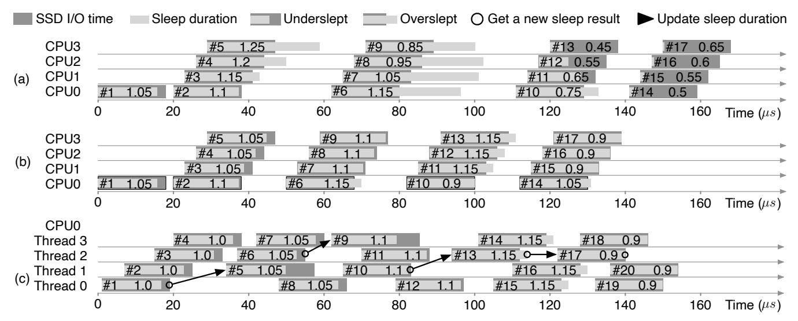

Figure 9: Per-device and per-core PAS modes with (UP,DN) = (0.05,0.1). The number inside each I/O denotes its *adjust* value. (a) In per-device mode, the response to concurrent I/Os is sluggish. (b) In per-core mode, PAS variables are kept per CPU core, eliminating the issue. (c) Multiple threads share a CPU; arrows depict the flow of sleep-result submission and duration updates.

Figure 10: Mode transition diagram of DPAS.

issues  $N_{PAS}$  (default: 100) I/Os to get the average I/O queue depth (QD). If the QD is 1, meaning a single thread is issuing I/Os, DPAS switches to classic polling mode. Classic polling inherently limits execution to one thread per CPU, thereby forcing QD to 1 regardless of how many threads are waiting. To stay adaptive, DPAS automatically returns to PAS normal mode after issuing  $N_{CP}$  (default: 1,000) I/Os. These transition conditions let DPAS operate mainly in classic polling mode under low contention, while ensuring a prompt transition back to PAS normal mode when contention increases.

If DPAS detects one or more timer failures within  $N_{PAS}$  PAS I/Os, it switches to PAS overloaded mode. In this mode, it submits another  $N_{PAS}$  I/Os to check the QD again. DPAS returns to PAS normal mode only when QD drops to 1, indicating that CPU contention has been resolved. If QD exceeds a threshold  $\theta$ , DPAS switches to interrupt mode, issues  $N_{INT}$  (default: 10,000) interrupt I/Os, and then returns to PAS overloaded mode. Unlike classic polling mode, we set  $N_{INT}$  to be  $10 \times$  larger than  $N_{CP}$  because severe contention takes longer to subside, and the penalty for prematurely reverting to PAS (busy-waiting) is far more critical than the efficiency trade-offs between PAS and classic polling. Measurements in Section 4.2 confirm that  $N_{INT} = 10,000$  yields significantly higher stability than smaller windows.

We set  $\theta$  empirically to 1 for NAND flash SSDs and to

3 for 3D XPoint SSDs. The former makes DPAS switch to interrupt mode more aggressively, while the latter keeps it in PAS overloaded mode longer, giving slightly higher IOPS despite more exposure to timer failures. Evaluation results in Section 4 confirm that, with these settings, DPAS outperforms other methods without additional per-device tuning.

#### 3.6 Implementation

We implemented PAS and DPAS in the multi-queue block layer of the Linux kernel. Each PAS bucket entry occupies 37 bytes (variables such as adjust, duration, UP, DN, sr pnlt, and sr last). With 16 bucket entries per core, PAS uses 592 bytes per core; DPAS's mode switching logic adds 104 bytes per core, and an additional 100 bytes per core are reserved for the global PAS/DPAS variables. In total, nine source files were changed, introducing 1,224 new lines and removing 30 lines (excluding the trace-function code). Like EHP [26], DPAS assigns two device queues to each CPU: one for polled I/Os and one for interrupt I/Os. When the number of CPUs far exceeds the number of device queues, an interrupt queue may be shared by multiple CPUs, which can degrade I/O performance. This limitation can be mitigated by OS changes: either by using a single queue for both I/O types or by adapting the kernel's queue mapper to allocate a device queue dynamically as a poll or interrupt queue according to demand.

#### 4 Evaluation

#### 4.1 Experimental Setup

We built a test platform with a single Intel(R) Xeon(R) Gold 6230 CPU (20 cores, 2.10 GHz) and 192 GB DDR4 2666

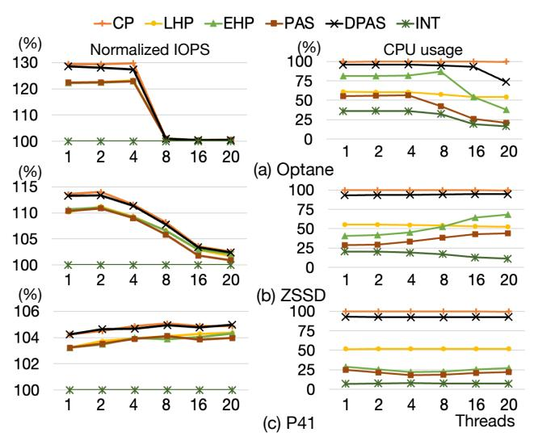

Figure 11: Thread scalability (4 KB I/O size, 1 thread per CPU). The NIOPS y-axes are scaled differently for legibility.

memory, running Ubuntu 18.04 on kernel 5.18. The storage set includes two enterprise ULL SSDs and one consumer SSD: Intel Optane DC P5800X 400 GB (Optane) [4], Samsung 983 ZET 480 GB (ZSSD) [8], and SK hynix P41 Gold 1 TB (P41) [5], which use 3D XPoint, SLC-based Z-NAND, and TLC NAND flash, respectively. We restored the BIOS to its default settings and turned off hyper-threading, as enabling it reduced 4 KB random-read IOPS for interrupts by as much as 40% compared with classic polling on Optane, and disabling it is advised to improve repeatability in scalability experiments [7]. The I/O completion methods tested are interrupts (INT), classic polling (CP), LHP [16], EHP [26], PAS, and DPAS. CP also represents latency-sensitive applications in Select-ISR [40], while INT corresponds to throughput-sensitive applications in Select-ISR and urgent I/O in CINT [35]. CINT uses asynchronous I/Os for non-urgent I/O, which are outside the scope of this work. Each experiment was run five times, and the results were averaged.

#### 4.2 Microbenchmark Results

To assess each method under synthetic loads, we formatted every SSD with an XFS file system and ran FIO [1] in direct mode for 10 seconds per run. I/O polling was enabled via pvsync2 with the hipri flag.

Thread scalability. Figure 11 shows IOPS and CPU usage for 4 KB random reads with 1–20 threads. On Optane, CP yields up to 30% higher read IOPS than INT and 27% more write IOPS (omitted for space). The benefit fades after eight threads, as Optane reaches its throughput limit. ZSSD and P41 show smaller IOPS gains compared to Optane, but they continue to scale thanks to higher internal parallelism; P41's write IOPS equal Optane's, owing to its DRAM buffer. For all SSDs, CP

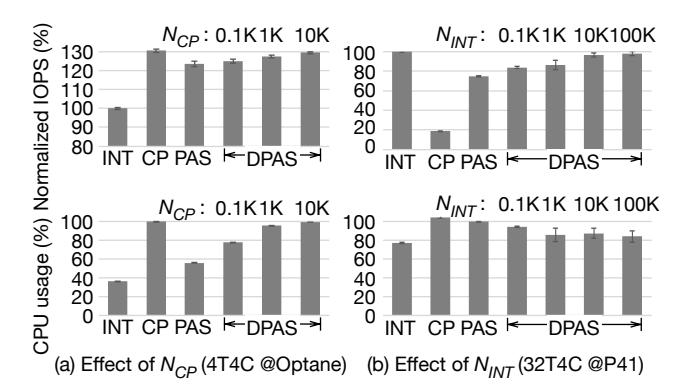

Figure 12: Sensitivity of DPAS parameters ( $N_{CP}$ ,  $N_{INT}$ ) regarding normalized IOPS and CPU usage (4 KB random reads on four CPUs). (a) Increasing  $N_{CP}$  from 100 to 10,000 under no CPU contention (4T) on Optane. (b) Increasing  $N_{INT}$  from 100 to 100,000 under heavy CPU contention (32T) on P41.

and DPAS outperform LHP, EHP, and PAS until the device becomes saturated. LHP consistently consumes about half of the CPU across thread counts, while EHP and PAS adjust their CPU use with latency. On ZSSD, higher thread counts produce a noisier lower envelope, reducing the sleep time of EHP and PAS and raising CPU usage. In contrast, on Optane with eight or more threads, latency increases, so their CPU usage drops due to longer sleep durations. PAS achieves the lowest CPU usage among hybrid polling methods, averaging 21 percentage points less than LHP. DPAS operates mainly in CP mode to maximize IOPS, using over 90% of the CPU except with 20 threads on Optane.

**Parameter Sensitivity.** We evaluated the sensitivity of DPAS to its mode-switching parameters,  $N_{CP}$  and  $N_{INT}$ , using 4 KB random reads on four CPUs. Using a baseline configuration  $(N_{PAS} = 100, N_{CP} = 1,000, N_{INT} = 10,000)$ , we swept the target parameter while keeping others fixed. Figure 12 contrasts two scenarios: 4 threads (4T) on Optane to tune  $N_{CP}$  in the absence of CPU contention, and 32 threads (32T) on P41 to tune  $N_{INT}$  under heavy CPU contention. Figure 12(a) shows that for 4T, increasing  $N_{CP}$  approaches the classic polling (CP) ceiling. We select  $N_{CP} = 1,000$  as it captures most throughput benefits (1.27×) while retaining responsiveness compared to  $N_{CP} = 10,000$ . Conversely, Figure 12(b) shows that for 32T, small windows ( $N_{INT} = 100$ ) cause mode thrashing, degrading performance to  $0.84 \times$  of INT. Increasing  $N_{INT}$  to 10,000 restores stability  $(0.97\times)$ , with negligible gains beyond that point. We therefore fix  $N_{INT} = 10,000$  to ensure stability without unnecessarily prolonging interrupt mode.

Larger sized I/Os. Figure 13 shows that enlarging the I/O size gradually diminishes the advantage of polling-based methods over INT. LHP maintains CPU consumption between 50% and 60% regardless of I/O size, while EHP and PAS reduce their CPU usage as the transfer size grows. For 128 KB reads on all three devices, and 16–32 KB reads on P41, EHP no

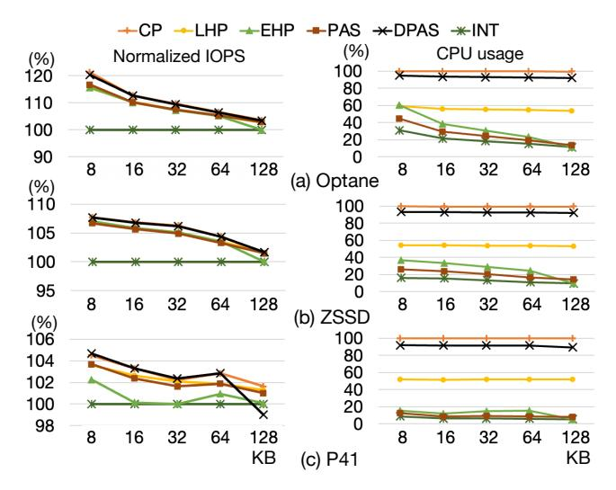

Figure 13: Random read tests with 1 thread (size: 8–128 KB). The NIOPS y-axes are scaled differently for legibility.

longer yields any IOPS gain compared with INT. On P41, DPAS also drops slightly at 128 KB reads, delivering about 1% fewer IOPS than INT. This degradation correlates with an increase in the 99.95th-percentile latency, a pattern observed only on P41.

# 4.3 Tests with Real I/O Traces

To assess performance with realistic mixed-read/write workloads and varying I/O sizes, we replayed three block I/O traces from the SNIA IOTTA repository [\[6\]](#page-14-14): Baleen [\[37\]](#page-15-6), Systor'17 [\[25\]](#page-15-7), and Slacker [\[20\]](#page-14-15). For Baleen, we used Regions 5–7, the most recent of seven large production traces; for Systor'17, we used a 30-minute VDI trace; and for Slacker, we combined the application-startup I/Os from 57 HelloBench containers. Baleen is dominated by large I/Os, whereas Systor and Slacker are composed mainly of smaller requests. A single replay thread was bound to four dedicated CPUs to avoid interference from CPU contention or background I/O, which we examine in separate experiments. When an I/O's block address exceeded the device capacity, we applied modulo division to map it within the target storage.

Figure [14](#page-9-1) shows normalized IOPS and CPU usage for all methods, devices, and workloads. On ZSSD and P41, the Slacker and Systor traces exhibit larger IOPS fluctuations, presumably due to internal garbage collection, whereas Optane's performance is notably steadier. Baleen's gap between INT and the other methods is small on every SSD, as the trace is dominated by large I/Os. By contrast, Systor and Slacker contain many small requests that benefit from polling-based methods. LHP and PAS usually deliver higher IOPS than EHP, and PAS consistently uses less CPU than LHP. EHP shows a clear trade-off between IOPS and CPU usage; for Baleen on P41, it yields no IOPS gain while keeping CPU usage near

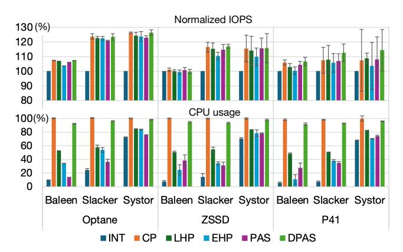

Figure 14: Trace replay results for three workloads (error bars: standard deviation).

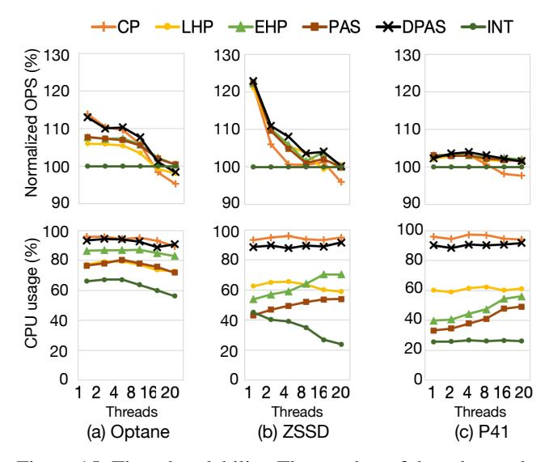

Figure 15: Thread scalability. The number of threads equals the number of CPUs. The average across YCSB A–F is shown. For legibility, the NOPS y-axes start at 90%.

INT, likely due to falling back to interrupts for large I/Os. CP mostly yields the highest IOPS, except on P41, but its results vary more than the other methods for Slacker and Systor, causing average IOPS drop. DPAS consistently achieves near-best performance across all tests, surpassing CP on P41, and its higher CPU usage suggests a reliance on classic polling.

#### 4.4 Macrobenchmark Results

We assessed the methods under varying system-resource conditions by running the Yahoo! Cloud Serving Benchmark (YCSB) [\[14\]](#page-14-6) on RocksDB stored on an XFS file system. The RocksDB POSIX I/O interface was replaced with pvsync2 to enable polling-based methods. All six YCSB workloads were executed with fixed operation counts: 8M operations for D, 250K for E, and 3M for A, B, C, and F.

Thread scalability. We evaluated each method by measuring

operations-per-second (OPS) and CPU usage while varying the number of RocksDB threads, assigning an equal number of CPUs to each configuration. In addition to these foreground threads, RocksDB creates background threads (e.g., for compaction) that periodically compete with the foreground threads for CPU cycles. Figure 15 shows the geometric mean of the six YCSB workloads. On Optane, LHP, EHP, and PAS achieve 5–8% higher OPS than INT with up to eight threads, while CP and DPAS provide further performance gains. Beyond 8 threads, the OPS advantage of these methods over INT decreases as Optane approaches saturation. At these higher concurrency levels, CP's performance falls below INT with a significant increase in tail latency. DPAS also exhibits a moderate decline, suggesting partial operation in CP mode under these configurations. On ZSSD, CP's performance degrades significantly, while DPAS outperforms INT up to 16 threads. On P41, hybrid-polling methods show smaller gains in OPS compared to the ULL SSDs, but maintain a consistent performance advantage across all thread counts. Overall, DPAS tends to mirror the best-performing method in each scenario and frequently surpasses it, owing to its dynamic adaptation to CPU contention.

**CPU contention.** To evaluate the effects of CPU contention, we repeated the experiment using only four CPUs with 2–32 threads. The results are shown in Figure 16. When the thread count exceeds the available CPUs, CP's OPS drops sharply. PAS still yields OPS gains for 2–8 threads on Optane and ZSSD, and for 2–4 threads on P41. However, its performance falls significantly below INT for 16–32 threads on ZSSD and P41. LHP and EHP also experience throughput degradation under contention, though to a lesser extent than PAS. DPAS mitigates the slowdown by reacting to PAS timer-failure notifications and switching to interrupt mode; it maintains CP mode for 2–4 threads, achieving the highest OPS among all methods at the cost of increased CPU usage.

**Breakdown of I/O modes in DPAS.** Figure 17 shows how DPAS mixes I/O modes for configurations selected from Figure 16. In Figure 17(a), DPAS detects persistent timer failures and remains in PAS-overloaded mode. Because the average queue depth remains below the threshold (3 for Optane), DPAS does not transition to interrupt mode and achieves a 12.3% OPS gain over INT. Figure 17(b) shows DPAS primarily alternating between PAS-normal and CP modes; with approximately 2% of I/Os issued in interrupt mode due to occasional CPU overload from background RocksDB threads. DPAS improves OPS by 10.3% relative to INT, while CP gains only 0.3% under the same conditions. CP's limited benefit stems from its fixed reliance on polling, even when the CPU is contended. Figure 17(c) shows timer failures occurring on all CPUs, causing most DPAS instances to switch to interrupt mode. However, CPU2 remains in PAS-normal mode. The CPUs that transitioned to interrupt mode process more I/Os, reducing the load on CPU2 and preventing further timer failures, thereby allowing it to remain in PAS-normal

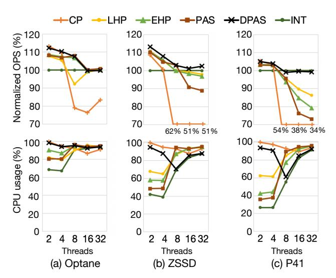

Figure 16: Tests under CPU contention (4 CPUs). For ZSSD and P41, CP's OPS values are flattened for legibility.

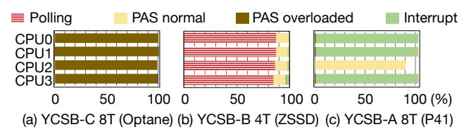

Figure 17: Breakdown of I/O modes in DPAS (4 CPUs).

mode. The combined OPS of the four CPUs is 2.8% lower than INT, whereas PAS alone experiences a 9.3% OPS drop compared with INT.

I/O interference. To assess hybrid-polling methods under deterministic I/O interference, we developed an I/O pulse generator that continuously issues random reads based on three parameters: I/O size, target IOPS, and pulse interval. A setting of (128 KB, 1,000 IOPS, 40 ms) produces 40 consecutive 128 KB reads every 40 ms, sustaining 1,000 IOPS; doubling the interval to 80 ms reduces the reads per pulse to 80 while keeping the same IOPS target. We ran four generators on CPU4-7, each emitting 128 KB random reads with pulse intervals ranging from 40 ms to 640 ms, collectively generating 500 MB/s of traffic while maintaining 1,000 IOPS per generator. Simultaneously, we measured the performance of four YCSB threads on CPU0-3. Figure 18 shows the average YCSB throughput for workloads A–F. LHP's OPS degradation increases as the pulse interval increases, particularly on faster storage devices. EHP exhibits a consistent OPS drop across all SSDs for intervals between 160 ms and 640 ms, with the magnitude varying by device. In contrast, PAS and DPAS maintain stable OPS across the entire interval range, demonstrating strong resilience to I/O interference.

**Latency analysis.** Figure 18 shows that CP never outperforms INT on ZSSD for any pulse interval. To understand this, we examined latency at the 80 ms interval for YCSB B on Optane

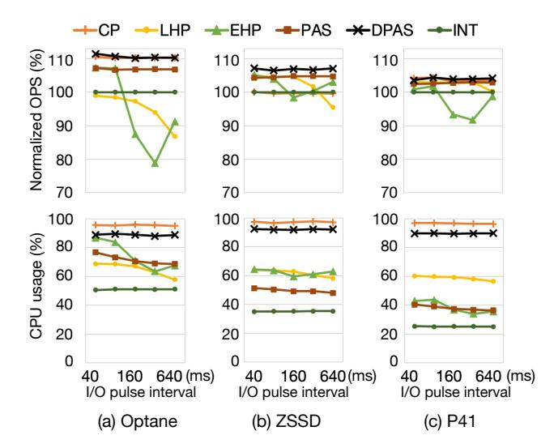

Figure 18: I/O interference. Eight CPUs are used to run four YCSB threads and four I/O generator threads (128 KB reads at 1,000 IOPS each). The NOPS y-axes start from 70%.

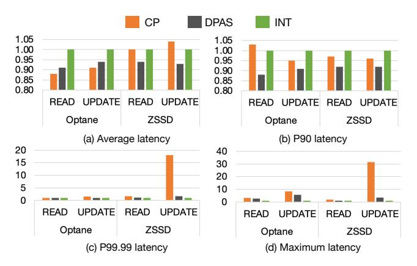

Figure 19: Latency comparison (YCSB B with an 80 ms pulse period). Latency values are normalized to INT.

and ZSSD. Figure 19 presents the average,  $90^{th}$ ,  $99.99^{th}$ , and maximum latencies for CP, DPAS, and INT. On Optane, CP's average latency is lower than INT for both READ and UP-DATE operations. However, on ZSSD, CP's average UPDATE latency is significantly higher than INT, explaining its modest OPS loss. CP matches INT up to the  $90^{th}$  percentile, but its  $99.99^{th}$  percentile and maximum latencies are  $17\times$  and  $30\times$  larger, respectively, causing noticeable degradation. During I/O interference, DPAS operates in classic-polling mode for up to 90% of I/Os. This results in a tail-latency increase, but it is far smaller than that observed with CP.

Trace analysis. We captured sleep-duration traces of LHP, EHP, and DPAS on CPU0 while running YCSB A with 320 ms pulse interval. Figure 20(a) shows LHP's behavior: it adjusts sleep duration only at the next sampling epoch, meaning it often oversleeps after a latency spike has already subsided. This extra I/O time is misinterpreted as inherent device latency, carrying the delay into subsequent epochs and requiring mul-

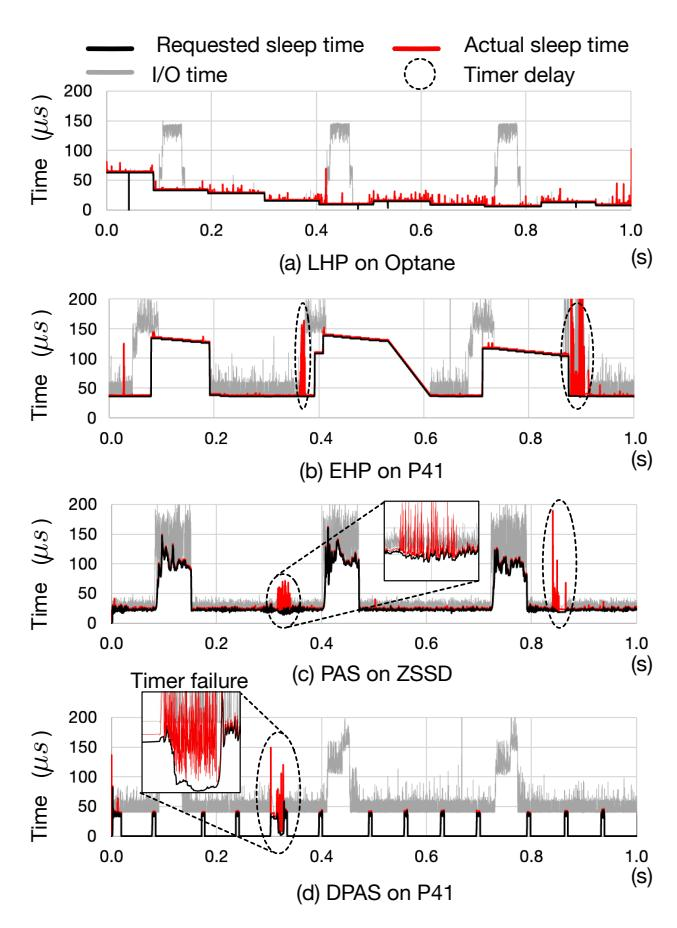

Figure 20: YCSB A random read traces under I/O interference (size: 4,096–7,680 bytes; I/O pulse interval: 320 ms).

tiple cycles to return to a normal sleep duration. Figure 20(b) shows EHP. Under stable conditions, EHP accurately tracks the lower envelope of I/O latency, but a sustained device slowdown lasting an entire epoch will cause it to increase the sleep duration in the following epoch. Similar to LHP, it oversleeps when the slowdown ends abruptly and requires multiple epochs to recover tracking. Figure 20(c) shows PAS, which maintains tight tracking of the lower envelope of latency, consistent with PAS-Sim. Figure 20(d) shows DPAS. It initially issues 100 PAS I/Os to estimate the average QD, detecting that only a single I/O thread is active. DPAS then switches to CP mode, issuing 1,000 polled I/Os before returning to PAS-normal mode. When a timer failure occurs (zoomed-in portion), DPAS moves to PAS-overloaded mode, collects a new QD value, and decides whether to switch to interrupt mode or revert to PAS-normal mode. In this case, the CPU contention that caused the timer failure was brief, allowing DPAS to quickly resume PAS-normal mode. The dashed circles in the trace highlight that all hybrid-polling methods experience timer delays, but only PAS and DPAS respond immediately to these delays.

**Dynamic mode switching of DPAS.** In previous experiments,

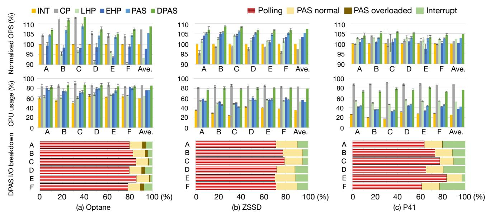

Figure 21: Tests under varying CPU and I/O contention. Four CPUs were used to run 4 YCSB threads and 4 I/O generator threads, configured identically to Figure [18](#page-11-1) (error bars: standard deviation).

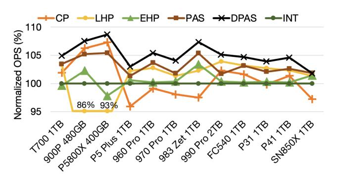

Figure 22: OPS comparison under varying CPU and I/O contention. Shown are average for YCSB workloads A–F.

DPAS typically identified the most effective I/O completion method and operated primarily in that mode. To evaluate DPAS's ability to adapt to varying CPU and I/O contention, we modified the configuration from Figure [18](#page-11-1) by limiting execution to four CPUs. This created reduced baseline CPU contention, with periodic I/O generator activations introducing intermittent CPU and I/O interference. As shown in the upper row of Figure [21,](#page-12-0) DPAS achieves average OPS improvements of 9%, 7%, and 5% over INT on Optane, ZSSD, and P41, respectively. PAS also demonstrates consistent gains, though slightly lower than DPAS. In contrast, CP, LHP, and EHP suffer notable performance degradation, and for some devices, even fall below the performance of INT under the same conditions. The bottom-row bar graphs illustrate how DPAS assigns different weights to its operating modes based on the device and workload. Notably, DPAS remains in PASoverloaded mode more often on Optane, reflecting its higher θ threshold setting for that device.

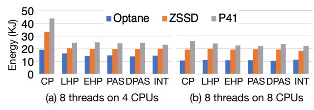

Figure 23: Accumulated energy consumption of YCSB A–F.

DPAS performance without parameter tuning. PAS operates effectively without any parameter tuning due to its dynamic sensitivity adjustment. DPAS introduces a single tunable parameter, θ, which we set to 1 for NAND-flash SSDs and 3 for 3D XPoint SSDs. To evaluate DPAS performance without per-device tuning, we tested it on eight additional NAND-flash SSDs and one additional 3D XPoint SSD, using the same configuration from Figure [21.](#page-12-0) As shown in Figure [22,](#page-12-1) DPAS consistently outperforms the other methods on all devices except SN850X. In contrast, CP, LHP, and EHP fall behind INT on several of the SSDs.

Energy efficiency. Recent studies analyzed [\[19\]](#page-14-16) and optimized [\[28\]](#page-15-8) the energy efficiency of I/O completion. To compare the energy efficiency of each test method in our tests, we recorded the total energy consumed during a single run of the six YCSB workloads. The test machine consumed 110 W at idle and up to 200 W under load, with no measurable power-draw differences among the methods themselves. Figure [23\(](#page-12-2)a) shows that CP consumes the most energy when CPU contention is high, primarily due to its longer execution time. As CPU contention decreases, as shown in Figure [23\(](#page-12-2)b), the energy gap narrows.

#### 5 Discussion

Evaluation summary. Each I/O completion method presents a distinct trade-off, making a universally optimal path impractical. Classic polling maximizes throughput by eliminating context-switch overhead, but is prohibitive where CPU contention is not guaranteed low. Hybrid-polling methods, including all epoch-based variants, perform well under moderate and stable load, but suffer degraded wake-up latency as CPU cores saturate. Epoch-based hybrid-polling methods further lose tracking fidelity with abrupt device latency changes.

PAS improves upon generic hybrid polling with tighter sleep-duration estimates, reducing wasted CPU cycles, but still inherits its limitations. In contrast, DPAS offers a practical route to predictable, high-performance storage I/O across diverse hardware and workloads. Building on PAS's finegrained latency feedback, DPAS adds a dynamic selector that switches at run time among three I/O completion modes. This adaptability enables near-optimal I/O performance on both ultra-low-latency NVMe drives and commodity SSDs, delivering consistent behavior without a one-size-fits-all solution. Future extension directions. By default, DPAS prioritizes maximizing I/O performance, ideal for workloads demanding high I/O performance. For workloads prioritizing CPU headroom over maximum IOPS, DPAS can be extended to disable the classic-polling path, offering a CPU-saving mode. The system would then rely on PAS-enhanced hybrid polling and interrupt-driven completion, accepting a slight I/O throughput loss compared to classic polling due to context-switch overhead.

Another direction is to integrate interrupt coalescing. DPAS currently lacks any coalescing mechanism, so a surge of concurrent I/Os can trigger interrupt storms when DPAS operates in interrupt mode. As noted in Section [2.4,](#page-3-0) recent work [\[35\]](#page-15-5) mitigates this issue by pre-classifying applications as "urgent" or "non-urgent" and applying coalescing only to the latter. Because DPAS avoids offline, per-application profiling, we need a dynamic urgency threshold that can be evaluated for each I/O request in real time (e.g., using latency targets, request size, or QoS hints). vIC [\[9\]](#page-14-17) is a viable candidate, as it adjusts coalescing based on the number of in-flight commands and the current I/O rate without requiring pre-classification. However, it has been validated only in virtualized environments and still requires verification on native systems. If DPAS were extended with such a dynamic coalescing scheme, it could broaden its applicability from moderately throughput-oriented workloads, which are adequately handled with plain interrupts, to extremely throughput-heavy workloads that would benefit from interrupt coalescing.

#### 6 Related Work

Polling originated in the networking domain [\[15,](#page-14-18) [30\]](#page-15-9), and was later adapted for storage-I/O completion [\[10,](#page-14-2) [12,](#page-14-3) [22,](#page-14-19) [38\]](#page-15-0). Native support for polling in storage subsystems entered the Linux kernel in version 4.4 [\[17\]](#page-14-20). More recently, user-level I/O frameworks such as SPDK and io\_uring [\[11,](#page-14-21) [39\]](#page-15-10) have also adopted polling to lower latency and improve throughput. Empirical results demonstrate that polling improves performance across a range of storage stacks: asynchronous I/O [\[27\]](#page-15-11), direct I/O paths [\[36\]](#page-15-12), and virtualized block devices [\[31\]](#page-15-13).

While these approaches improve performance, they all suffer from the fundamental inefficiencies of classic polling. To mitigate this overhead, prior work has proposed adaptive polling-interval strategies for NVMe devices [\[23,](#page-15-14) [32,](#page-15-15) [33\]](#page-15-16). These strategies dynamically adjust the polling interval to balance performance and CPU usage. Hybrid polling was introduced as a compromise between raw performance and CPU efficiency [\[16,](#page-14-4) [21,](#page-14-5) [29\]](#page-15-1), but subsequent research on this line has been limited [\[13,](#page-14-8) [26,](#page-15-2) [34\]](#page-15-3). A key open problem identified in recent work [\[40\]](#page-15-4), which PAS and DPAS address, is the accurate estimation of sleep durations under highly dynamic I/O workloads. More recent studies have examined the performance limits of hybrid polling on ultra-low latency (ULL) SSDs [\[24,](#page-15-17) [35\]](#page-15-5).

# 7 Conclusion

In this paper, we introduced PAS, a novel I/O latency-tracking mechanism, and DPAS, an adaptive extension that enables dynamic mode switching. Our evaluation demonstrates that PAS achieves significantly higher accuracy in sleep-duration estimation compared to existing hybrid-polling techniques. Furthermore, DPAS effectively synthesizes the strengths of classic polling, interrupts, and PAS, delivering consistent performance gains across diverse SSDs and workloads without requiring per-application profiling.

#### Acknowledgments

We sincerely thank our shepherd, Sarah Neuwirth, and the anonymous reviewers of FAST '26 for their valuable feedback and guidance. We extend our gratitude to the reviewers of previous versions; their constructive criticism and detailed comments significantly improved the quality and presentation of this work.

This work was supported by the National Research Foundation of Korea (NRF) grant funded by the Korea government (MSIT) (No. 2018R1D1A1B05044558). This work was also supported by the Institute of Information & Communications Technology Planning & Evaluation (IITP) grant funded by the Korea government (MSIT) [No. RS-2025-02219317, AI Star Fellowship (Kookmin University); No. IITP-2024-RS-2024- 00417958, Global Research Support Program in the Digital Field; and No. IITP-2024-RS-2024-00397085, Leading Generative AI Human Resources Development].

# References

- [1] Flexible I/O Tester. [https://github.com/axboe/](https://github.com/axboe/fio) [fio](https://github.com/axboe/fio).
- [2] hrtimers - subsystem for high-resolution kernel timers. [https://docs.kernel.org/timers/hrtimers.](https://docs.kernel.org/timers/hrtimers.html) [html](https://docs.kernel.org/timers/hrtimers.html).
- [3] Intel® Optane™ SSD 9 Series. [https:](https://www.intel.com/content/www/us/en/products/details/memory-storage/consumer-ssds/optane-ssd-9-series.html) [//www.intel.com/content/www/us/en/products/](https://www.intel.com/content/www/us/en/products/details/memory-storage/consumer-ssds/optane-ssd-9-series.html) [details/memory-storage/consumer-ssds/](https://www.intel.com/content/www/us/en/products/details/memory-storage/consumer-ssds/optane-ssd-9-series.html) [optane-ssd-9-series.html](https://www.intel.com/content/www/us/en/products/details/memory-storage/consumer-ssds/optane-ssd-9-series.html).
- [4] Intel® Optane™ SSD P5800X product brief. [https://www.intel.com/content/www/](https://www.intel.com/content/www/us/en/products/docs/memory-storage/solid-state-drives/data-center-ssds/optane-ssd-p5800x-p5801x-brief.html) [us/en/products/docs/memory-storage/](https://www.intel.com/content/www/us/en/products/docs/memory-storage/solid-state-drives/data-center-ssds/optane-ssd-p5800x-p5801x-brief.html) [solid-state-drives/data-center-ssds/](https://www.intel.com/content/www/us/en/products/docs/memory-storage/solid-state-drives/data-center-ssds/optane-ssd-p5800x-p5801x-brief.html) [optane-ssd-p5800x-p5801x-brief.html](https://www.intel.com/content/www/us/en/products/docs/memory-storage/solid-state-drives/data-center-ssds/optane-ssd-p5800x-p5801x-brief.html).
- [5] Platinum P41 SSD. [https://ssd.skhynix.com/](https://ssd.skhynix.com/platinum_p41/) [platinum\\_p41/](https://ssd.skhynix.com/platinum_p41/).
- [6] SNIA IOTTA Repository. [https://iotta.snia.org/](https://iotta.snia.org/traces/block-io ) [traces/block-io](https://iotta.snia.org/traces/block-io ).
- [7] SPDK NVMe BDEV Performance Report Release 18.04. [https://ci.spdk.io/download/](https://ci.spdk.io/download/performance-reports/SPDK_nvme_bdev_perf_report_18.04.pdf ) [performance-reports/SPDK\\_nvme\\_bdev\\_perf\\_](https://ci.spdk.io/download/performance-reports/SPDK_nvme_bdev_perf_report_18.04.pdf ) [report\\_18.04.pdf](https://ci.spdk.io/download/performance-reports/SPDK_nvme_bdev_perf_report_18.04.pdf ).
- [8] Ultra-low latency with samsung Z-NAND SSD. [https://www.samsung.com/semiconductor/](https://www.samsung.com/semiconductor/global.semi.static/Ultra-Low_Latency_with_Samsung_Z-NAND_SSD-0.pdf) [global.semi.static/Ultra-Low\\_Latency\\_with\\_](https://www.samsung.com/semiconductor/global.semi.static/Ultra-Low_Latency_with_Samsung_Z-NAND_SSD-0.pdf) [Samsung\\_Z-NAND\\_SSD-0.pdf](https://www.samsung.com/semiconductor/global.semi.static/Ultra-Low_Latency_with_Samsung_Z-NAND_SSD-0.pdf).
- [9] Irfan Ahmad, Ajay Gulati, and Ali Mashtizadeh. vIC: Interrupt coalescing for virtual machine storage device IO. In *2011 USENIX Annual Technical Conference (ATC)*, Portland, OR, June 2011.
- [10] Ameen Akel, Adrian M. Caulfield, Todor I. Mollov, Rajesh K. Gupta, and Steven Swanson. Onyx: A prototype phase change memory storage array. In *3rd Workshop on Hot Topics in Storage and File Systems (HotStorage)*, June 2011.
- [11] Jens Axboe. Faster IO through io\_uring. [https://kernel-recipes.org/en/2019/talks/](https://kernel-recipes.org/en/2019/talks/faster-io-through-io_uring/) [faster-io-through-io\\_uring/](https://kernel-recipes.org/en/2019/talks/faster-io-through-io_uring/).
- [12] Adrian M. Caulfield, Arup De, Joel Coburn, Todor I. Mollow, Rajesh K. Gupta, and Steven Swanson. Moneta: A high-performance storage array architecture for nextgeneration, non-volatile memories. In *2010 43rd Annual IEEE/ACM International Symposium on Microarchitecture (MICRO)*, December 2010.

- [13] Myoungjun Chun, Yoona Kim, and Jihong Kim. An adaptive polling selection technique for ultra-low latency storage systems. *IEMEK Journal of Embedded Systems and Applications*, 14(2):63–69, 2019.
- [14] Brian F. Cooper, Adam Silberstein, Erwin Tam, Raghu Ramakrishnan, and Russell Sears. Benchmarking cloud serving systems with YCSB. In *Proceedings of the 1st ACM Symposium on Cloud Computing (SoCC)*, pages 143–154, 2010.
- [15] Constantinos Dovrolis, Brad Thayer, and Parameswaran Ramanathan. HIP: Hybrid interrupt-polling for the network interface. *ACM SIGOPS Operating Systems Review*, 35(4):50–60, October 2001.
- [16] Assaf Eisenman, Darryl Gardner, Islam AbdelRahman, Jens Axboe, Siying Dong, Kim Hazelwood, Chris Petersen, Asaf Cidon, and Sachin Katti. Reducing DRAM footprint with NVM in facebook. In *Proceedings of the Thirteenth European Conference on Computer Systems (EuroSys)*, 2018.
- [17] Alex Handy. Linux 4.10 arrives. [https://sdtimes.](https://sdtimes.com/coding/linux-4-10-arrives/) [com/coding/linux-4-10-arrives/](https://sdtimes.com/coding/linux-4-10-arrives/).
- [18] Mingzhe Hao, Levent Toksoz, Nanqinqin Li, Edward Edberg Halim, Henry Hoffmann, and Haryadi S. Gunawi. LinnOS: Predictability on unpredictable flash storage with a light neural network. In *14th USENIX Symposium on Operating Systems Design and Implementation (OSDI)*, pages 173–190. USENIX Association, November 2020.
- [19] Bryan Harris and Nihat Altiparmak. When poll is more energy efficient than interrupt. In *Proceedings of the 14th ACM Workshop on Hot Topics in Storage and File Systems (HotStorage)*, HotStorage '22, page 59–64, New York, NY, USA, 2022. Association for Computing Machinery.
- [20] Tyler Harter, Brandon Salmon, Rose Liu, Andrea C Arpaci-Dusseau, and Remzi H Arpaci-Dusseau. Slacker: Fast distribution with lazy docker containers. In *14th USENIX Conference on File and Storage Technologies (FAST)*, pages 181–195, 2016.
- [21] Christoph Hellwig. Past and present of the Linux NVMe Driver, September 2017. [https://www.snia.org/](https://www.snia.org/sites/default/files/SDC/2017/presentations/NVMe/Hellwig_Christoph_Past_and_Present_of_the_Linux_NVMe_Driver.pdf) [sites/default/files/SDC/2017/presentations/](https://www.snia.org/sites/default/files/SDC/2017/presentations/NVMe/Hellwig_Christoph_Past_and_Present_of_the_Linux_NVMe_Driver.pdf) [NVMe/Hellwig\\_Christoph\\_Past\\_and\\_Present\\_of\\_](https://www.snia.org/sites/default/files/SDC/2017/presentations/NVMe/Hellwig_Christoph_Past_and_Present_of_the_Linux_NVMe_Driver.pdf) [the\\_Linux\\_NVMe\\_Driver.pdf](https://www.snia.org/sites/default/files/SDC/2017/presentations/NVMe/Hellwig_Christoph_Past_and_Present_of_the_Linux_NVMe_Driver.pdf).
- [22] Sooman Jeong, Kisung Lee, Seongjin Lee, Seoungbum Son, and Youjip Won. I/O stack optimization for smartphones. In *2013 USENIX Annual Technical Conference (ATC)*, pages 309–320, San Jose, CA, June 2013.

- [23] Hyeong-Jun Kim, Young-Sik Lee, and Jin-Soo Kim. NVMeDirect: A user-space I/O framework for application-specific optimization on NVMe SSDs. In *8th USENIX Workshop on Hot Topics in Storage and File Systems (HotStorage)*, Denver, CO, June 2016.
- [24] Sungjoon Koh, Junhyeok Jang, Changrim Lee, Miryeong Kwon, Jie Zhang, and Myoungsoo Jung. Faster than flash: An in-depth study of system challenges for emerging ultra-low latency SSDs. In *2019 IEEE International Symposium on Workload Characterization (IISWC)*, pages 216–227, 2019.
- [25] Chunghan Lee, Tatsuo Kumano, Tatsuma Matsuki, Hiroshi Endo, Naoto Fukumoto, and Mariko Sugawara. Understanding storage traffic characteristics on enterprise virtual desktop infrastructure. In *Proceedings of the 10th ACM International Systems and Storage Conference (SYSTOR)*, pages 1–11, 2017.
- [26] Gyusun Lee, Seokha Shin, and Jinkyu Jeong. Efficient hybrid polling for ultra-low latency storage devices. *Journal of Systems Architecture*, 122:102338, 2022.
- [27] Gyusun Lee, Seokha Shin, Wonsuk Song, Tae Jun Ham, Jae W. Lee, and Jinkyu Jeong. Asynchronous I/O stack: A low-latency kernel I/O stack for Ultra-Low latency SSDs. In *2019 USENIX Annual Technical Conference (ATC)*, pages 603–616, Renton, WA, July 2019. USENIX Association.
- [28] Endian Li, Shushu Yi, Li Peng, Qiao Li, Diyu Zhou, Zhenlin Wang, Xiaolin Wang, Bo Mao, Yingwei Luo, Ke Zhou, and Jie Zhang. SPDK+: Low latency or high power efficiency? We take both. In *Proceedings of the 17th ACM Workshop on Hot Topics in Storage and File Systems*, HotStorage '25, page 17–23, New York, NY, USA, 2025. Association for Computing Machinery.
- [29] Damien Le Moal. I/O latency optimization with polling. In *Vault Linux Storage and Filesystems Conference (Vault)*, March 2017.
- [30] Jamal Hadi Salim, Robert Olsson, and Alexey Kuznetsov. Beyond softnet. In *5th Annual Linux Showcase & Conference (ALS)*, November 2001.
- [31] Dongjoo Seo, Yongsoo Joo, and Nikil Dutt. Improving virtualized I/O performance by expanding the polled I/O path of Linux. In *Proceedings of the 16th ACM Workshop on Hot Topics in Storage and File Systems (HotStorage)*, page 31–37, 2024.
- [32] Dong In Shin, Young Jin Yu, Hyeong S. Kim, Jae Woo Choi, Do Yung Jung, and Heon Y. Yeom. Dynamic interval polling and pipelined post I/O processing for lowlatency storage class memory. In *5th USENIX Workshop*

- *on Hot Topics in Storage and File Systems (HotStorage)*, June 2013.
- [33] Woong Shin, Qichen Chen, Myoungwon Oh, Hyeonsang Eom, and Heon Y. Yeom. OS I/O path optimizations for flash solid-state drives. In *2014 USENIX Annual Technical Conference (ATC)*, pages 483–488, Philadelphia, PA, June 2014.
- [34] Yongju Song and Young Ik Eom. HyPI: Reducing CPU consumption of the I/O completion method in highperformance storage systems. In *Proceedings of the 13th International Conference on Ubiquitous Information Management and Communication (IMCOM)*, pages 646–653, 2019.
- [35] Amy Tai, Igor Smolyar, Michael Wei, and Dan Tsafrir. Optimizing storage performance with calibrated interrupts. In *15th USENIX Symposium on Operating Systems Design and Implementation (OSDI)*, pages 129– 145, July 2021.
- [36] Jörg Thalheim, Harshavardhan Unnibhavi, Christian Priebe, Pramod Bhatotia, and Peter Pietzuch. Rkt-Io: A direct I/O stack for shielded execution. In *Proceedings of the Sixteenth European Conference on Computer Systems (EUROSYS)*, pages 490–506, 2021.
- [37] Daniel Lin-Kit Wong, Hao Wu, Carson Molder, Sathya Gunasekar, Jimmy Lu, Snehal Khandkar, Abhinav Sharma, Daniel S Berger, Nathan Beckmann, and Gregory R Ganger. Baleen:ML admission & prefetching for flash caches. In *22nd USENIX Conference on File and Storage Technologies (FAST)*, pages 347–371, 2024.
- [38] Jisoo Yang, Dave B. Minturn, and Frank Hady. When poll is better than interrupt. In *10th USENIX Conference on File and Storage Technologies (FAST)*, February 2012.
- [39] Ziye Yang, James R. Harris, Benjamin Walker, Daniel Verkamp, Changpeng Liu, Cunyin Chang, Gang Cao, Jonathan Stern, Vishal Verma, and Luse E. Paul. SPDK: A development kit to build high performance storage applications. In *2017 IEEE International Conference on Cloud Computing Technology and Science (CloudCom)*, pages 154–161, 2017.
- [40] Jie Zhang, Miryeong Kwon, Donghyun Gouk, Sungjoon Koh, Changlim Lee, Mohammad Alian, Myoungjun Chun, Mahmut Taylan Kandemir, Nam Sung Kim, Jihong Kim, and Myoungsoo Jung. FlashShare: Punching through server storage stack from kernel to firmware for ultra-low latency SSDs. In *13th USENIX Symposium on Operating Systems Design and Implementation (OSDI)*, pages 477–492, Carlsbad, CA, October 2018.

# A Artifact Appendix

#### Abstract

This artifact accompanies the FAST '26 paper *"DPAS: A Prompt, Accurate and Safe I/O Completion Method for SSDs."* It provides an implementation of PAS, a novel latencytracking mechanism for hybrid polling, and DPAS, a dynamic switching scheme among classic polling, PAS, and interrupts for NVMe I/O completion in Linux, plus documentation/scripts to exercise the core experiments and validate the paper's main claims.

#### Scope

The artifact is intended to validate the following claims from the paper:

- C1 (PAS CPU reduction vs. Linux Hybrid Polling). For 4 KB random reads, PAS reduces CPU usage substantially compared to Linux Hybrid Polling (LHP), while maintaining comparable I/O performance. The paper reports a reduction of about 21 percentage points in CPU usage vs. LHP in this setting.
- C2 (DPAS improves YCSB/RocksDB throughput under contention and interference). Under simultaneous CPU contention and I/O interference, DPAS improves YCSB performance over interrupts. The paper reports improvements of about 9% on a 3D XPoint SSD and 5% on a TLC NAND SSD.
- C3 (DPAS adapts by switching modes at runtime). DPAS dynamically selects among classic polling, PAS (normal/overloaded), and interrupts based on contention/timer-failure signals, producing near-best performance across scenarios.

Because results depend on CPU, SSD model/firmware, and background load, exact numbers may differ; the goal is to reproduce the *qualitative trends* and relative ordering that support C1–C3.

#### Contents

The artifact repository provides materials to:

- build and run a Linux kernel that includes PAS/DPAS changes in the NVMe/block I/O completion path;
- run microbenchmarks (FIO-based) used in the paper to measure IOPS and CPU usage for interrupts (INT) / classic polling (CP) / LHP / EHP / PAS / DPAS;
- run macrobenchmarks (YCSB on RocksDB) used in the paper, including contention/interference configurations;
- collect logs and generate plots comparable to those shown in the paper.

# Hosting

Artifact URL:

[https://github.com/DongDongJu/DPAS\\_FAST26](https://github.com/DongDongJu/DPAS_FAST26)

Please evaluate the artifact at:

• Branch: main

#### Requirements

Privileges: root access is required (kernel install/boot and performance settings).

#### Hardware:

- x86\_64 machine recommended.
- One NVMe SSD is required to evaluate NVMe completion methods.
- Multiple CPU cores recommended for contention experiments.

#### Software:

- Linux build toolchain for kernel compilation (gcc/clang, make, bc, bison, flex, libssl-dev, libelf-dev, etc.).
- The artifact targets the kernel version used in the paper (Linux 5.18).
- FIO for microbenchmarks.
- RocksDB + YCSB for macrobenchmarks (and any wrapper enabling the polled I/O path as used in the paper).

# Experimental Notes (Paper Alignment)

The paper's evaluation uses Ubuntu 18.04 with Linux 5.18 and NVMe SSDs including Intel Optane DC P5800X (3D XPoint), Samsung 983 ZET (Z-NAND), and SK hynix P41 (TLC NAND), and disables hyper-threading for repeatability. The artifact is designed to reproduce the same experiment logic; different platforms should still reproduce the trends.

DPAS parameters (as used in the paper) are:

- NPAS = 100, NCP = 1000, NINT = 10000;
- threshold θ = 1 for NAND flash SSDs and θ = 3 for 3D XPoint SSDs.

#### Getting Started

A quick "kick-the-tires" run should:

- 1. build and boot the PAS/DPAS-enabled kernel (or apply the patch onto the specified kernel version and boot it);
- 2. run a short 4 KB random-read FIO workload in each mode (INT / CP / LHP / EHP / PAS / DPAS);
- 3. confirm PAS/DPAS paths are exercised (e.g., via counters/log messages provided by the artifact).

# Reproducing Key Results

R1: PAS CPU reduction (supports C1). Run 4 KB random reads while varying thread count (1 thread per CPU core). Collect IOPS and CPU usage for each mode and confirm PAS reduces CPU usage relative to LHP while maintaining similar performance.

R2: DPAS under CPU contention (supports C2, C3). Constrain execution to a small CPU set (e.g., 4 CPUs) and run more threads than CPUs. Confirm classic polling degrades sharply while DPAS switches away from pathological busywait behavior and remains competitive with interrupts.

R3: DPAS under I/O interference (supports C2, C3). Run YCSB/RocksDB foreground threads alongside pulsed background I/O generators. Confirm DPAS achieves stable throughput and outperforms interrupts on average, consistent with the paper's conclusion.

# Contact

For AE questions, please contact the corresponding author, Yongsoo Joo (ysjoo@kookmin.ac.kr), or the artifact maintainer, Dongjoo Seo (dongjoo.seo1@samsung.com).