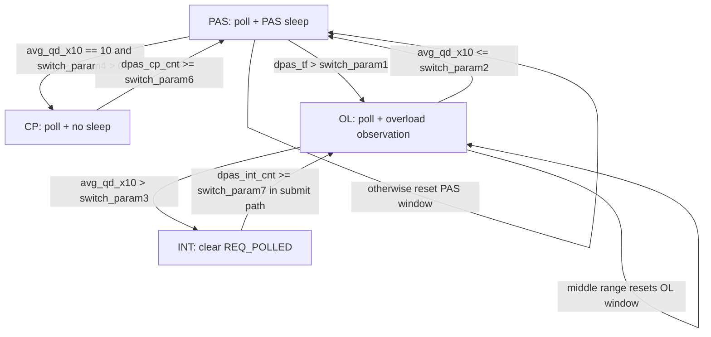

# DPAS 학습 노트 v2 — 4KB random read 코드 경로 중심판

> 이 문서는 기존 `history/DPAS-학습-노트.md`를 유지한 채, 실제 `scripts/micro_4krr` 실험이 커널에서 어떤 함수와 변수를 지나가는지 복구하기 위한 새 학습 노트다.  
> 이번 판은 표를 최소화했다. 대신 호출 흐름, 코드 조각, 변수 타임라인, mode별 필름처럼 읽히는 구조를 사용한다.  
> 기준 소스는 현재 작업트리의 `dpas-kernel/`와 `scripts/micro_4krr/`다.  
> 현재 작업트리의 `blk_mq_poll_bio()`에는 `standalone_cp = !q->pas_enabled && q->poll_nsec < 0` guard가 있으므로, standalone CP는 pre-oneshot poll을 건너뛴다.

---

## 0. 읽는 법

이 노트는 처음부터 끝까지 읽어도 되고, 디버깅 중에는 아래 순서로 건너뛰어도 된다.

```text
실험 조건이 궁금하다
  -> 1장 scripts가 만드는 fio workload

fio 한 건이 kernel에서 어디로 가는지 궁금하다
  -> 2장 4KB random read 한 건의 실제 코드 경로

REQ_POLLED, bi_cookie, bio_poll 관계가 헷갈린다
  -> 3장 제출 시점에서 poll 대상이 정해지는 순간

CP/LHP/PAS/DPAS mode별 차이가 헷갈린다
  -> 5장 mode별 변수 필름

PAS가 어떻게 학습하는지 헷갈린다
  -> 6장 PAS sleep, complete, duration update

최근 CP 회귀와 pre-oneshot poll이 헷갈린다
  -> 8장 회귀 맥락
```

이 문서에서 가장 중요한 문장:

```text
DPAS는 fio가 만든 HIPRI direct read를 submit 시점에서 poll I/O로 둘지 interrupt I/O로 바꾸고,
poll I/O라면 bio_poll() 안에서 CP, LHP, PAS, DPAS 정책에 맞게 sleep, busy poll, 학습, mode switch를 수행한다.
```

---

## 1. scripts가 실제로 만드는 4KB random read workload

### 1.1 가장 중요한 runner: `run_host_dpas_optane.sh`

현재 full DPAS host 실험에서 중심이 되는 파일은 다음이다.

```text
scripts/micro_4krr/run_host_dpas_optane.sh
```

이 스크립트의 기본값:

```text
DPAS_DEVICE_LIST = nvme1n1
DPAS_IO_MODE     = INT,CP,LHP,PAS,DPAS
DPAS_JOB_LIST    = 20,16,8,4,2,1
DPAS_RUNTIME     = 10 seconds
DPAS_REPEATS     = 1
```

fio 명령은 루프 안에서 이렇게 만들어진다.

```bash
FIO_CMD="fio --directory=./test_${device} \
  --filename_format=testfile.\$jobnum \
  --direct=1 \
  --ramp_time=3 \
  --size=100m \
  --bs=4k \
  --ioengine=pvsync2 \
  --iodepth=1 \
  --runtime=${RUNTIME} \
  --numjobs=${job} \
  --time_based \
  --group_reporting \
  --name=run \
  --eta-newline=1 \
  --cpus_allowed=${CPU_ALLOWED_LIST} \
  --cpus_allowed_policy=split \
  --nice=-10 \
  --prioclass=2 \
  --prio=0"

if [ "${rr_rw}" = "RR" ]; then
  FIO_CMD="${FIO_CMD} --readonly --rw=randread"
else
  FIO_CMD="${FIO_CMD} --rw=randwrite"
fi

if [ "${mode}" != "INT" ]; then
  FIO_CMD="${FIO_CMD} --hipri"
fi
```

그래서 RR mode에서 실제 workload는 이렇게 읽으면 된다.

```text
fio
  --direct=1
  --readonly
  --rw=randread
  --bs=4k
  --ioengine=pvsync2
  --iodepth=1
  --numjobs=<job>
  --time_based
  --hipri        # INT가 아닐 때만
```

이 조건이 kernel에 주는 의미:

```text
--direct=1
  -> filesystem page cache를 통과하지 않는 direct I/O

--rw=randread --bs=4k
  -> 4KB read bio가 주로 생성됨
  -> 512B sector 기준 8 sectors
  -> PAS bucket 계산에서는 read bucket 6

--ioengine=pvsync2
  -> sync direct I/O path
  -> 완료 대기 loop가 중요함

--iodepth=1
  -> job 하나당 한 번에 깊게 쌓지 않음

--hipri
  -> kernel 쪽에서는 IOCB_HIPRI 조건을 만들기 위한 fio 옵션
  -> DPAS submit hook이 이 flag를 보고 REQ_POLLED를 유지하거나 지움
```

### 1.2 mode별 sysfs knob 설정

`run_host_dpas_optane.sh`는 mode마다 queue knob를 명시적으로 쓴다. 핵심 흐름은 다음이다.

```text
모든 mode 시작 전:
  reset_queue_knobs(device)
    io_poll_delay = -1
    nomerges = 0
    pas_enabled = 0
    pas_adaptive_enabled = 0
    ehp_enabled = 0
    switch_enabled = 0
```

그 다음 mode별로 달라진다.

```text
INT:
  추가 knob 없음
  fio에도 --hipri 없음
  -> interrupt baseline

CP:
  io_poll = 1
  fio에 --hipri 있음
  io_poll_delay는 reset 값 -1 유지
  pas_enabled = 0
  -> standalone classic polling

LHP:
  io_poll = 1
  io_poll_delay = 0
  pas_enabled = 0
  -> adaptive LHP

PAS:
  io_poll = 1
  io_poll_delay = 0
  pas_enabled = 1
  pas_adaptive_enabled = 1
  switch_enabled = 0
  -> standalone PAS

DPAS:
  io_poll = 1
  io_poll_delay = 0
  pas_enabled = 1
  pas_adaptive_enabled = 1
  logging_enabled = 2
  switch_param1..7 set
  switch_enabled = 1    # 반드시 마지막에 씀. 쓰는 순간 state machine reset
  -> full DPAS mode switching
```

중요한 이유:

```text
fio --hipri alone is not enough.
mode별 sysfs knob가 poll path 내부 분기를 결정한다.

fio option
  --hipri
    -> submit helper에 IOCB_HIPRI 조건 제공

queue knob
  pas_enabled / io_poll_delay / switch_enabled
    -> blk_mq_poll_bio() 안에서 CP, LHP, PAS, DPAS 분기 결정
```

### 1.3 관련 테스트 스크립트가 보장하는 것

`test_optane_pas_cp_lhp_int_script.sh`는 `run_optane_full_dpas_no_ehp.sh`가 최소한 다음 조건을 유지하는지 정적으로 검사한다.

```text
스크립트 안에 있어야 하는 문자열:
  --bs=4k
  --ioengine=pvsync2
  --readonly --rw=randread
  nvme_setup
  reset_queue_knobs
  set_mode_knobs
  io_poll_delay -1
  pas_enabled 0
  pas_adaptive_enabled 0
  ehp_enabled 0
  switch_enabled 0
  io_poll 1

스크립트 안에 있으면 안 되는 것:
  default IO_MODE에 EHP
  default IO_MODE에 DPAS
  실제 실행되는 switch_* echo
```

이 테스트의 의미:

```text
PAS/INT/CP/LHP만 비교하는 스크립트에서는 full DPAS switch를 일부러 끄고,
각 mode가 같은 4KB random read workload에서 순수하게 비교되도록 보호한다.
```

### 1.4 raw block probe와 ext4 file probe

두 probe는 같은 4KB random read를 다른 입구로 보낸다.

```text
ext4_file_precondition_probe.sh
  fio --filename=<file>
  --readonly --rw=randread --bs=4k --direct=1 --ioengine=pvsync2
  --iodepth=1 --numjobs=1 --randrepeat=1 --randseed=<seed>

raw_block_precondition_probe.sh
  fio --filename=<partition>
  --readonly --rw=randread --bs=4k --direct=1 --ioengine=pvsync2
  --iodepth=1 --numjobs=<jobs> --offset=<raw offset> --size=<raw size>
```

차이:

```text
file path
  -> filesystem read_iter
  -> XFS 또는 ext4 direct I/O
  -> iomap direct I/O
  -> bio

raw block path
  -> block device file operation
  -> block/fops.c direct I/O
  -> bio
```

공통점:

```text
둘 다 최종적으로 bio를 만들고,
HIPRI이면 blk_dpas_prepare_bio()를 거쳐 REQ_POLLED 여부를 결정한다.
```

---

## 2. 4KB random read 한 건의 실제 kernel path

아래는 `run_host_dpas_optane.sh`가 XFS mount directory에서 `fio --direct=1 --readonly --rw=randread --bs=4k --ioengine=pvsync2 --iodepth=1 --hipri`를 실행했을 때의 대표 흐름이다.

```text
fio worker thread
  -> pvsync2 read syscall
  -> VFS read_iter
  -> xfs_file_read_iter()
  -> xfs_file_dio_read()
  -> iomap_dio_rw()
  -> __iomap_dio_rw()
  -> iomap_dio_iter()
  -> iomap_dio_bio_iter()
  -> iomap_dio_bio_iter_one()
  -> iomap_dio_submit_bio()
  -> blk_dpas_prepare_bio()
  -> blk_crypto_submit_bio()
  -> blk-mq submit
  -> blk_mq_start_request()
  -> sync DIO wait loop
  -> bio_poll()
  -> blk_mq_poll_bio()
  -> __blk_hctx_poll()
  -> nvme_poll()
```

### 2.1 XFS read path

`xfs_file_read_iter()`는 direct I/O flag를 보면 `xfs_file_dio_read()`로 간다.

```c
if (IS_DAX(inode))
    ret = xfs_file_dax_read(iocb, to);
else if (iocb->ki_flags & IOCB_DIRECT)
    ret = xfs_file_dio_read(iocb, to);
else
    ret = xfs_file_buffered_read(iocb, to);
```

`xfs_file_dio_read()`는 iomap direct I/O로 넘긴다.

```c
ret = iomap_dio_rw(iocb, to, &xfs_read_iomap_ops, dio_ops, dio_flags,
        NULL, 0);
```

변수 관점:

```text
fio --direct=1
  -> iocb->ki_flags has IOCB_DIRECT
  -> xfs_file_read_iter() chooses xfs_file_dio_read()
  -> iomap direct I/O path begins
```

### 2.2 iomap이 bio를 만든다

`__iomap_dio_rw()`는 direct I/O 범위를 순회한다.

```c
struct iomap_iter iomi = {
    .inode = inode,
    .pos = iocb->ki_pos,
    .len = iov_iter_count(iter),
    .flags = IOMAP_DIRECT,
    .private = private,
};
```

`iomap_dio_iter()`는 mapped extent면 `iomap_dio_bio_iter()`로 간다.

```c
case IOMAP_MAPPED:
    return iomap_dio_bio_iter(iter, dio);
```

`iomap_dio_bio_iter_one()`는 bio를 만들고 sector와 completion callback을 채운다.

```c
bio = iomap_dio_alloc_bio(iter, dio, nr_vecs, op);
bio->bi_iter.bi_sector = iomap_sector(&iter->iomap, pos);
bio->bi_write_hint = iter->inode->i_write_hint;
bio->bi_ioprio = dio->iocb->ki_ioprio;
bio->bi_private = dio;
bio->bi_end_io = iomap_dio_bio_end_io;
```

그리고 중요한 guard가 있다.

```c
/* We can only poll for single bio I/Os. */
if (iov_iter_count(dio->submit.iter))
    dio->iocb->ki_flags &= ~IOCB_HIPRI;
```

의미:

```text
polling direct I/O는 single bio I/O에서만 유지된다.
만약 남은 iter가 있어 여러 bio로 쪼개지면 IOCB_HIPRI를 지운다.
```

4KB, `iodepth=1`, direct random read는 보통 single bio가 된다. 이 판단은 workload와 mapping 상태에 따른 것이므로, 코드상 보장되는 것은 "여러 bio가 되면 HIPRI를 지운다"까지다.

### 2.3 iomap submit hook이 DPAS로 들어간다

`iomap_dio_submit_bio()`:

```c
if (iocb->ki_flags & IOCB_HIPRI) {
    if (blk_dpas_prepare_bio(bdev_get_queue(bio->bi_bdev), bio, iocb))
        dio->submit.poll_bio = bio;
}

blk_crypto_submit_bio(bio);
```

이 코드가 DPAS submit hook의 실제 진입점이다.

```text
IOCB_HIPRI present
  -> call blk_dpas_prepare_bio(q, bio, iocb)
    -> if return true
       dio->submit.poll_bio = bio
    -> later sync wait loop can call bio_poll(dio->submit.poll_bio)
```

### 2.4 raw block path도 같은 helper를 쓴다

`block/fops.c` 쪽은 file system이 아니라 block device file에 직접 I/O를 할 때의 입구다.

```c
if (iocb->ki_flags & IOCB_HIPRI &&
    blk_dpas_prepare_bio(bdev_get_queue(bio->bi_bdev), bio, iocb)) {
    submit_bio(bio);
    WRITE_ONCE(iocb->private, bio);
} else {
    submit_bio(bio);
}
```

의미:

```text
file path:
  dio->submit.poll_bio = bio

raw block path:
  iocb->private = bio

둘 다 blk_dpas_prepare_bio()가 REQ_POLLED 여부를 결정한다.
```

---

## 3. 제출 시점: `blk_dpas_prepare_bio()`가 실제로 바꾸는 것

### 3.1 이 함수의 입력과 출력

```text
input:
  q
  bio
  iocb

reads:
  q->switch_enabled
  q->dpas_mode

writes:
  bio->bi_opf의 REQ_POLLED
  iocb->ki_flags의 IOCB_HIPRI
  q->dpas_int_cnt / dpas_cp_cnt / dpas_pas_cnt / dpas_ol_cnt
  q->dpas_mode, q->dpas_ol_cnt, q->dpas_qd_sum, q->dpas_tf  # INT window 만료 시

returns:
  true  -> caller keeps this bio as pollable
  false -> caller does not track this bio for polling
```

### 3.2 full DPAS가 꺼져 있으면

```c
if (!q->switch_enabled) {
    bio_set_polled(bio, iocb);
    return true;
}
```

변수 변화:

```text
bio->bi_opf |= REQ_POLLED
return true
```

의미:

```text
switch_enabled=0이면 DPAS state machine은 끄고,
기존 HIPRI polling 요청을 그대로 살린다.
```

### 3.3 INT mode면

```c
iocb->ki_flags &= ~IOCB_HIPRI;
bio_clear_polled(bio);
q->dpas_int_cnt++;
```

그리고 window가 끝나면:

```c
if (q->dpas_int_cnt >= q->switch_param7) {
    if (q->logging_enabled >= 2)
        q->dpas_int_to_ol++;

    q->dpas_mode = DPAS_MODE_OL;
    q->dpas_ol_cnt = 0;
    q->dpas_qd_sum = 0;
    q->dpas_tf = 0;
}

polled = false;
```

이 흐름을 그림으로 보면:

```text
DPAS_MODE_INT
  -- clears -->
IOCB_HIPRI
  -- clears -->
REQ_POLLED
  -- increments -->
dpas_int_cnt
  -- if enough -->
dpas_mode = OL
```

핵심: INT는 poll path로 들어오지 않는다. 따라서 INT에서 OL로 돌아가는 카운트는 poll path가 아니라 submit path에서 센다.

### 3.4 CP, PAS, OL mode면

```c
case DPAS_MODE_CP:
    bio_set_polled(bio, iocb);
    q->dpas_cp_cnt++;
    break;

case DPAS_MODE_PAS:
    bio_set_polled(bio, iocb);
    q->dpas_pas_cnt++;
    break;

case DPAS_MODE_OL:
    bio_set_polled(bio, iocb);
    q->dpas_ol_cnt++;
    break;
```

그림:

```text
CP / PAS / OL
  -- keeps -->
IOCB_HIPRI
  -- sets -->
REQ_POLLED
  -- increments -->
mode-specific submit counter
  -- enters later -->
bio_poll()
```

### 3.5 `bio_set_polled()`가 하는 일

`include/linux/bio.h`:

```c
static inline void bio_set_polled(struct bio *bio, struct kiocb *kiocb)
{
    bio->bi_opf |= REQ_POLLED;
    if (kiocb->ki_flags & IOCB_NOWAIT)
        bio->bi_opf |= REQ_NOWAIT;
}
```

`bio_clear_polled()`:

```c
static inline void bio_clear_polled(struct bio *bio)
{
    bio->bi_opf &= ~REQ_POLLED;
}
```

이 시점에 결정되는 것:

```text
REQ_POLLED set
  -> blk-mq가 poll hardware context를 선택할 수 있음
  -> completion은 caller가 bio_poll()로 찾아야 함

REQ_POLLED clear
  -> interrupt driven completion path
  -> sync wait loop는 blk_io_schedule() 쪽으로 감
```

---

## 4. `REQ_POLLED`가 hctx 선택과 `bi_cookie`로 이어지는 순간

### 4.1 hctx type 선택

`block/blk-mq.h`의 selector:

```c
static inline enum hctx_type blk_mq_get_hctx_type(blk_opf_t opf)
{
    enum hctx_type type = HCTX_TYPE_DEFAULT;

    if (opf & REQ_POLLED)
        type = HCTX_TYPE_POLL;
    else if ((opf & REQ_OP_MASK) == REQ_OP_READ)
        type = HCTX_TYPE_READ;
    return type;
}
```

그림:

```text
bio->bi_opf has REQ_POLLED
  -- selects -->
HCTX_TYPE_POLL
  -- maps to -->
poll hctx
```

여기서 DPAS가 submit 시점에 `REQ_POLLED`를 지우면, 이 I/O는 poll hctx로 가지 않는다.

### 4.2 request 시작 시 cookie 저장

`blk_mq_start_request()`:

```c
if (rq->bio && rq->bio->bi_opf & REQ_POLLED)
    WRITE_ONCE(rq->bio->bi_cookie, rq->mq_hctx->queue_num);
```

그림:

```text
polled request starts
  -- has -->
rq->mq_hctx
  -- exposes index -->
rq->mq_hctx->queue_num
  -- stores into -->
bio->bi_cookie
```

### 4.3 `bi_cookie`는 request tag가 아니다

잘못된 모델:

```text
bio->bi_cookie
  -- means -->
request tag
```

정확한 모델:

```text
bio->bi_cookie
  -- indexes -->
q->queue_hw_ctx[cookie]
  -- selects -->
which hctx to poll
```

왜 이게 중요한가:

```text
bio_poll(bio)는 request pointer를 받지 않는다.
나중에 bio만 들고 poll 대상 hctx를 찾아야 하므로,
request 시작 시점에 hctx 번호를 bio에 남겨둔다.
```

---

## 5. sync direct I/O wait loop에서 `bio_poll()`이 반복된다

`__iomap_dio_rw()`의 sync wait loop:

```c
for (;;) {
    set_current_state(TASK_UNINTERRUPTIBLE);
    if (!READ_ONCE(dio->submit.waiter))
        break;

    if (dio->submit.poll_bio &&
        (dio->submit.poll_bio->bi_opf & REQ_POLLED))
        bio_poll(dio->submit.poll_bio, NULL, 0);
    else
        blk_io_schedule();
}
__set_current_state(TASK_RUNNING);
```

흐름:

```text
waiter still present
  -- and poll_bio has REQ_POLLED -->
bio_poll()

waiter still present
  -- but no poll_bio or no REQ_POLLED -->
blk_io_schedule()
```

중요한 점:

```text
bio_poll()의 return value가 loop break 조건이 아니다.
loop는 dio->submit.waiter가 NULL이 되는지 본다.
```

그래서 CP hang을 볼 때는 단순히 `bio_poll()`이 0을 반환했다는 사실만으로 부족하다. 실제로는 다음을 구분해야 한다.

```text
1. __blk_hctx_poll() 안에서 계속 도는가?
2. __blk_hctx_poll()에서 빠져나와 bio_poll()을 반복 호출하는가?
3. bio_poll() 초입에서 cookie 때문에 바로 0을 반환하는가?
4. waiter가 NULL로 바뀌지 않는 이유가 completion 미관측인가?
```

---

## 6. `bio_poll()`에서 `blk_mq_poll_bio()`로

`bio_poll()`는 bio에서 cookie와 queue를 꺼낸다.

```c
blk_qc_t cookie = READ_ONCE(bio->bi_cookie);
bdev = READ_ONCE(bio->bi_bdev);
q = bdev_get_queue(bdev);

if (cookie == BLK_QC_T_NONE)
    return 0;

blk_flush_plug(current->plug, false);

if (!percpu_ref_tryget(&q->q_usage_counter))
    return 0;

if (queue_is_mq(q))
    ret = blk_mq_poll_bio(q, bio, cookie, iob, flags);
```

이 그림을 기억하면 된다.

```text
bio_poll(bio)
  -- reads -->
bio->bi_cookie
  -- reads -->
bio->bi_bdev -> request_queue
  -- flushes -->
current plug
  -- enters -->
blk_mq_poll_bio(q, bio, cookie, ...)
```

---

## 7. `blk_mq_poll_bio()` 현재 작업트리 기준

현재 코드의 흐름을 그대로 풀면 다음과 같다.

```text
blk_mq_poll_bio(q, bio, cookie, iob, flags)

1. if !blk_mq_can_poll(q): return 0

2. if cookie == BLK_QC_T_NONE: return 0
   if cookie >= q->nr_hw_queues: return 0

3. hctx = READ_ONCE(q->queue_hw_ctx[cookie])
   if !hctx: return 0

4. standalone_cp = !q->pas_enabled && q->poll_nsec < 0

5. if !standalone_cp:
       pre-oneshot poll
       if sentinel: ret = 0
       if completion, error, sentinel, or caller requested oneshot:
           goto out_complete

6. if q->pas_enabled:
       blk_mq_poll_pas_sleep(q, bio, flags)
   else:
       blk_mq_poll_lhp_sleep(q, bio, flags)

7. main poll:
       ret = __blk_hctx_poll(q, hctx, iob, flags, &poll_count)
       if sentinel: ret = 0

8. out_complete:
       if q->pas_enabled:
           blk_mq_poll_pas_complete(q, bio, ret, poll_count)

9. return ret
```

### 7.1 현재 코드의 `standalone_cp` guard

```text
standalone_cp = !q->pas_enabled && q->poll_nsec < 0
```

의미:

```text
pas_enabled = 0
poll_nsec = -1
  -> standalone classic polling
  -> pre-oneshot poll 생략
```

이 guard는 중요하다. 과거 회귀 분석에서 문제였던 것은 LHP/PAS 방어용 pre-oneshot poll이 CP에도 들어간 점이었다. 현재 작업트리는 standalone CP에 대해서 그 pre-oneshot을 건너뛰도록 되어 있다.

### 7.2 CP, LHP, PAS, DPAS가 여기서 갈라지는 모습

```text
standalone CP
  pas_enabled=0, poll_nsec=-1
  -> skip pre-oneshot
  -> lhp_sleep() called but returns immediately
  -> __blk_hctx_poll() busy poll

LHP
  pas_enabled=0, poll_nsec=0 or positive
  -> pre-oneshot poll
  -> lhp_sleep() sleeps
  -> __blk_hctx_poll()

PAS
  pas_enabled=1, switch_enabled=0
  -> pre-oneshot poll
  -> pas_sleep() records qd and bio->bi_pas
  -> __blk_hctx_poll()
  -> pas_complete() records result

DPAS
  pas_enabled=1, switch_enabled=1
  -> same PAS machinery
  -> plus dpas_mode controls submit and switch decisions
```

---

## 8. mode별 변수 필름

여기부터는 표 대신 한 I/O가 지나갈 때 변수가 어떻게 바뀌는지 필름처럼 본다.

### 8.1 INT 필름

설정:

```text
mode = INT
fio --hipri 없음
reset knobs only
```

흐름:

```text
fio read
  -> no --hipri
  -> IOCB_HIPRI not set
  -> iomap_dio_submit_bio() does not call blk_dpas_prepare_bio()
  -> dio->submit.poll_bio not set
  -> bio submitted as normal read
  -> wait loop uses blk_io_schedule()
  -> interrupt completion wakes task
```

full DPAS가 `dpas_mode=INT`인 경우에는 `--hipri`가 있어도 submit helper가 지운다.

```text
IOCB_HIPRI set
  -> blk_dpas_prepare_bio()
  -> clear IOCB_HIPRI
  -> clear REQ_POLLED
  -> dpas_int_cnt++
  -> maybe dpas_mode = OL
  -> return false
  -> no bio_poll tracking
```

INT에서 변하지 않는 것:

```text
bio->bi_cookie is not set for poll
bio->bi_pas is not active
PAS stats do not update
```

### 8.2 standalone CP 필름

설정:

```text
mode = CP
fio has --hipri
io_poll = 1
io_poll_delay = -1
pas_enabled = 0
switch_enabled = 0
```

흐름:

```text
fio --hipri
  -> IOCB_HIPRI
  -> blk_dpas_prepare_bio()
  -> bio_set_polled()
  -> REQ_POLLED set
  -> return true
  -> dio->submit.poll_bio = bio

blk-mq submit
  -> REQ_POLLED selects HCTX_TYPE_POLL
  -> blk_mq_start_request()
  -> bio->bi_cookie = hctx->queue_num

wait loop
  -> bio_poll()
  -> blk_mq_poll_bio()
  -> standalone_cp = true
  -> skip pre-oneshot
  -> blk_mq_poll_lhp_sleep()
       poll_nsec < 0, return
  -> __blk_hctx_poll()
       busy poll until completion or need_resched
```

CP에서 중요한 변수:

```text
REQ_POLLED        set
bi_cookie         hctx number
BIO_LHP_POLL_SLEPT  not set
bio->bi_pas.active  not set
dpas_qd_sum       not touched
PAS stats         not touched
```

### 8.3 LHP 필름

설정:

```text
mode = LHP
fio has --hipri
io_poll = 1
io_poll_delay = 0
pas_enabled = 0
switch_enabled = 0
```

흐름:

```text
submit side
  -> same as CP until REQ_POLLED and bi_cookie

poll side
  -> standalone_cp = false
  -> pre-oneshot poll tries one immediate completion check
  -> if not complete:
       blk_mq_poll_lhp_sleep()
         poll_nsec == 0
         nsecs = blk_mq_poll_lhp_nsecs(q, bio)
           bucket = blk_mq_poll_pas_bucket(bio)
           if poll_stat has samples:
              nsecs = mean / 2
           else:
              nsecs = 0
         blk_mq_poll_sleep_nsec(bio, nsecs)
           set BIO_LHP_POLL_SLEPT if nsecs > 0
  -> __blk_hctx_poll()
```

LHP에서 중요한 점:

```text
LHP sleeps, but it does not update PAS stats.
LHP may set BIO_LHP_POLL_SLEPT.
LHP does not set bio->bi_pas.active.
```

### 8.4 PAS 필름

설정:

```text
mode = PAS
fio has --hipri
io_poll = 1
io_poll_delay = 0
pas_enabled = 1
pas_adaptive_enabled = 1
switch_enabled = 0
```

흐름:

```text
submit side
  -> bio_set_polled()
  -> dpas_pas_cnt++ if switch_enabled path is active; standalone switch off이면 full switch counter 의미는 없음
  -> REQ_POLLED set
  -> bi_cookie stored later

poll side
  -> pre-oneshot poll
  -> if not complete:
       blk_mq_poll_pas_sleep()
         bucket = blk_mq_poll_pas_bucket(bio)
         cpu = get_cpu()
         stat = per_cpu_ptr(q->pas_stat, cpu)
         update previous duration if update_req is set
         nsecs = stat[bucket].dur
         dur_cnt = stat[bucket].dur_cnt
         sleep nsecs
         bio->bi_pas = { active, cpu, bucket, dur_cnt, dur }
  -> __blk_hctx_poll()
  -> blk_mq_poll_pas_complete()
       if ret > 0 and poll_count != UINT_MAX:
          compare ctx dur_cnt with stat dur_cnt
          write sr_pnlt, sr_last, update_req
          clear bio->bi_pas.active
```

PAS에서 가장 중요한 변수 그림:

```text
complete result
  -- writes -->
sr_pnlt, sr_last, update_req
  -- consumed by next sleep -->
blk_mq_poll_pas_update_duration()
  -- changes -->
dur, adj, up, dn, dur_cnt
```

### 8.5 full DPAS 필름

설정:

```text
mode = DPAS in script
fio has --hipri
io_poll = 1
io_poll_delay = 0
pas_enabled = 1
pas_adaptive_enabled = 1
logging_enabled = 2
switch_param1..7 set
switch_enabled = 1 written last
```

`switch_enabled=1`을 쓰는 순간:

```text
dpas_mode = PAS
all mode counters = 0
dpas_qd = 0
dpas_qd_sum = 0
dpas_tf = 0
debug transition counters = 0
avg_qd records = -1
```

그 뒤 I/O는 mode에 따라 submit helper에서 갈라진다.

```text
dpas_mode = PAS
  -> submit keeps REQ_POLLED
  -> dpas_pas_cnt++
  -> poll path does PAS sleep and PAS complete
  -> window end may go CP or OL or stay PAS

dpas_mode = CP
  -> submit keeps REQ_POLLED
  -> dpas_cp_cnt++
  -> poll path skips PAS sleep inside blk_mq_poll_pas_sleep()
  -> window end returns to PAS

dpas_mode = OL
  -> submit keeps REQ_POLLED
  -> dpas_ol_cnt++
  -> poll path uses PAS machinery to observe QD
  -> window end may go PAS or INT or stay OL

dpas_mode = INT
  -> submit clears IOCB_HIPRI and REQ_POLLED
  -> dpas_int_cnt++
  -> no poll path
  -> submit path returns to OL after switch_param7 I/Os
```

---

## 9. 표 없이 보는 PAS 내부 흐름

### 9.1 4KB random read는 bucket 6

PAS bucket 계산:

```c
ddir = op_is_write(bio_op(bio)) ? 1 : 0;
bucket = ddir + 2 * ilog2(sectors);
```

4KB read:

```text
4KB = 4096 bytes
sector size unit in bio_sectors = 512 bytes
sectors = 4096 / 512 = 8
ilog2(8) = 3
read ddir = 0
bucket = 0 + 2 * 3 = 6
```

그래서 `scripts/micro_4krr`의 대표 workload는 PAS read bucket 6을 주로 건드린다.

### 9.2 sleep 전 snapshot

`blk_mq_poll_pas_sleep()`에서 일어나는 일:

```text
bucket = 6 for 4KB read
cpu = current cpu
stat = q->pas_stat[cpu][bucket]

if switch_enabled:
  dpas_qd++
  dpas_qd_sum += dpas_qd

if stat->update_req:
  update_duration(stat)

nsecs = stat->dur
dur_cnt = stat->dur_cnt
sleep(nsecs)

bio->bi_pas.active = true
bio->bi_pas.cpu = cpu
bio->bi_pas.bucket = bucket
bio->bi_pas.dur_cnt = dur_cnt
bio->bi_pas.dur = nsecs

if switch_enabled:
  dpas_qd--
```

여기서 `dpas_qd`와 `dpas_qd_sum`의 차이:

```text
dpas_qd
  -> 현재 sleep 구간 안에 들어온 poll waiter 수
  -> sleep 끝나면 감소

dpas_qd_sum
  -> window 평균 계산을 위한 누적 표본
  -> sleep 끝나도 감소하지 않음
  -> mode switch 때 reset
```

### 9.3 completion을 못 봤을 때 context를 유지하는 이유

현재 complete 함수는 이렇게 한다.

```c
if (ret <= 0 || poll_count == UINT_MAX)
    return;
```

여기서 `ctx->active`를 지우지 않는다.

이유:

```text
첫 bio_poll()
  -> PAS sleep함
  -> bio->bi_pas.active = true
  -> __blk_hctx_poll()에서 completion 못 봄
  -> ret = 0
  -> complete는 return, ctx 유지

다음 bio_poll()
  -> BIO_LHP_POLL_SLEPT 때문에 다시 sleep하지 않음
  -> __blk_hctx_poll()에서 completion 찾을 수 있음
  -> preserved bio->bi_pas로 어느 bucket/dur_cnt 결과인지 알 수 있음
```

이것이 `9193bdd03`에서 `bio->bi_pas`가 필요했던 이유다.

### 9.4 completion을 봤을 때 result 저장

```text
ret > 0
poll_count != UINT_MAX
same cpu as sleep cpu
same dur_cnt generation
not already checked
```

위 조건을 통과하면:

```text
stat->dur_cnt_checked = stat->dur_cnt
stat->sr_pnlt = old stat->sr_last
stat->sr_last = poll_count <= poll_threshold ? 0 : 1
stat->update_req = 1
bio->bi_pas.active = false
```

`sr_last`의 의미:

```text
poll_count <= poll_threshold
  -> 깬 뒤 거의 바로 완료를 봄
  -> 너무 오래 잤을 수 있음
  -> oversleep
  -> sr_last = 0

poll_count > poll_threshold
  -> 깬 뒤에도 많이 poll함
  -> 너무 일찍 깼을 수 있음
  -> undersleep
  -> sr_last = 1
```

### 9.5 다음 sleep에서 duration 업데이트

`update_req=1`이면 다음 sleep 진입 때 `blk_mq_poll_pas_update_duration()`이 소비한다.

```text
previous result + current result
  -> cur_case
  -> adj changes
  -> dur = dur * adj / div
  -> if dur < d_init:
       dur = d_init
       dpas_tf++ if switch_enabled
  -> dur_cnt++
```

case를 말로 풀면:

```text
oversleep followed by oversleep
  -> still sleeping too much
  -> decrease adj by dn

oversleep followed by undersleep
  -> direction changed
  -> reset around div + up

undersleep followed by oversleep
  -> direction changed
  -> reset around div - dn

undersleep followed by undersleep
  -> still waking too early
  -> increase adj by up
```

---

## 10. mode switch는 언제 일어나는가

full DPAS에서 mode switch는 두 곳에서 일어난다.

```text
INT -> OL
  -> submit path
  -> because INT does not enter poll path

CP/PAS/OL decisions
  -> poll path
  -> blk_dpas_maybe_switch_mode()
```

### 10.1 mode graph



### 10.2 평균 QD는 10배 스케일

```text
PAS window:
  avg_qd_x10 = dpas_qd_sum * 10 / dpas_pas_cnt

OL window:
  avg_qd_x10 = dpas_qd_sum * 10 / dpas_ol_cnt
```

예시:

```text
avg_qd_x10 = 10
  -> average QD = 1.0

avg_qd_x10 = 17
  -> average QD = 1.7

avg_qd_x10 = 39
  -> average QD = 3.9
```

### 10.3 `dpas_switch_stats` 읽기

`run_host_dpas_optane.sh`는 mode가 `DPAS`일 때 run 직후 다음 파일을 저장한다.

```text
./fio_data/<device>/<RR>/<job>T/DPAS/dpas_switch_stats_<repeat>.txt
```

출력 의미:

```text
pas_eval
  -> PAS window 평가 횟수

pas_to_cp
  -> PAS가 평균 QD 1이라고 보고 CP로 간 횟수

pas_to_ol
  -> PAS duration이 하한에 자주 걸려 OL로 간 횟수

pas_stay_not_qd1
  -> PAS 평가는 했지만 CP/OL 조건이 아니라 PAS에 남은 횟수

ol_eval
  -> OL window 평가 횟수

ol_to_pas
  -> OL 평균 QD가 낮아 PAS로 간 횟수

ol_to_int
  -> OL 평균 QD가 높아 INT로 간 횟수

ol_stay_between
  -> OL 평균 QD가 PAS/INT 경계 사이에 있어 OL에 남은 횟수

cp_to_pas
  -> CP 평가 window가 끝나 PAS로 돌아간 횟수

int_to_ol
  -> INT 평가 window가 끝나 OL로 돌아간 횟수

last_avg_qd_x10, min_avg_qd_x10, max_avg_qd_x10
  -> 평균 QD에 10을 곱한 값
```

---

## 11. NVMe driver까지 내려가는 poll

`blk_mq_poll_bio()`의 main poll은 `__blk_hctx_poll()`로 들어간다.

```text
__blk_hctx_poll(q, hctx, iob, flags, &poll_count)
  -> q->mq_ops->poll(hctx, iob)
```

NVMe PCI driver는 mq ops에 `.poll = nvme_poll`을 넣는다.

```c
static const struct blk_mq_ops nvme_mq_ops = {
    ...
    .poll = nvme_poll,
};
```

`nvme_poll()`:

```c
static int nvme_poll(struct blk_mq_hw_ctx *hctx, struct io_comp_batch *iob)
{
    struct nvme_queue *nvmeq = hctx->driver_data;
    bool found;

    if (!test_bit(NVMEQ_POLLED, &nvmeq->flags) ||
        !nvme_cqe_pending(nvmeq))
        return 0;

    spin_lock(&nvmeq->cq_poll_lock);
    found = nvme_poll_cq(nvmeq, iob);
    spin_unlock(&nvmeq->cq_poll_lock);

    return found;
}
```

그림:

```text
blk_mq_poll_bio()
  -> __blk_hctx_poll()
    -> q->mq_ops->poll(hctx)
      -> nvme_poll(hctx)
        -> check NVMEQ_POLLED
        -> check CQE pending
        -> nvme_poll_cq()
        -> return found
```

`ret > 0`이면 completion을 찾은 것이다. `ret == 0`이면 이번 poll에서 completion을 찾지 못한 것이다.

---

## 12. `__blk_hctx_poll()`의 sentinel을 절대 completion으로 읽지 말기

핵심 코드:

```c
if (stateful_wait) {
    if (signal_pending_state(state, current) ||
        task_is_running(current)) {
        if (poll_countp)
            *poll_countp = UINT_MAX;
        __set_current_state(TASK_RUNNING);
        return 1;
    }
} else if (task_sigpending(current)) {
    if (poll_countp)
        *poll_countp = UINT_MAX;
    return 1;
}
```

의미:

```text
ret = 1 and poll_count = UINT_MAX
  does not mean "one completion".

It means:
  signal or wakeup escape was observed.
```

현재 `blk_mq_poll_bio()`는 이 sentinel을 본 뒤 다음처럼 바꾼다.

```text
if poll_count == UINT_MAX and ret == 1:
    ret = 0
```

이유:

```text
PAS complete path는 ret > 0을 completion처럼 볼 수 있다.
그래서 sentinel ret=1을 그대로 두면 PAS 통계에 가짜 completion이 섞일 수 있다.
```

주의:

```text
이 변환은 completion 통계 보호에는 맞지만,
wakeup escape 관측 신호를 ret 값에서는 잃게 만든다.
따라서 CP hang을 볼 때는 ret만 보지 말고 poll_count == UINT_MAX 자체를 찍어야 한다.
```

---

## 13. 최근 CP 회귀 맥락

### 13.1 `9193bdd03`: `bio->bi_pas` 보존

문제:

```text
PAS sleep metadata가 stack local이면
  sleep한 호출에서 completion을 못 찾고 ret=0으로 빠진 뒤
  다음 bio_poll()에서 completion을 찾아도
  어느 CPU, 어느 bucket, 어느 dur_cnt로 잤는지 알 수 없음
```

해결:

```text
bio->bi_pas.active
bio->bi_pas.cpu
bio->bi_pas.bucket
bio->bi_pas.dur_cnt
bio->bi_pas.dur
```

이 값을 bio에 저장해서 여러 `bio_poll()` 호출 사이에 유지한다.

### 13.2 `bd3df84d9`: sleep 전 pre-oneshot poll

의도:

```text
LHP/PAS가 sleep하기 전에
  이미 완료된 I/O를 먼저 잡고
  이상 cookie를 방어하고
  wakeup sentinel을 PAS completion 통계로 넣지 않기
```

추가된 동작:

```text
cookie guard
pre-oneshot __blk_hctx_poll(... BLK_POLL_ONESHOT ...)
poll_count == UINT_MAX && ret == 1 -> ret = 0
poll_count == UINT_MAX이면 out_complete
```

문제 후보였던 지점:

```text
이 pre-oneshot이 CP/LHP/PAS 공통 앞단에 있으면
standalone CP도 LHP/PAS 방어 로직을 타게 된다.
```

### 13.3 현재 작업트리의 차이

현재 `blk_mq_poll_bio()`는 `standalone_cp`를 계산한다.

```text
standalone_cp = !q->pas_enabled && q->poll_nsec < 0
```

그리고 standalone CP가 아니면 pre-oneshot poll을 한다.

```text
if (!standalone_cp) {
    pre-oneshot poll
}
```

따라서 현재 작업트리 기준:

```text
pas_enabled=0, io_poll_delay=-1
  -> standalone CP
  -> pre-oneshot 생략
```

그래도 남는 확인:

```text
main poll 뒤 sentinel 변환은 여전히 있다.
막힌 fio가 있을 때는 ret=0만 보지 말고 poll_count==UINT_MAX 반복 여부를 찍어야 한다.
```

---

## 14. 실제 디버깅할 때 보는 순서

### 14.1 스크립트 쪽 확인

```text
1. 어떤 runner인가?
   run_host_dpas_optane.sh
   run_optane_full_dpas_no_ehp.sh
   host_repeat_optane.sh
   ext4_file_precondition_probe.sh
   raw_block_precondition_probe.sh

2. fio가 --hipri를 받는 mode인가?
   INT가 아니면 대부분 --hipri 있음

3. fio 조건이 같은가?
   --direct=1
   --readonly --rw=randread
   --bs=4k
   --ioengine=pvsync2
   --iodepth=1
   --numjobs=<jobs>

4. mode knob가 맞는가?
   CP  : io_poll=1, io_poll_delay=-1, pas_enabled=0
   LHP : io_poll=1, io_poll_delay=0,  pas_enabled=0
   PAS : io_poll=1, io_poll_delay=0,  pas_enabled=1, pas_adaptive_enabled=1
   DPAS: PAS knobs plus switch_enabled=1
```

### 14.2 kernel path 확인

```text
file path인가?
  -> xfs_file_read_iter()
  -> xfs_file_dio_read()
  -> iomap_dio_rw()
  -> iomap_dio_submit_bio()

raw block path인가?
  -> block/fops.c direct I/O path
  -> blk_dpas_prepare_bio()

둘 다 이후:
  -> bio_set_polled or bio_clear_polled
  -> blk_mq_start_request()
  -> bio->bi_cookie
  -> bio_poll()
  -> blk_mq_poll_bio()
```

### 14.3 hang이면 먼저 나누기

```text
case A: fio task stack이 __blk_hctx_poll() 안
  -> driver poll loop 또는 need_resched 관련
  -> poll_count 증가, nvme_poll ret 확인

case B: fio task가 bio_poll() 반복으로 밖에 있음
  -> __blk_hctx_poll()이 0으로 자주 빠지는지 확인
  -> waiter가 왜 NULL이 안 되는지 확인

case C: blk_mq_poll_bio() 초입 return 0 반복
  -> bi_cookie == BLK_QC_T_NONE?
  -> cookie >= nr_hw_queues?
  -> hctx NULL?

case D: poll_count == UINT_MAX 반복
  -> wakeup/signal sentinel 반복
  -> ret=0으로 변환되므로 ret만 보면 안 됨
```

---

## 15. 꼭 기억할 짧은 문장들

```text
IOCB_HIPRI는 사용자 요청이고, REQ_POLLED는 kernel routing 결정이다.
```

```text
INT mode는 poll path에서 처리하면 늦다. submit path에서 REQ_POLLED를 지워야 한다.
```

```text
bi_cookie는 request tag가 아니다. q->queue_hw_ctx[cookie]로 들어가는 hctx selector다.
```

```text
4KB read는 8 sectors이고, PAS bucket은 6이다.
```

```text
bio->bi_pas는 ret=0으로 첫 poll이 끝난 뒤에도 PAS 결과를 잃지 않기 위한 저장소다.
```

```text
dpas_qd는 현재 sleep 구간 임시값이고, dpas_qd_sum은 mode window 평균을 위한 누적값이다.
```

```text
poll_count == UINT_MAX는 많이 돌았다는 뜻이 아니라 signal/wakeup sentinel이다.
```

```text
현재 작업트리의 standalone CP는 pre-oneshot poll을 건너뛴다.
```

---

## 16. 코드 근거 위치

```text
scripts/micro_4krr/run_host_dpas_optane.sh
  -> full DPAS host runner
  -> fio 4KB random read command
  -> mode별 sysfs knob 설정
  -> DPAS mode의 dpas_switch_stats 저장

scripts/micro_4krr/run.sh
  -> 원본 style micro_4krr runner
  -> fio --bs=4k --ioengine=pvsync2 --rw=randread --hipri 조건

scripts/micro_4krr/run_optane_full_dpas_no_ehp.sh
  -> PAS/INT/CP/LHP-only Optane runner
  -> full DPAS switch 비활성 비교용

scripts/micro_4krr/test_optane_pas_cp_lhp_int_script.sh
  -> 4KB randread, pvsync2, mode knob reset을 정적으로 확인

scripts/micro_4krr/host_repeat_optane.sh
  -> warmup 포함 host repeat runner

scripts/micro_4krr/ext4_file_precondition_probe.sh
  -> file path 4KB random read probe

scripts/micro_4krr/raw_block_precondition_probe.sh
  -> raw block path 4KB random read probe

dpas-kernel/fs/xfs/xfs_file.c
  -> xfs_file_read_iter()
  -> xfs_file_dio_read()

dpas-kernel/fs/iomap/direct-io.c
  -> iomap_dio_rw()
  -> __iomap_dio_rw()
  -> iomap_dio_bio_iter_one()
  -> iomap_dio_submit_bio()
  -> sync direct I/O wait loop

dpas-kernel/block/fops.c
  -> raw block direct I/O submit hook

dpas-kernel/block/blk-core.c
  -> blk_dpas_prepare_bio()
  -> bio_poll()

dpas-kernel/include/linux/bio.h
  -> bio_set_polled()
  -> bio_clear_polled()

dpas-kernel/block/blk-mq.h
  -> blk_mq_get_hctx_type()
  -> REQ_POLLED selects HCTX_TYPE_POLL

dpas-kernel/block/blk-mq.c
  -> blk_mq_start_request()
  -> __blk_hctx_poll()
  -> blk_mq_poll_lhp_sleep()
  -> blk_mq_poll_pas_bucket()
  -> blk_mq_poll_pas_sleep()
  -> blk_mq_poll_pas_complete()
  -> blk_mq_poll_pas_update_duration()
  -> blk_dpas_maybe_switch_mode()
  -> blk_mq_poll_bio()

dpas-kernel/block/blk-sysfs.c
  -> queue knob show/store
  -> switch_enabled reset
  -> dpas_switch_stats output

dpas-kernel/drivers/nvme/host/pci.c
  -> nvme_poll()
  -> nvme_mq_ops.poll = nvme_poll
```

---

작성일: 2026-07-01  
문서 상태: 기존 `DPAS-학습-노트.md` 보존. `DPAS-학습-노트-v2.md`는 실제 4KB random read scripts와 kernel call path 중심으로 재작성한 판.
