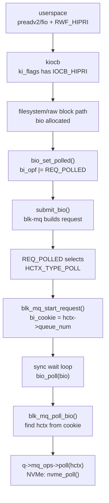

# DPAS 학습 노트

> 이 문서는 `history/` 폴더의 일일 기록과 실제 `dpas-kernel/` 소스를 종합해서, DPAS 전체 맥락과 핵심 개념을 한 눈에 복기할 수 있도록 정리한 것이다.
> 대상 독자: 나 자신. 다시 DPAS 작업을 이어할 때 "지금까지 뭘 했고 무엇이 핵심인가"를 빠르게 복구하기 위함.
>
> 코드 인용은 모두 현재 `dpas-kernel/` 트리에서 가져왔고, `파일::함수` 형태로 출처를 표기한다.
> 외부 배경은 Linux kernel 공식 문서의 blk-mq 설명과 queue sysfs 설명을 참고했다. 실제 판단 기준은 이 checkout의 `dpas-kernel/` 코드다.

---

## 0. 30초 요약 (먼저 보는 그림)

```
 user: preadv2(fd, ..., RWF_HIPRI)   또는   fio --hipri=1
        │  kiocb.ki_flags |= IOCB_HIPRI
        ▼
 ┌──────────────────────────────────────────────────────────┐
 │ SUBMIT PATH                                                │
 │   fs/iomap/direct-io.c   (ext4/xfs file DIO)               │
 │   block/fops.c           (raw /dev/nvme0n1)                │
 │     └─▶ blk_dpas_prepare_bio()  ◀── ★DPAS submit 훅★       │
 │           현재 mode를 보고 REQ_POLLED를 set / clear         │
 └──────────────────────────────────────────────────────────┘
        │  submit_bio()
        ▼
 ┌──────────────────────────────────────────────────────────┐
 │ blk-mq:  bio ─▶ request                                    │
 │   blk_mq_start_request(): bio->bi_cookie = hctx->queue_num │
 └──────────────────────────────────────────────────────────┘
        │  (sync DIO wait loop가 bio_poll() 반복 호출)
        ▼
 ┌──────────────────────────────────────────────────────────┐
 │ POLL PATH:  blk_mq_poll_bio()   ◀── ★DPAS poll 훅★         │
 │   1) sleep  : PAS bucket-sleep / LHP sleep / CP no-sleep   │
 │   2) poll   : nvme_poll()                                  │
 │   3) complete: over/under 판정 + blk_dpas_maybe_switch_mode│
 └──────────────────────────────────────────────────────────┘
        │  q->mq_ops->poll(hctx)
        ▼
 ┌──────────────────────────────────────────────────────────┐
 │ driver: drivers/nvme/host/pci.c::nvme_poll()               │
 │   CQ를 직접 긁어서 완료를 찾는다 (인터럽트 안 기다림)        │
 └──────────────────────────────────────────────────────────┘
```

> 핵심 한 줄: **"HIPRI I/O가 들어오면 현재 mode(INT/CP/PAS/OL)에 맞춰 REQ_POLLED를 켜거나 끄고(submit 훅), polling이면 poll 직전에 적절히 자서 CPU를 아끼고(poll 훅), 관찰 결과로 mode를 자동 전환한다(switch)."**

### 0.1 먼저 구분할 것: 원래 커널 path와 DPAS가 비튼 path

DPAS를 이해할 때 가장 먼저 분리해야 할 것은 **원래 Linux block polling path**와 **DPAS가 새로 끼워 넣은 판단 지점**이다.

원래 path의 큰 구조는 이렇다. Linux blk-mq 문서는 block layer가 `bio`를 받아 `request`를 만들고, hardware context(`hctx`)를 통해 driver와 이어진다고 설명한다. `HCTX_TYPE_POLL`은 polled I/O용 hardware queue type이다.



DPAS는 이 path를 갈아엎지 않았다. 대신 **두 군데를 비틀었다.**

```text
원래 path:
  HIPRI 요청
    -- sets -->
  REQ_POLLED
    -- selects -->
  poll hctx
    -- waits by -->
  busy polling or kernel hybrid polling

DPAS path:
  HIPRI 요청
    -- asks policy -->
  blk_dpas_prepare_bio(q, bio, iocb)
    -- set/clear -->
  REQ_POLLED
    -- if polled, enters -->
  blk_mq_poll_bio(q, bio, cookie, ...)
    -- sleeps/records/switches around -->
  driver poll callback
```

이 그림에서 봐야 할 것: `REQ_POLLED`는 단순한 플래그가 아니라 **나중에 poll queue와 poll wait loop를 타게 하는 제출 시점의 결정**이다. 그래서 DPAS의 INT 모드는 poll path에 들어온 뒤에 처리하면 늦고, submit path에서 `IOCB_HIPRI`와 `REQ_POLLED`를 지워야 한다.

### 0.2 한 I/O가 지나갈 때 변수는 이렇게 바뀐다

아래 흐름은 `pas_enabled=1`, `switch_enabled=1`, sync direct I/O + HIPRI를 기준으로 한 변수 변화 지도다.

```text
[0. switch 켬]
queue_switch_enabled_store()
  -- resets -->
switch_enabled = 1
dpas_mode      = PAS
dpas_*_cnt     = 0
dpas_qd        = 0
dpas_qd_sum    = 0
dpas_tf        = 0

이 reset은 새 측정 window를 PAS에서 깨끗하게 시작하기 위한 것이다.

[1. HIPRI bio 제출]
iomap_dio_submit_bio() 또는 __blkdev_direct_IO_async()
  -- sees -->
iocb->ki_flags & IOCB_HIPRI
  -- calls -->
blk_dpas_prepare_bio(q, bio, iocb)

여기서 DPAS는 "사용자가 HIPRI를 요청했더라도 지금 mode에서 정말 polling으로 보낼 것인가"를 결정한다.

[2. submit helper의 세 갈래]
switch_enabled == 0
  -- preserves -->
bio->bi_opf |= REQ_POLLED

dpas_mode == INT
  -- clears -->
iocb->ki_flags &= ~IOCB_HIPRI
bio->bi_opf    &= ~REQ_POLLED
dpas_int_cnt++

dpas_mode == CP/PAS/OL
  -- sets -->
bio->bi_opf |= REQ_POLLED
dpas_cp_cnt 또는 dpas_pas_cnt 또는 dpas_ol_cnt++

INT만 polling 흔적을 지운다. INT I/O는 poll path를 타면 안 되기 때문이다.

[3. request 시작]
blk_mq_start_request()
  -- if REQ_POLLED -->
bio->bi_cookie = rq->mq_hctx->queue_num

이 값은 나중에 bio_poll()이 어느 hctx를 poll해야 하는지 알려주는 selector다.

[4. sync wait]
__iomap_dio_rw()
  -- if poll_bio && REQ_POLLED -->
bio_poll(bio)
  -- else -->
blk_io_schedule()

polled I/O는 caller가 직접 완료를 찾아야 하므로 bio_poll() 호출이 실제 완료 진행의 핵심이다.

[5. PAS sleep 진입]
blk_mq_poll_pas_sleep()
  -- samples -->
dpas_qd++
dpas_qd_sum += dpas_qd
ctx = { cpu, bucket, dur_cnt, dur }

ctx는 complete 단계에서 "내가 잤던 그 duration 세대의 결과가 맞는가"를 확인하기 위한 snapshot이다.

[6. driver poll]
__blk_hctx_poll()
  -- calls -->
nvme_poll()
  -- returns -->
ret, poll_count

poll_count는 깬 뒤 몇 번 더 돌았는지 기록한다. 이 값이 oversleep/undersleep 판정으로 바뀐다.

[7. PAS complete]
blk_mq_poll_pas_complete()
  -- records -->
sr_pnlt = old sr_last
sr_last = 0 또는 1
update_req = 1

결과는 즉시 dur에 반영되지 않는다. 다음 sleep 진입 때 update_duration()이 정책을 갱신한다.

[8. 다음 sleep]
blk_mq_poll_pas_update_duration()
  -- updates -->
adj
dur
dur_cnt++
dpas_tf++  (dur이 d_init 하한에 clamp될 때)

oversleep이면 dur을 줄이고, undersleep이면 dur을 늘린다. d_init 바닥에 자주 걸리면 PAS가 힘든 상황이라는 신호로 dpas_tf를 올린다.
```

`bio->bi_cookie`는 request tag가 아니다. 이 노트에서 계속 강조하는 이유는 `bio_poll()`이 나중에 `request *`를 받지 않고 `bio`만 받기 때문이다. 따라서 `bi_cookie`는 request slot 번호가 아니라 `q->queue_hw_ctx[cookie]`로 들어가기 위한 **poll 대상 hctx selector**로 이해해야 한다.

### 0.3 수정 이유를 흐름으로 다시 보면

**첫 번째 수정: sync DIO HIPRI wait loop를 복구했다.** DPAS 실험은 `pvsync2 + direct=1 + hipri=1`이 실제로 `bio_poll()`을 호출해야 의미가 있다. 최신 upstream 흐름에서는 sync DIO polling 경로가 약해져 있었기 때문에, `__iomap_dio_rw()`가 `dio->submit.poll_bio`를 보고 `bio_poll()`을 반복 호출하도록 되살렸다.

**두 번째 수정: `blk_dpas_prepare_bio()`를 submit-time gate로 추가했다.** `REQ_POLLED`는 submit 시점에 poll queue 선택에 영향을 준다. 따라서 INT mode를 poll 단계에서 처리하면 이미 늦다. helper는 INT일 때 `IOCB_HIPRI`와 `REQ_POLLED`를 지우고, CP/PAS/OL일 때만 polled bio로 보낸다.

**세 번째 수정: submit hook을 한 함수로 모았다.** 5.18식 경로별 hook은 filesystem DIO와 raw blockdev 중 하나를 놓치기 쉽다. 현재 구조에서는 `iomap`과 `block/fops`가 모두 `blk_dpas_prepare_bio()`를 부르므로, mode 판단이 한 곳에 모인다.

**네 번째 수정: `blk_mq_poll_bio()`를 bio-aware poll path로 추가했다.** 7.1의 `bio_poll()` 경로에서는 `bio`를 보고 bucket을 계산해야 하고, 같은 bio의 재-poll에서 중복 sleep을 막아야 하며, `bi_cookie`로 hctx를 찾아야 한다. 그래서 poll path가 `bio`를 알고 PAS/LHP sleep을 적용한 뒤 driver poll로 내려가도록 만들었다.

**다섯 번째 수정: DPAS 상태를 `request_queue`에 모았다.** submit path와 poll path가 같은 `dpas_mode`, counter, QD window를 봐야 한다. 그래서 `q->dpas_mode`, `q->dpas_*_cnt`, `q->dpas_qd_sum`, `q->dpas_tf`를 queue level에 두고 `dpas_lock`으로 보호한다.

**여섯 번째 수정: `INT -> OL`만 submit path에서 처리한다.** INT I/O는 `REQ_POLLED`가 제거되어 poll path를 타지 않는다. 그래서 `dpas_int_cnt >= switch_param7`이 되면 submit helper가 직접 `dpas_mode=OL`로 되돌린다.

### 0.4 외부 배경 자료

- Linux blk-mq 공식 문서: `bio`가 block layer에 들어와 `request`로 만들어지고, `blk_mq_hw_ctx`와 driver callback으로 이어지는 구조를 설명한다. <https://docs.kernel.org/block/blk-mq.html>
- Linux queue sysfs 공식 문서: `io_poll_delay=-1/0/>0`이 classic polling, hybrid polling, fixed sleep polling을 뜻한다. <https://docs.kernel.org/5.10/block/queue-sysfs.html>
- 현재 checkout의 코드 기준: `include/linux/bio.h::bio_set_polled()` 주석은 polled I/O completion은 caller가 찾아야 하며 IRQ driven I/O와 다르다고 설명한다.

---

## 1. DPAS는 무엇인가

**DPAS** = Dynamic Polling/Interrupt Switching. 하위 기법으로 PAS(Poll-After-Sleep), LHP(Low-power Hybrid Polling) 등을 포함한다.

목표는 단순하다:

> NVMe SSD 같은 고속 블록 장치에서, **I/O latency를 줄이면서도 CPU를 낭비하지 않도록** polling과 interrupt를 상황에 따라 바꿔 쓰자.

CPU가 계속 spin하면서 장치를 확인하는 것을 **classic polling (CP)** 라고 한다. latency는 낮지만 CPU를 100% 쓴다.
반면 interrupt를 기다리면 CPU는 낮지만 latency가 높아진다.

```
   [실행 동작 스펙트럼 — "어떻게 완료를 기다리나"]
   latency 낮음 ◀───────────────────────────────▶ latency 높음
   CPU 100%                                        CPU 거의 0

   CP ───────── PAS ───────── LHP ───────── INT
   (busy spin) (학습 sleep)  (평균/2 sleep) (인터럽트)
```

```
   [full DPAS 자동 전환은 LHP를 포함하지 않는다]
   enum dpas_mode = { INT, CP, PAS, OL }     ← LHP 없음! ★

        cp_cnt>=p6
      ┌───────────┐
      ▼           │
     CP          PAS ⇄ OL ───▶ INT
      ▲           │    │         │ int_cnt>=p7
      └───────────┘    │         │ (submit path)
   param4&&QD≈1    avg_qd≤p2 ↑   └─────────────┘
                   avg_qd>p3 ─────────▶ INT

   LHP 는 pas_enabled=0 + io_poll_delay=0 인 "별도 정적 구성"이다.
   PAS 의 대안일 뿐, 자동 전환 대상이 아니다.
   (전환 로직은 전부 pas_enabled 경로 안에 있어서 LHP와 배타적)
```

DPAS는 이 스펙트럼 위의 여러 동작을 두고 쓴다. 단, **자동 전환(full DPAS, `switch_enabled=1`)이 오가는 집합은 `{CP, PAS, OL, INT}` 뿐이고 LHP는 빠진다.** LHP는 `pas_enabled=0`일 때 선택하는 PAS의 정적 대안이며, polling 직전에 잠깐 자서 CPU를 아낀다는 점만 PAS와 공유한다.

### 주요 모드 요약

```text
INT: Interrupt
  -- clears at submit -->
REQ_POLLED off
  -- waits by -->
interrupt completion

CP: Classic Polling
  -- keeps -->
REQ_POLLED on
  -- waits by -->
sleep 없이 busy-spin polling

LHP: Low-power Hybrid Polling
  -- keeps -->
REQ_POLLED on
  -- sleeps by -->
fixed delay 또는 평균 latency / 2

PAS: Poll-After-Sleep
  -- keeps -->
REQ_POLLED on
  -- learns -->
bucket별 sleep duration

OL: OverLoad
  -- keeps -->
REQ_POLLED on
  -- observes -->
평균 QD가 낮으면 PAS, 높으면 INT

EHP: Early Hint Polling
  -- exists as -->
5.18 개념과 7.1 knob
  -- not yet used as -->
현재 full DPAS 자동 전환 mode
```

이 그림에서 봐야 할 것: `INT`만 submit 단계에서 polling을 끊는다. `CP`, `PAS`, `OL`은 모두 polled I/O로 보낸 뒤 poll path에서 CPU와 latency의 균형을 다르게 잡는다. `LHP`와 `EHP`는 개념상 같이 설명되지만, `enum dpas_mode`가 오가는 자동 전환 집합에는 들어가지 않는다.

`enum dpas_mode`는 실제로 4개만 정의돼 있다 (`include/linux/blkdev.h`). **표의 LHP/EHP는 별도 knob 조합으로 켜는 동작이지, 자동 전환이 오가는 모드가 아니다.**

```c
enum dpas_mode {
	/* full DPAS가 I/O를 보낼 때 선택하는 실행 모드 */
	DPAS_MODE_INT = 0,
	DPAS_MODE_CP  = 1,
	DPAS_MODE_PAS = 2,
	DPAS_MODE_OL  = 3,
};
```

> 상태 업데이트(2026-06): 7.1 `dpas-kernel`은 INT/CP/LHP/PAS 단독 동작뿐 아니라 **full mode switching(PAS↔OL↔INT↔CP 자동 전환)까지 구현되어 있다.** `switch_enabled=1`이면 `blk_dpas_maybe_switch_mode()`가 관찰 window마다 mode를 바꾼다. (이전 노트는 "설계/구현 중"이라고 적었으나 더 이상 사실이 아니다 — 6절·9절 참고.)

---

## 2. 핵심 데이터 구조

### 2.1 세 구조체의 관계

```
 struct kiocb  ── "이 I/O 요청의 신분증"
   ├ ki_filp     → 사용자가 연 파일/디바이스
   ├ ki_pos      → 현재 I/O offset
   ├ ki_flags    → IOCB_HIPRI / IOCB_NOWAIT / IOCB_DIRECT
   └ ki_complete → AIO/io_uring 완료 콜백
        │   submit 단계가 이 kiocb로부터 bio를 만든다
        ▼
 struct bio    ── "디스크로 보내는 I/O 요청서(데이터 자체가 아님)"
   ├ bi_bdev   → 실제로 갈 block device
   ├ bi_opf    → READ/WRITE | REQ_POLLED | REQ_NOWAIT
   ├ bi_iter   → 시작 sector, 길이
   ├ bi_io_vec → 데이터가 담긴 물리 페이지 배열
   ├ bi_cookie → poll할 hctx 번호  ◀───────────────┐
   ├ bi_end_io → 완료 시 호출될 콜백                 │  blk_mq_start_request()에서 채움
   └ bi_private → 콜백에 넘길 추가 데이터             │
        │   blk-mq가 bio들을 합쳐 request로 만든다    │
        ▼                                          │
 struct request ── "blk-mq 스케줄링 단위"            │
   └ mq_hctx->queue_num ──────────────────────────┘
        (bi_cookie = rq->mq_hctx->queue_num)
```

### 2.2 `struct kiocb`

VFS read/write, Direct I/O, libaio(`io_submit`), io_uring 모두 `kiocb`를 거친다.
사용자가 `RWF_HIPRI`나 io_uring polling을 요청하면 `kiocb->ki_flags`에 `IOCB_HIPRI`가 붙는다. DPAS는 이 플래그를 보고 "이 I/O를 polling으로 볼 것인가?"를 판단한다.

### 2.3 `struct bio`

bio는 데이터 그 자체가 아니라, **데이터가 어디 있고 어디로 가야 하는지, 무슨 연산을 해야 하는지**를 적은 패킷이다.
파일시스템의 경우 `kiocb->ki_filp`는 파일을 가리키지만 `bio->bi_bdev`는 그 파일이 저장된 실제 디스크를 가리킨다. raw block device의 경우 둘이 같은 디스크다.

### 2.4 `struct request`

blk-mq가 bio를 변환/합쳐서 만든 것. 여러 bio가 하나의 request에 합쳐질 수 있다. bio polling 경로에서는 나중에 `bio->bi_cookie`로 "어느 hctx를 poll해야 하는가"를 복원한다.

### 2.5 `struct blk_rq_pas_stat` — PAS sleep 학습 상태 (per-CPU, bucket별)

실제 정의 (`include/linux/blk_types.h`):

```c
struct blk_rq_pas_stat {
	u64       dur;             /* 이번 세대의 sleep duration (ns) */
	long long adj;             /* duration 조정 계수 (fixed-point, q->div 기준) */
	long long up;              /* undersleep 시 증가폭 */
	long long dn;              /* oversleep 시 감소폭 */

	u8 sr_pnlt;                /* 전전번 sleep 결과 (0=oversleep, 1=undersleep) */
	u8 sr_last;                /* 직전 sleep 결과 */
	u8 update_req;             /* 다음 sleep 진입 시 duration 갱신 pending */
	u8 dur_cnt;                /* 현재 duration "세대" 번호 */
	u8 dur_cnt_checked;        /* 이 세대 결과가 이미 반영됐는지 */
};
```

이 구조체는 `q->pas_stat`에 **per-CPU 배열**로 들어 있고, bucket index로 접근한다 (`q->pas_stat[cpu][bucket]`).

### 2.6 `struct request_queue`의 DPAS 필드 (상태는 이제 queue 레벨로 통일)

5.18은 per-CPU `struct blk_switch`에 상태를 흩어 두었지만, 7.1 `dpas-kernel`은 거의 모든 DPAS 상태를 `request_queue`에 모았다 (`include/linux/blkdev.h`):

```c
struct request_queue {
	...
	int			poll_nsec;        /* -1=CP, 0=adaptive LHP, >0=fixed LHP */
	struct blk_rq_stat	*poll_stat;       /* bucket별 평균 latency (LHP용) */
	struct blk_rq_pas_stat __percpu *pas_stat; /* PAS 학습 상태 (per-CPU) */

	spinlock_t		dpas_lock;        /* ★DPAS mode/counter/qd 보호 (진짜 lock!)★ */
	enum dpas_mode		dpas_mode;        /* 현재 full DPAS 모드 */

	/* mode별 평가 window에서 submit된 HIPRI I/O 개수 */
	u32			dpas_cp_cnt;
	u32			dpas_pas_cnt;
	u32			dpas_ol_cnt;
	u32			dpas_int_cnt;

	/* PAS/OL 전환 판단용 poll-sleep 구간의 queue depth 표본 */
	u32			dpas_qd;
	u64			dpas_qd_sum;
	u32			dpas_tf;          /* PAS duration이 d_init 최저값에 걸린 횟수 */

	int pas_enabled;
	int pas_adaptive_enabled;             /* 0=off, 1=DPAS1, 2=DPAS2 */
	int ehp_enabled;
	int switch_enabled;                   /* 1이면 full mode switching ON */
	int switch_param1; /* PAS->OL 전환 tf 임계값 */
	int switch_param2; /* OL->PAS 전환 평균 QD 임계값(x10) */
	int switch_param3; /* OL->INT 전환 평균 QD 임계값(x10) */
	int switch_param4; /* PAS->CP 전환 허용 여부 */
	int switch_param5; /* PAS/OL 모드 평가 I/O 개수 */
	int switch_param6; /* CP 모드 평가 I/O 개수 */
	int switch_param7; /* INT 모드 평가 I/O 개수 */

	u64 div;            /* fixed-point 분모 */
	u32 d_init;         /* sleep duration 하한 (us 단위 초기값) */
	long long up_init, dn_init;
	long long heat_up, cool_dn;           /* adaptive up/dn 가감속 (DPAS/DPAS2) */
	long long min_dn, max_dn;
	int updn_ratio;
	...
};
```

> **5.18 대비 핵심 변화**: 상태가 per-CPU `blk_switch`에서 `request_queue` 한 곳으로 모였고, `N_POLL` 같은 약한 가짜 int lock 대신 **진짜 `spinlock_t dpas_lock`** 이 생겼다. submit path와 poll path가 동시에 `dpas_mode`를 보기 때문에 이 lock으로 보호한다.

---

## 3. I/O 하나가 polling 경로를 타는 전체 흐름

### 3.1 제출 단계 (submit path) — ★이제 DPAS 훅이 단일 helper로 통일됨★

5.18은 경로마다 mode 훅이 흩어져 있었지만, 7.1은 `blk_dpas_prepare_bio()` **한 함수**로 모았다. 두 제출 경로가 모두 이 helper를 호출한다.

**(1) 파일시스템 DIO 경로** (`fs/iomap/direct-io.c::iomap_dio_submit_bio`):

```c
if (iocb->ki_flags & IOCB_HIPRI) {
	if (blk_dpas_prepare_bio(bdev_get_queue(bio->bi_bdev), bio, iocb))
		dio->submit.poll_bio = bio;
}
```

**(2) raw block device async 경로** (`block/fops.c::__blkdev_direct_IO_async`):

```c
if (iocb->ki_flags & IOCB_HIPRI &&
    blk_dpas_prepare_bio(bdev_get_queue(bio->bi_bdev), bio, iocb)) {
	submit_bio(bio);
	WRITE_ONCE(iocb->private, bio);
} else {
	submit_bio(bio);
}
```

helper의 반환값(`polled`)이 true면 "이 bio를 나중에 poll하라"는 뜻이고, false면 INT 모드라 인터럽트로 완료를 기다린다.

**`blk_dpas_prepare_bio()` 본체** (`block/blk-core.c`) — mode별로 `REQ_POLLED`를 set/clear하고, 동시에 각 mode의 평가 카운터를 증가시킨다:

```c
bool blk_dpas_prepare_bio(struct request_queue *q, struct bio *bio,
			  struct kiocb *iocb)
{
	bool polled = true;
	unsigned long flags;

	if (!q->switch_enabled) {
		/* full DPAS off: 기존 HIPRI polling 동작 그대로 */
		bio_set_polled(bio, iocb);
		return true;
	}

	spin_lock_irqsave(&q->dpas_lock, flags);
	switch (q->dpas_mode) {
	case DPAS_MODE_INT:
		/* interrupt 모드: HIPRI여도 REQ_POLLED 제거 */
		iocb->ki_flags &= ~IOCB_HIPRI;
		bio_clear_polled(bio);
		q->dpas_int_cnt++;
		if (q->dpas_int_cnt >= q->switch_param7) {
			q->dpas_mode = DPAS_MODE_OL;   /* INT window 다 채우면 OL로 */
			q->dpas_ol_cnt = 0;
			q->dpas_qd_sum = 0;
			q->dpas_tf = 0;
		}
		polled = false;
		break;
	case DPAS_MODE_CP:                          /* classic polling */
		bio_set_polled(bio, iocb); q->dpas_cp_cnt++; break;
	case DPAS_MODE_PAS:                         /* adaptive sleep 후 poll */
		bio_set_polled(bio, iocb); q->dpas_pas_cnt++; break;
	case DPAS_MODE_OL:                          /* overload 관찰 */
		bio_set_polled(bio, iocb); q->dpas_ol_cnt++; break;
	default:
		bio_set_polled(bio, iocb); break;
	}
	spin_unlock_irqrestore(&q->dpas_lock, flags);
	return polled;
}
```

> 포인트: **INT 모드만 유일하게 submit 단계에서 mode 전환(INT→OL)을 한다.** 왜냐하면 INT I/O는 poll path를 타지 않아서, poll 쪽 `blk_dpas_maybe_switch_mode()`가 INT를 빠져나올 기회가 없기 때문이다.

### 3.2 request 시작 — cookie 기록

`block/blk-mq.c::blk_mq_start_request()`:

```c
if (rq->bio && rq->bio->bi_opf & REQ_POLLED)
	WRITE_ONCE(rq->bio->bi_cookie, rq->mq_hctx->queue_num);
```

request가 시작될 때 polled bio의 `bi_cookie`에 hctx 번호를 기록한다. 나중에 `bio_poll()`은 이 cookie로 어떤 hctx를 poll할지 찾는다.

### 3.3 대기/polling 단계 (poll path)

sync DIO는 `fs/iomap/direct-io.c::__iomap_dio_rw()` 안에서 다음 루프를 돈다:

```c
for (;;) {
	set_current_state(TASK_UNINTERRUPTIBLE);
	if (!READ_ONCE(dio->submit.waiter))
		break;                               /* I/O 완료 */

	if (dio->submit.poll_bio &&
		(dio->submit.poll_bio->bi_opf & REQ_POLLED))
		bio_poll(dio->submit.poll_bio, NULL, 0);  /* 같은 bio 반복 poll */
	else
		blk_io_schedule();                   /* INT면 그냥 잔다 */
}
__set_current_state(TASK_RUNNING);
```

`bio_poll()`은 cookie로 queue를 찾아 `blk_mq_poll_bio()`로 들어간다 (`block/blk-core.c::bio_poll`):

```c
int bio_poll(struct bio *bio, struct io_comp_batch *iob, unsigned int flags)
{
	blk_qc_t cookie = READ_ONCE(bio->bi_cookie);
	...
	q = bdev_get_queue(bdev);
	if (cookie == BLK_QC_T_NONE)
		return 0;
	...
	if (queue_is_mq(q))
		ret = blk_mq_poll_bio(q, bio, cookie, iob, flags);
	...
}
```

전체 호출 그림:

```
 bio_poll(bio)
   ├ cookie = bio->bi_cookie
   ├ q = bdev_get_queue(bio->bi_bdev)
   └ blk_mq_poll_bio(q, bio, cookie, ...)
        ├ 1) sleep:  pas_enabled ? blk_mq_poll_pas_sleep()
        │                        : blk_mq_poll_lhp_sleep()
        ├ 2) poll :  __blk_hctx_poll() → q->mq_ops->poll() → nvme_poll()
        └ 3) done :  blk_mq_poll_pas_complete()  (+ maybe_switch_mode)
```

### 3.3.1 왜 `TASK_UNINTERRUPTIBLE`로 표시한 뒤 `bio_poll()`을 하나

이 부분은 처음 보면 이상하다.

```c
set_current_state(TASK_UNINTERRUPTIBLE);

if (dio->submit.poll_bio &&
	(dio->submit.poll_bio->bi_opf & REQ_POLLED))
	bio_poll(dio->submit.poll_bio, NULL, 0);
else
	blk_io_schedule();
```

겉으로는 "잠자는 상태로 바꿨는데 왜 곧바로 poll을 하지?"처럼 보인다. 핵심은
`set_current_state(TASK_UNINTERRUPTIBLE)`가 **그 자리에서 CPU를 재우는 함수가
아니라**, completion handler의 wakeup을 받을 수 있게 "나는 지금 기다리는
중"이라고 task state를 먼저 표시하는 단계라는 점이다.

```text
set_current_state(TASK_UNINTERRUPTIBLE)
  = 기다리는 중이라고 표시한다. 아직 CPU를 놓은 것은 아니다.

blk_io_schedule()
  = 실제로 CPU를 놓고 잔다.

bio_poll()
  = CPU를 잡은 채 직접 completion queue를 확인한다.
```

그래서 wait loop의 의도는 다음과 같다.

```text
1. 먼저 current를 sleep state로 표시한다.
2. 완료 조건(dio->submit.waiter)을 확인한다.
3. 완료되지 않았으면:
   - polled bio이면 직접 bio_poll()한다.
   - non-polled bio이면 blk_io_schedule()로 잔다.
4. completion handler가 깨우면 current state가 TASK_RUNNING으로 바뀐다.
```

순서가 이렇게 되어야 wakeup race를 줄일 수 있다. 완료 조건을 먼저 보고 그 뒤에
sleep state로 표시하면, 그 짧은 틈에 completion wakeup이 지나가버릴 수 있다.
그래서 kernel wait loop는 보통 "state 설정 -> 조건 확인 -> sleep 또는 poll" 형태를
가진다.

현재 `__blk_hctx_poll()`의 `stateful_wait`도 이 구조를 전제로 한다.

```text
iomap wait loop:
  current state = TASK_UNINTERRUPTIBLE
  bio_poll()

__blk_hctx_poll():
  entry state를 저장한다.
  stateful_wait = entry state != TASK_RUNNING

poll 중 wakeup 발생:
  current state가 TASK_RUNNING으로 바뀐다.
  task_is_running(current)가 true가 된다.
  inner poll loop에서 빠져나와 상위 wait loop로 돌아간다.
```

즉 `task_is_running(current)` 탈출은 "poll이 completion을 직접 찾았다"는 뜻이
아니라, **sleep state에서 들어온 poller가 completion/wakeup 쪽에 의해 깨워졌다**는
뜻이다. 그래서 이 경로에서는 `poll_countp = UINT_MAX`로 표시해 PAS feedback이
이 값을 정상 poll 결과로 학습하지 않게 한다.

### 3.3.2 단일 CPU에서 "안 비키면 여전히 안 비키는 것 아닌가"

이 질문이 헷갈리는 이유는 두 가지 현상이 섞여 보이기 때문이다.

```text
현상 A:
  busy poller가 CPU를 오래 잡는다.
  그래서 상위 wait loop로 돌아가지 못한다.

현상 B:
  I/O completion/wakeup은 이미 발생했다.
  그런데 inner poll loop가 그 신호를 탈출 조건으로 보지 못한다.
```

수정 전 문제를 "단일 CPU에서 한 thread가 안 비켜서 다른 thread가 못 돈다"로만
이해하면 반은 맞고 반은 부족하다. 이 수정의 핵심은 **다른 thread에게 CPU를
양보시키는 것**이 아니라, **completion path가 current task를 깨운 사실을 poll
loop가 알아차리게 하는 것**이다.

현재 코드에서 봐야 할 두 조건은 서로 의미가 다르다.

```c
} while (!need_resched());
```

`need_resched()`는 "지금 스케줄러를 돌릴 이유가 있는가"를 묻는다. 즉 CPU time
slice, 더 높은 우선순위 task, preemption 필요 같은 스케줄링 압력을 보는 조건이다.
반면 "내 I/O가 완료되어 wait loop의 조건이 바뀌었는가"를 직접 묻는 조건은 아니다.

그래서 단일 CPU에서 다음 상황이 가능하다.

```text
current task가 bio_poll() 안에서 계속 돈다.
completion path가 waiter를 깨운다.
current state는 TASK_RUNNING으로 바뀐다.
하지만 당장 스케줄러를 돌릴 이유는 없을 수 있다.
need_resched()는 계속 false일 수 있다.
```

그 경우 기존 loop는 상위 `iomap` wait loop로 빨리 돌아가지 못한다. 상위 loop에만
있는 완료 조건은 이것이다.

```c
if (!READ_ONCE(dio->submit.waiter))
	break;
```

즉 `dio->submit.waiter == NULL`을 확인해야 sync DIO wait loop가 끝나는데, inner
poll loop 안에 계속 있으면 이 조건을 다시 볼 수 없다.

그래서 현재 코드에는 별도 탈출 조건이 들어간다.

```c
long state = get_current_state();
bool stateful_wait = state != TASK_RUNNING;

...

if (stateful_wait) {
	if (signal_pending_state(state, current) ||
	    task_is_running(current)) {
		if (poll_countp)
			*poll_countp = UINT_MAX;
		__set_current_state(TASK_RUNNING);
		return 1;
	}
}
```

이 코드는 다음 뜻이다.

```text
1. __blk_hctx_poll()에 들어올 때 current state를 본다.
2. entry state가 TASK_RUNNING이 아니면,
   이 poll은 보통 wait loop 안에서 들어온 poll이다.
3. poll 중 누군가 current state를 TASK_RUNNING으로 바꿨다면,
   completion/wakeup path가 이 task를 깨웠다는 뜻이다.
4. 그러면 inner poll loop에 계속 있지 말고 상위 wait loop로 돌아간다.
```

시각적으로 보면 이렇다.

```text
단일 CPU, fio random read 4KB, CP mode

fio task
  |
  |  set_current_state(TASK_UNINTERRUPTIBLE)
  v
bio_poll()
  |
  v
__blk_hctx_poll()
  |
  |  q->mq_ops->poll()
  |    또는 interrupt/softirq completion
  v
I/O completion path
  |
  |  WRITE_ONCE(dio->submit.waiter, NULL)
  |  blk_wake_io_task(waiter)
  |
  |  if waiter == current:
  |      __set_current_state(TASK_RUNNING)
  |  else:
  |      wake_up_process(waiter)
  v
__blk_hctx_poll()
  |
  |  task_is_running(current) == true
  v
return to bio_poll()
  |
  v
return to iomap wait loop
  |
  |  !READ_ONCE(dio->submit.waiter)
  v
complete
```

여기서 중요한 점은 completion이 반드시 "다른 userspace thread가 스케줄되어야"
생기는 것이 아니라는 점이다.

```text
polling completion:
  현재 fio task가 NVMe CQ를 직접 확인하고 completion을 처리할 수 있다.
  같은 task 안에서 blk_wake_io_task(current)가 실행될 수 있다.

interrupt/softirq completion:
  일반 thread처럼 scheduler time slice를 기다리는 것이 아니다.
  현재 CPU에서 실행 중인 task를 끊고 들어올 수 있다.
```

따라서 현재 수정은 다음 문제를 해결한다.

```text
해결하지 않는 것:
  단일 CPU에서 busy poller를 주기적으로 강제 양보시키기
  CP polling에 100회 budget을 부여하기

해결하는 것:
  wait 상태에서 들어온 poller가 wakeup되었는데도
  inner poll loop에 갇혀 상위 completion 조건을 못 보는 문제
```

짧게 말하면:

```text
기존 7.1 문제:
  wakeup이 와도 __blk_hctx_poll()이 그 사실을 모름
  -> 상위 iomap wait loop로 못 돌아감
  -> waiter == NULL 확인을 못 함

현재 수정:
  task_is_running(current)로 wakeup을 감지함
  -> poll helper가 return
  -> 상위 iomap wait loop가 waiter == NULL 확인
  -> 완료
```

그래서 `poll_countp = UINT_MAX`도 같이 필요하다. 이 탈출은 "정상적으로 N번 poll해서
completion을 찾았다"는 표본이 아니라 "wakeup 때문에 wait loop로 복귀해야 한다"는
제어 흐름이다. PAS feedback이 이 값을 일반 poll count로 학습하면 sleep duration
조정이 오염될 수 있다.

### 3.3.3 이 구조가 원래 7.1-rc4에 있었나

로컬 `dpas-kernel` history 기준으로 구분해야 한다.

```text
8fac1449a Import Linux v7.1-rc4
  - wait loop 자체는 있었다.
  - set_current_state(TASK_UNINTERRUPTIBLE)도 있었다.
  - 완료 전이면 blk_io_schedule()로 자는 구조였다.
  - sync DIO wait loop 안에서 bio_poll()하는 branch는 없었다.

347554c8d dio의 hipri path 복구
  - dio->submit.poll_bio 필드를 복구했다.
  - IOCB_HIPRI bio를 dio->submit.poll_bio에 저장했다.
  - sync DIO wait loop에서 REQ_POLLED bio이면 bio_poll()하도록 복구했다.
```

따라서 정확한 표현은 이렇다.

```text
원래 7.1-rc4 import:
  sleep-state wait loop는 있음.
  sync DIO bio_poll branch는 없음.

현재 DPAS 7.1:
  5.18 DPAS 실험에 필요했던 sync DIO HIPRI polling branch를 복구함.
```

### 3.4 시나리오 A — PAS mode에서 4KB read 하나가 지나갈 때

전제:

```text
switch_enabled = 1
pas_enabled    = 1
dpas_mode      = DPAS_MODE_PAS
switch_param5  = PAS/OL window 크기
bio            = 4KB READ, HIPRI direct I/O
```

변수 변화:

```text
sysfs에서 switch_enabled=1을 씀
  -- resets -->
dpas_mode=PAS, dpas_pas_cnt=0, dpas_qd=0, dpas_qd_sum=0, dpas_tf=0

HIPRI bio submit
  -- calls -->
blk_dpas_prepare_bio()
  -- sets/increments -->
bio->bi_opf |= REQ_POLLED
dpas_pas_cnt: 0 -> 1

request start
  -- stores -->
bio->bi_cookie = rq->mq_hctx->queue_num   예: 3

sync wait loop
  -- reads -->
dio->submit.poll_bio && REQ_POLLED
  -- calls -->
bio_poll(bio)
  -- maps -->
cookie 3 -> q->queue_hw_ctx[3]

PAS sleep entry
  -- computes -->
bucket = read + 2 * ilog2(8 sectors) = 6
  -- samples -->
dpas_qd: 0 -> 1
dpas_qd_sum: 0 -> 1
  -- snapshots -->
ctx = { active=true, cpu=current, bucket=6, dur_cnt=stat[6].dur_cnt, dur=stat[6].dur }
  -- after sleep -->
dpas_qd: 1 -> 0

driver poll
  -- returns -->
ret, poll_count

PAS complete
  -- writes next-update request -->
sr_pnlt = old sr_last
sr_last = (poll_count <= poll_threshold ? 0 : 1)
update_req = 1
  -- may switch -->
blk_dpas_maybe_switch_mode()
```

이 그림에서 봐야 할 것: `dpas_pas_cnt`는 submit 시점의 window 카운터이고, `dpas_qd_sum`은 sleep 구간에서만 모은 queue depth 표본이다. 둘 다 mode 전환에 쓰이지만, 측정하는 대상이 다르다.

작은 숫자 예시:

```text
switch reset 직후
  dpas_pas_cnt = 0
  dpas_qd      = 0
  dpas_qd_sum  = 0
  dpas_tf      = 0
  bi_cookie    = NONE
  의미: PAS window를 새로 시작한다.

PAS submit 직후
  dpas_pas_cnt = 1
  dpas_qd      = 0
  dpas_qd_sum  = 0
  dpas_tf      = 0
  bi_cookie    = NONE
  의미: polled로 보내기로 결정했지만 아직 request가 시작되지 않았다.

request start 직후
  dpas_pas_cnt = 1
  dpas_qd      = 0
  dpas_qd_sum  = 0
  dpas_tf      = 0
  bi_cookie    = 3
  의미: bio_poll()이 나중에 hctx #3을 poll할 수 있게 됐다.

PAS sleep 중
  dpas_pas_cnt = 1
  dpas_qd      = 1
  dpas_qd_sum  = 1
  dpas_tf      = 0
  bi_cookie    = 3
  의미: sleep 구간의 active QD 표본 하나를 적재했다.

sleep 종료
  dpas_pas_cnt = 1
  dpas_qd      = 0
  dpas_qd_sum  = 1
  dpas_tf      = 0
  bi_cookie    = 3
  의미: active depth는 되돌리지만, window 표본 합은 유지한다.

duration이 d_init에 clamp
  dpas_pas_cnt = 1
  dpas_qd      = 0
  dpas_qd_sum  = 1
  dpas_tf      = 1
  bi_cookie    = 3
  의미: PAS가 더 줄이고 싶어도 하한에 막혔다. 이 반복이 PAS->OL 신호가 된다.
```

`dpas_tf`가 커진다는 것은 "PAS가 sleep을 줄이고 싶은데 `d_init` 하한에 자주 막힌다"는 신호다. 현재 구현은 이 신호가 `switch_param1`보다 커지면 PAS가 workload를 감당하기 어렵다고 보고 `PAS -> OL`로 간다.

### 3.5 시나리오 B — INT mode에서는 왜 submit에서 끊어야 하나

전제:

```text
switch_enabled = 1
dpas_mode      = DPAS_MODE_INT
userspace      = 여전히 RWF_HIPRI로 I/O 제출
```

INT mode의 핵심은 "사용자는 HIPRI를 요청했지만, 이번 window에서는 일부러 interrupt path로 보낸다"이다.

```text
HIPRI bio submit
  -- calls -->
blk_dpas_prepare_bio()
  -- clears -->
iocb->ki_flags &= ~IOCB_HIPRI
bio->bi_opf &= ~REQ_POLLED
  -- increments -->
dpas_int_cnt++
  -- returns false -->
dio->submit.poll_bio를 저장하지 않음

sync wait loop
  -- sees no polled bio -->
blk_io_schedule()
  -- waits by -->
interrupt completion
```

여기서 `REQ_POLLED`를 지우지 않으면 block layer가 poll hctx를 선택할 수 있다. 그러면 "INT mode인데 실제 request는 polled queue로 들어가는" 모순이 생긴다. 그래서 INT는 poll path가 아니라 submit path에서 끊는 것이 맞다.

INT만 예외적으로 submit path에서 `INT -> OL` 전환까지 처리한다.

```text
INT I/O #1 ... #N
  -- each submit increments -->
dpas_int_cnt
  -- when dpas_int_cnt >= switch_param7 -->
dpas_mode = DPAS_MODE_OL
dpas_ol_cnt = 0
dpas_qd_sum = 0
dpas_tf = 0
```

이 예외가 필요한 이유는 간단하다. INT I/O는 `bio_poll()`을 호출하지 않으므로 `blk_dpas_maybe_switch_mode()`에 도달하지 않는다. 따라서 submit helper가 INT window의 출구가 된다.

---

## 4. PAS(Poll-After-Sleep) 핵심 개념

### 4.1 poll path 3단계 — `blk_mq_poll_bio()`

PAS의 모든 마법은 이 함수의 **sleep → poll → complete** 3단계에 들어 있다 (`block/blk-mq.c`):

```c
int blk_mq_poll_bio(struct request_queue *q, struct bio *bio, blk_qc_t cookie,
		struct io_comp_batch *iob, unsigned int flags)
{
	struct blk_mq_pas_poll_ctx pas = {};
	struct blk_mq_hw_ctx *hctx;
	unsigned int poll_count = 0;
	int ret;

	if (!blk_mq_can_poll(q))
		return 0;
	hctx = q->queue_hw_ctx[cookie];

	/* 1) SLEEP: PAS면 bucket-sleep, 아니면 LHP sleep */
	if (q->pas_enabled)
		blk_mq_poll_pas_sleep(q, bio, flags, &pas);
	else
		blk_mq_poll_lhp_sleep(q, bio, flags);

	/* 2) POLL: 실제 디바이스 큐를 긁는다. poll_count = 깬 뒤 돈 횟수 */
	ret = __blk_hctx_poll(q, hctx, iob, flags, &poll_count);

	/* 3) COMPLETE: over/under 판정 + (switch면) mode 전환 */
	blk_mq_poll_pas_complete(q, &pas, ret, poll_count);
	return ret;
}
```

```
   ┌── 1) SLEEP ───────────────────────────────────────────┐
   │   pas_enabled ? blk_mq_poll_pas_sleep()  ← bucket dur   │
   │               : blk_mq_poll_lhp_sleep()  ← fixed/avg½   │
   └────────────────────────────────────────────────────────┘
   ┌── 2) POLL ────────────────────────────────────────────┐
   │   __blk_hctx_poll() → nvme_poll()                      │
   │   poll_count = 깬 뒤 완료까지 돌린 spin 횟수            │
   └────────────────────────────────────────────────────────┘
   ┌── 3) COMPLETE ────────────────────────────────────────┐
   │   poll_count==0 → OVERSLEEP / >0 → UNDERSLEEP          │
   │   결과를 stat에 기록 → 다음 sleep duration 갱신 예약    │
   └────────────────────────────────────────────────────────┘
```

### 4.2 Bucket — read/write × 크기별로 sleep을 따로 학습

```
 bucket = ddir + 2 * ilog2(sectors)        ddir: read=0, write=1

   sectors=8 (4KB):  ilog2(8)=3
     read  : 0 + 2*3 = 6   (짝수)
     write : 1 + 2*3 = 7   (홀수)

   index:  [0][1] [2][3] [4][5] [6][7] ... [14][15]
   dir  :   r  w   r  w   r  w   r  w        r   w
            └─ 작은 IO ───────────────────── 큰 IO ─┘
   (bucket >= 16 이면 ddir + 14 로 clamp)
```

실제 코드 (`block/blk-mq.c::blk_mq_poll_pas_bucket`):

```c
static int blk_mq_poll_pas_bucket(const struct bio *bio)
{
	unsigned int sectors;
	int ddir, bucket;

	if (!bio) return -1;
	if (bio_op(bio) != REQ_OP_READ && bio_op(bio) != REQ_OP_WRITE)
		return -1;
	sectors = bio_sectors(bio);
	if (!sectors) return -1;

	ddir = op_is_write(bio_op(bio)) ? 1 : 0;
	bucket = ddir + 2 * ilog2(sectors);

	if (bucket >= BLK_MQ_POLL_STATS_BKTS)            /* 16 */
		return ddir + BLK_MQ_POLL_STATS_BKTS - 2;
	return bucket;
}
```

### 4.3 sleep 단계 본체 — `blk_mq_poll_pas_sleep()`

자기 전에 duration을 갱신하고, 자는 동안의 queue depth 표본을 모은다:

```c
static void blk_mq_poll_pas_sleep(struct request_queue *q, struct bio *bio,
				  unsigned int flags, struct blk_mq_pas_poll_ctx *ctx)
{
	...
	if (q->switch_enabled && q->dpas_mode == DPAS_MODE_CP) {
		/* CP는 sleep 없이 전이 조건만 검사 */
		spin_lock_irqsave(&q->dpas_lock, lock_flags);
		blk_dpas_maybe_switch_mode(q);
		spin_unlock_irqrestore(&q->dpas_lock, lock_flags);
		return;
	}
	if (!q->pas_enabled || !q->pas_stat) return;
	if (flags & BLK_POLL_ONESHOT) return;
	if (!bio || bio_flagged(bio, BIO_LHP_POLL_SLEPT)) return;   /* 중복 sleep guard */

	bucket = blk_mq_poll_pas_bucket(bio);
	if (bucket < 0) return;

	cpu  = get_cpu();
	stat = per_cpu_ptr(q->pas_stat, cpu);

	if (q->switch_enabled) {                 /* PAS/OL 전환용 QD 표본 누적 */
		spin_lock_irqsave(&q->dpas_lock, lock_flags);
		q->dpas_qd++;
		q->dpas_qd_sum += q->dpas_qd;
		spin_unlock_irqrestore(&q->dpas_lock, lock_flags);
	}

	blk_mq_poll_pas_update_duration(q, &stat[bucket]);   /* 직전 결과 반영 */
	nsecs   = READ_ONCE(stat[bucket].dur);
	dur_cnt = stat[bucket].dur_cnt;
	q->last_poll_count++;
	put_cpu();

	if (!blk_mq_poll_sleep_nsec(bio, nsecs))   /* 실제 hrtimer sleep */
		goto out_qd;

	ctx->active = true;                        /* complete 단계에 넘길 컨텍스트 */
	ctx->cpu = cpu; ctx->bucket = bucket;
	ctx->dur_cnt = dur_cnt; ctx->dur = nsecs;
out_qd:
	if (q->switch_enabled) { /* QD 표본 되돌리기 */ ... }
}
```

### 4.4 oversleep / undersleep 판정과 duration 갱신

```
 깬 뒤 poll_count 로 판정:
   poll_count == 0  → OVERSLEEP  (자고 일어났더니 이미 완료 = latency 직접 낭비)
   poll_count  > 0  → UNDERSLEEP (덜 자서 깬 뒤 또 돌림 = CPU 낭비)
```

complete 단계가 결과를 `sr_pnlt`/`sr_last`에 밀어 넣는다 (`blk_mq_poll_pas_complete`):

```c
if (ctx->dur_cnt == stat[ctx->bucket].dur_cnt &&
    stat[ctx->bucket].dur_cnt != stat[ctx->bucket].dur_cnt_checked) {
	stat[ctx->bucket].dur_cnt_checked = stat[ctx->bucket].dur_cnt;
	stat[ctx->bucket].sr_pnlt = stat[ctx->bucket].sr_last;          /* 한 칸 밀기 */
	stat[ctx->bucket].sr_last = poll_count <= q->poll_threshold ? 0 : 1;
	stat[ctx->bucket].update_req = 1;                               /* 다음 sleep때 반영 */
}
```

그리고 다음 sleep 진입 때 `blk_mq_poll_pas_update_duration()`이 두 결과 조합으로 `adj`를 정하고 duration을 곱셈 보정한다:

```text
두 번 연속 oversleep이면:
  sr_pnlt = 0, sr_last = 0
  cur_case = 0
  adj -= dn
  결과: sleep을 빠르게 줄인다.

직전에는 oversleep, 이번에는 undersleep이면:
  sr_pnlt = 0, sr_last = 1
  cur_case = 1
  adj = div + up
  결과: sleep을 다시 조금 늘린다.

직전에는 undersleep, 이번에는 oversleep이면:
  sr_pnlt = 1, sr_last = 0
  cur_case = 2
  adj = div - dn
  결과: sleep을 줄인다.

두 번 연속 undersleep이면:
  sr_pnlt = 1, sr_last = 1
  cur_case = 3
  adj += up
  결과: sleep을 천천히 늘린다.

공통 마무리:
  dur = dur * adj / div
  dur < d_init 이면 dur = d_init
  이때 switch_enabled가 켜져 있으면 dpas_tf++ 한다.
```

실제 코드:

```c
cur_case = stat->sr_pnlt * 2 + stat->sr_last;
switch (cur_case) {
case 0: stat->adj -= stat->dn;        break;   /* over, over   */
case 1: stat->adj = q->div + stat->up; break;  /* over, under  */
case 2: stat->adj = q->div - stat->dn; break;  /* under, over  */
case 3: stat->adj += stat->up;        break;   /* under, under */
}
if (stat->adj <= 0) stat->adj = q->div;

stat->dur = mul_u64_u64_div_u64(stat->dur, (u64)stat->adj, q->div);
if (stat->dur < q->d_init) {
	stat->dur = q->d_init;
	if (q->switch_enabled) {
		spin_lock_irqsave(&q->dpas_lock, lock_flags);
		q->dpas_tf++;             /* duration이 바닥에 자주 깔림 → PAS->OL 신호 */
		spin_unlock_irqrestore(&q->dpas_lock, lock_flags);
	}
}
stat->dur_cnt++;
```

### 4.4.1 PAS 변수 변화 예시 — 왜 결과를 "다음 sleep"에서 반영하나

`blk_mq_poll_pas_complete()`는 `dur`를 바로 바꾸지 않고 `update_req=1`만 세운다. 실제 `dur` 변경은 다음 `blk_mq_poll_pas_sleep()` 진입 때 `blk_mq_poll_pas_update_duration()`에서 한다.

이렇게 한 박자 늦추는 이유는 sleep 결과를 **같은 bucket의 다음 I/O가 자기 전에** 반영하기 위해서다. complete 시점에서 바로 바꾸면, 이미 다른 CPU나 다른 재진입이 같은 bucket의 `dur` 세대를 바꿨을 수 있다. 그래서 `ctx->dur_cnt == stat[bucket].dur_cnt`인지 확인하고, 같은 세대 결과만 반영한다.

예시:

```text
초기 상태: bucket=6
  stat[6].dur = 8000 ns
  stat[6].adj = div
  stat[6].sr_pnlt = 1
  stat[6].sr_last = 1
  stat[6].update_req = 0
  stat[6].dur_cnt = 10
  stat[6].dur_cnt_checked = 9

I/O A sleep 진입
  -- snapshots -->
ctx.dur_cnt = 10
ctx.dur = 8000 ns

I/O A wake + poll 결과
  poll_count = 0
  -- means -->
oversleep

complete 단계
  -- if ctx.dur_cnt == stat[6].dur_cnt -->
dur_cnt_checked: 9 -> 10
sr_pnlt: 1 -> old sr_last(1)
sr_last: 1 -> 0
update_req: 0 -> 1
dur: still 8000 ns

다음 I/O B sleep 진입
  -- sees update_req=1 -->
cur_case = sr_pnlt * 2 + sr_last = 1*2 + 0 = 2
adj = div - dn
dur = dur * adj / div
dur_cnt: 10 -> 11
update_req: 1 -> 0
```

이 그림에서 봐야 할 것: `sr_last`는 "방금 결과"이고, `dur`는 "다음 sleep부터 쓸 정책"이다. complete 단계는 결과를 기록하고, 다음 sleep 단계가 정책을 갱신한다.

### 4.4.2 `poll_count` 판정은 latency/CPU tradeoff를 변수로 바꾼 것이다

```text
poll_count <= poll_threshold
  -- records -->
sr_last = 0
  -- means -->
OVERSLEEP: 너무 오래 자서 완료가 이미 와 있었다.
  -- next update tends to -->
dur 감소

poll_count > poll_threshold
  -- records -->
sr_last = 1
  -- means -->
UNDERSLEEP: 덜 자서 깬 뒤에도 poll loop를 더 돌았다.
  -- next update tends to -->
dur 증가
```

따라서 `sr_last`는 단순한 성공/실패 플래그가 아니다. "이번 sleep이 latency를 낭비했는가, CPU를 낭비했는가"를 1비트로 압축한 값이다.

### 4.5 up < dn 비대칭의 의미

```
   OVERSLEEP  (latency를 직접 까먹음)  → dn 으로 빠르게 줄인다
   UNDERSLEEP (CPU만 조금 더 씀)       → up 으로 천천히 늘린다
                                        => 보통 up < dn
```
oversleep은 사용자 체감 latency를 바로 갉아먹으므로 공격적으로 줄이고, undersleep은 CPU만 약간 더 쓰는 것이라 보수적으로 늘린다.

### 4.6 adaptive up/dn (`pas_adaptive_enabled`)

- **DPAS1 (`=1`)**: `dn`을 heat_up/cool_dn으로 가감속하고 `up = dn / updn_ratio`로 유도.
- **DPAS2 (`=2`)**: `up`만 가감속, `dn`은 그대로.

```c
if (q->pas_adaptive_enabled) {
	if (cur_case == 0 || cur_case == 3) {           /* 같은 판정 2연속 → heat up */
		if (q->pas_adaptive_enabled == 1) {
			stat->dn = stat->dn * (q->div + q->heat_up) / q->div;
			if (stat->dn > q->max_dn) stat->dn = q->max_dn;
			stat->up = stat->dn / q->updn_ratio;
		} else if (q->pas_adaptive_enabled == 2) {
			stat->up = stat->up * (q->div + q->heat_up) / q->div;
			if (stat->up > q->div / 10) stat->up = q->div / 10;
		}
	} else {                                        /* 판정 뒤집힘 → cool down */
		stat->up = stat->up * (q->div - q->cool_dn) / q->div;
		...
	}
}
```

### 4.7 중복 sleep 방지 guard — `BIO_LHP_POLL_SLEPT`

같은 bio가 완료 전에 `bio_poll()`로 여러 번 재진입할 수 있다. sleep은 첫 진입에서 한 번만 해야 한다. `blk_mq_poll_sleep_nsec()`가 bio flag로 가드한다:

```c
static bool blk_mq_poll_sleep_nsec(struct bio *bio, u64 nsecs)
{
	if (!bio)  return false;
	if (!nsecs) return false;
	if (bio_flagged(bio, BIO_LHP_POLL_SLEPT))   /* 이미 잤으면 skip */
		return false;
	bio_set_flag(bio, BIO_LHP_POLL_SLEPT);
	... /* hrtimer_sleeper로 nsecs 동안 io_schedule() */
	return true;
}
```

```
   첫 진입      : flag 없음 → sleep 실행 → flag set → true
   재-poll 진입 : flag 있음 → sleep 건너뜀        → false
```
이 guard는 PAS와 LHP 모두에서 쓰인다.

---

## 5. LHP(Low-power Hybrid Polling) 개념

LHP는 PAS가 꺼져 있을 때(`pas_enabled=0`) 동작한다. `poll_nsec`(sysfs `io_poll_delay`) 한 값으로 모드가 갈린다.

```
   io_poll_delay = -1   → CP        : sleep 없음, busy spin
   io_poll_delay =  N>0 → fixed LHP : 항상 N ns 만큼 자고 poll
   io_poll_delay =  0   → adaptive  : 같은 bucket 평균 latency / 2 만큼 자고 poll
```

`block/blk-mq.c::blk_mq_poll_lhp_sleep`:

```c
static void blk_mq_poll_lhp_sleep(struct request_queue *q, struct bio *bio,
				  unsigned int flags)
{
	u64 nsecs;
	if (flags & BLK_POLL_ONESHOT) return;
	if (q->poll_nsec < 0) return;             /* CP: sleep 없음 */
	if (q->poll_nsec > 0) nsecs = q->poll_nsec;        /* fixed */
	else                  nsecs = blk_mq_poll_lhp_nsecs(q, bio); /* adaptive */
	blk_mq_poll_sleep_nsec(bio, nsecs);
}
```

### 5.1 Adaptive LHP는 blk-stat 평균 latency를 쓴다

```c
static u64 blk_mq_poll_lhp_nsecs(struct request_queue *q, struct bio *bio)
{
	int bucket;
	if (!blk_poll_stats_enable(q)) return 0;
	bucket = blk_mq_poll_pas_bucket(bio);
	if (bucket < 0) return 0;
	if (q->poll_stat[bucket].nr_samples)
		return (q->poll_stat[bucket].mean + 1) / 2;   /* 평균 latency의 절반 */
	return 0;
}
```

`q->poll_stat`은 100ms마다 갱신된다 (`blk_mq_poll_stats_fn` → `blk_stat_activate_msecs(q->poll_cb, 100)`):

```
   IO 완료마다 latency sample 적재
        │  (100ms 주기 timer)
        ▼
   blk_mq_poll_stats_fn(): bucket별 평균을 q->poll_stat에 복사
        │
        ▼
   다음 LHP sleep이 q->poll_stat[bucket].mean/2 를 읽음
```

cold-start 시에는 `nr_samples==0`이라 sleep 0(=CP처럼)으로 동작하다가, 통계가 쌓이면 nonzero sleep으로 전이한다.

### 5.2 PAS vs LHP 구조적 차이

```text
PAS 경로
  pas_enabled = 1
    -- selects -->
  blk_mq_poll_pas_sleep()
    -- reads/writes -->
  per-CPU q->pas_stat[cpu][bucket].dur
    -- learns from -->
  oversleep / undersleep result
    -- feeds -->
  full DPAS mode switching

LHP 경로
  pas_enabled = 0
    -- selects -->
  blk_mq_poll_lhp_sleep()
    -- reads -->
  q->poll_nsec 또는 q->poll_stat[bucket].mean / 2
    -- follows -->
  blk-stat 평균 latency
    -- does not feed -->
  full DPAS mode switching
```

PAS는 "이번 bucket에서 얼마나 자야 하는가"를 직접 학습한다. 그래서 `dur`, `sr_last`, `update_req`, `dpas_tf` 같은 상태가 생긴다. LHP는 훨씬 단순하다. `poll_nsec > 0`이면 고정 시간만 자고, `poll_nsec == 0`이면 blk-stat 평균 latency의 절반을 따라간다. LHP는 CPU를 줄이는 정적 대안이지만, full DPAS의 `{CP, PAS, OL, INT}` 자동 전환 안으로 들어오지는 않는다.

---

## 6. ★full mode switching (자동 전환) — 이제 구현됨★

> 이전 노트는 "full mode switching은 설계/구현 중"이라고 적었지만, 현재 `dpas-kernel`에는 **완전히 구현되어 있다.** `switch_enabled=1`이면 `blk_dpas_maybe_switch_mode()`가 관찰 window가 끝날 때마다 mode를 바꾼다.

### 6.1 상태 기계 (FSM)

```
                         full DPAS state machine
                       (switch_enabled=1 일 때만)

                          시작 = PAS
                              │
              ┌───────────────┴────────────────┐
              │                                 │
        tf > param1                    param4>0 && avg_qd==10
              │ (sleep이 d_init에 자주        │ (평균 QD ≈ 1 → sleep 이득 없음)
              ▼  깔림 = 장치 바쁨)            ▼
        ┌─────────┐                       ┌─────────┐
        │   OL    │                       │   CP    │
        └─────────┘                       └─────────┘
          │     │                              │
 avg_qd   │     │ avg_qd > param3              │ cp_cnt >= param6
 <= param2│     │ (QD 높음 = 과부하)           │ (관찰 끝)
          ▼     ▼                              ▼
       ┌─────────┐   int_cnt >= param7    ┌─────────┐
       │   PAS   │ ◀───────────────────── │   INT   │
       └─────────┘   (submit path에서)    └─────────┘
                                              ▲
                                              │ OL의 avg_qd > param3
                                              └────────────────────
```

전이 요약은 이렇게 읽으면 된다.

```text
PAS
  -- if dpas_tf > switch_param1 -->
OL

PAS
  -- if switch_param4 > 0 and avg_qd == 10 -->
CP

CP
  -- if dpas_cp_cnt >= switch_param6 -->
PAS

OL
  -- if avg_qd <= switch_param2 -->
PAS

OL
  -- if avg_qd > switch_param3 -->
INT

INT
  -- if dpas_int_cnt >= switch_param7 at submit path -->
OL
```

이 그림에서 봐야 할 것: `PAS`, `CP`, `OL`의 출구는 poll path의 `blk_dpas_maybe_switch_mode()`에 있다. `INT`의 출구만 submit path의 `blk_dpas_prepare_bio()`에 있다. INT에서는 `REQ_POLLED`가 지워져 `bio_poll()`이 호출되지 않기 때문이다.

> `avg_qd`는 `dpas_qd_sum * 10 / cnt` 로 **10배 스케일**된 평균 queue depth다. 그래서 `avg_qd == 10`은 평균 QD ≈ 1을 뜻하고, `param2/param3`도 x10 스케일로 비교한다.

### 6.1.1 전환 변수 읽는 법

full DPAS 전환 변수는 세 묶음으로 보면 된다.

```text
[window counter]
  dpas_pas_cnt / dpas_ol_cnt / dpas_cp_cnt / dpas_int_cnt
    -- tells -->
  "이 mode를 몇 개 I/O 동안 관찰했나?"

[load sample]
  dpas_qd_sum / dpas_pas_cnt 또는 dpas_ol_cnt
    -- computes -->
  avg_qd = dpas_qd_sum * 10 / cnt
    -- tells -->
  "sleep 구간에 queue depth가 평균적으로 얼마나 높았나?"

[PAS stress signal]
  dpas_tf
    -- increments when -->
  PAS duration이 d_init 하한에 clamp됨
    -- tells -->
  "PAS가 더 줄이고 싶은데 바닥에 막히는 일이 많나?"
```

각 변수는 맡은 역할이 다르다.

`dpas_pas_cnt`는 PAS submit이 들어올 때 오른다. 이 값이 `switch_param5`에 닿으면 PAS window가 충분히 찼다는 뜻이고, 그때 `dpas_tf`와 `avg_qd`를 보고 PAS를 유지할지, OL로 갈지, CP를 시험할지 판단한다.

`dpas_ol_cnt`는 OL submit이 들어올 때 오른다. 이 값도 `switch_param5`에 닿을 때까지 기다린다. OL window가 차면 평균 QD가 낮은지 높은지를 보고 PAS 또는 INT로 이동한다.

`dpas_cp_cnt`는 CP submit이 들어올 때 오른다. CP는 오래 머무는 mode가 아니라 짧게 classic polling을 다시 시험하는 mode다. `dpas_cp_cnt >= switch_param6`이 되면 PAS로 복귀한다.

`dpas_int_cnt`는 INT submit이 들어올 때 오른다. INT I/O는 poll path를 타지 않으므로 이 counter도 submit helper에서만 의미가 있다. `dpas_int_cnt >= switch_param7`이 되면 OL로 돌아가 다시 polling 쪽 상태를 관찰한다.

`dpas_qd`는 PAS sleep에 들어갈 때 `++` 되고 sleep 구간이 끝나면 `--` 된다. 즉, 순간적인 active depth다. `dpas_qd_sum`은 그 순간 표본들을 window 동안 계속 더한 값이다. 둘을 구분해야 한다. `dpas_qd`는 현재 상태이고, `dpas_qd_sum`은 나중에 `avg_qd`를 계산하기 위한 누적 관찰값이다.

`dpas_tf`는 PAS duration이 `d_init` 하한에 clamp될 때 오른다. 이 값이 크면 PAS가 더 짧게 자고 싶어도 바닥에 막히는 상황이 반복된다는 뜻이다. 그래서 `dpas_tf > switch_param1`은 `PAS -> OL` 전환의 신호가 된다.

전환식을 말로 풀면 다음과 같다.

```text
PAS -> OL:
  PAS window가 찼고, dpas_tf가 param1보다 크다.
  = PAS가 sleep을 줄이려 해도 d_init 바닥에 자주 닿는다.
  = 지금은 PAS가 애매하니 OL 관찰 모드로 이동한다.

PAS -> CP:
  PAS window가 찼고, param4가 켜져 있고, avg_qd == 10이다.
  = 평균 QD가 거의 1이라 기다릴 다른 I/O가 별로 없다.
  = sleep 이득이 작을 수 있으니 classic polling을 짧게 다시 시도한다.

OL -> INT:
  OL window가 찼고, avg_qd > param3이다.
  = sleep 구간 평균 QD가 높다.
  = polling으로 CPU를 태우기보다 interrupt로 밀어내는 쪽을 시험한다.
```

### 6.2 실제 코드 — `blk_dpas_maybe_switch_mode()` (`block/blk-mq.c`)

```c
static void blk_dpas_maybe_switch_mode(struct request_queue *q)
{
	s64 avg_qd;
	lockdep_assert_held(&q->dpas_lock);          /* 반드시 dpas_lock 잡고 호출 */
	if (!q->switch_enabled) return;

	switch (q->dpas_mode) {
	case DPAS_MODE_CP:
		if ((s64)q->dpas_cp_cnt >= q->switch_param6) {
			q->dpas_mode = DPAS_MODE_PAS;        /* CP 관찰 끝 → PAS 복귀 */
			q->dpas_pas_cnt = 0; q->dpas_qd_sum = 0; q->dpas_tf = 0;
		}
		break;
	case DPAS_MODE_PAS:
		if ((s64)q->dpas_pas_cnt < q->switch_param5) break;   /* window 미충족 */
		avg_qd = (s64)q->dpas_qd_sum * 10 / q->dpas_pas_cnt;
		if ((s64)q->dpas_tf > q->switch_param1) {
			q->dpas_mode = DPAS_MODE_OL;          /* sleep 바닥 잦음 → OL */
			q->dpas_ol_cnt = 0;
		} else if (q->switch_param4 > 0 && avg_qd == 10) {
			q->dpas_mode = DPAS_MODE_CP;          /* QD≈1 → CP 재시도 */
			q->dpas_cp_cnt = 0;
		} else {
			q->dpas_pas_cnt = 0;                  /* 유지, window 리셋 */
		}
		q->dpas_qd_sum = 0; q->dpas_tf = 0;
		break;
	case DPAS_MODE_OL:
		if ((s64)q->dpas_ol_cnt < q->switch_param5) break;
		avg_qd = (s64)q->dpas_qd_sum * 10 / q->dpas_ol_cnt;
		if (avg_qd <= q->switch_param2) {
			q->dpas_mode = DPAS_MODE_PAS; q->dpas_pas_cnt = 0;  /* 한가 → PAS */
		} else if (avg_qd > q->switch_param3) {
			q->dpas_mode = DPAS_MODE_INT; q->dpas_int_cnt = 0;  /* 과부하 → INT */
		} else {
			q->dpas_ol_cnt = 0;
		}
		q->dpas_qd_sum = 0; q->dpas_tf = 0;
		break;
	case DPAS_MODE_INT:
		/* INT는 poll path를 안 타므로 INT->OL은 submit helper에서 처리 */
		break;
	}
}
```

이 함수는 두 곳에서 호출된다:
- `blk_mq_poll_pas_sleep()`: CP 모드일 때 sleep 대신 전이 검사
- `blk_mq_poll_pas_complete()`: completion 결과 반영 후 window 종료 검사

### 6.3 호출 위치 그림

```
 submit path                          poll path
 ───────────                          ─────────
 blk_dpas_prepare_bio()               blk_mq_poll_bio()
   └ INT면 int_cnt++                    ├ pas_sleep()
       int_cnt>=param7 → OL             │   └ CP면 maybe_switch_mode()
   (그 외 mode는 cnt++만)               └ pas_complete()
                                            └ maybe_switch_mode()
```

---

## 7. 5.18 vs 7.1 `dpas-kernel` 구조 비교 (업데이트)

### 7.1 5.18 (원본)

```
 상태 저장: per-CPU struct blk_switch (irq_poll_switch)
 훅 위치 : fs/iomap/direct-io.c + block/fops.c (경로별 분산)
 mode 전환: submit hook 안에서도 수행 (INT->OL 등)
 동기화  : N_POLL 이라는 약한 가짜 int lock
```

문제점:
1. 경로별 훅이 분산돼 한 경로를 빼먹으면 I/O가 DPAS mode를 무시함.
2. submit hook이 mode 전환까지 떠안아 책임이 뒤섞임.
3. `N_POLL`은 진짜 lock이 아니어서 동시성에 취약.

### 7.2 7.1 `dpas-kernel` (현재)

```
 상태 저장: request_queue 레벨 필드 (dpas_mode, pas_stat, dpas_qd, dpas_cnt..)
 submit 훅: blk_dpas_prepare_bio() 단일 helper (iomap + fops 둘 다 호출)
 poll  훅: blk_mq_poll_bio() (PAS/LHP/CP sleep 정책 + complete)
 mode 전환: blk_dpas_maybe_switch_mode() (poll/complete + INT은 submit)
 동기화  : spinlock_t dpas_lock (진짜 lock)
```

진행 상황 비교:

```text
구버전 노트의 그림:
  HIPRI면 대체로 polled로 간다
  submit helper는 아직 없다
  full mode switching은 설계/구현 중이다
  상태 보호 lock은 명확하지 않다
  poll path 중심으로만 정리돼 있다

현재 dpas-kernel의 그림:
  HIPRI bio는 blk_dpas_prepare_bio()를 먼저 통과한다
  INT mode면 IOCB_HIPRI와 REQ_POLLED를 submit 단계에서 제거한다
  CP/PAS/OL mode면 REQ_POLLED를 유지하고 mode별 counter를 올린다
  blk_dpas_maybe_switch_mode()가 CP/PAS/OL 전이를 처리한다
  INT->OL만 submit helper가 처리한다
  dpas_lock이 queue-level mode/counter/qd를 보호한다
```

즉, 이전 노트에서 "아직 필요하다"고 적었던 submit helper, mode 전환, lock은 현재 코드에 들어가 있다. 지금 읽어야 할 쟁점은 "구현 여부"가 아니라 "이 구현이 실제 I/O에서 의도대로 전환되는지"다.

> 즉, 이전 노트의 "남은 과제" 1·2·3번(submit helper / mode 전환 / lock)은 **이미 구현 완료**다. 남은 건 주로 검증·실험·튜닝(9절).

---

## 8. sysfs knob과 실제 디바이스 poll

### 8.1 `switch_enabled` write 시 상태 reset

`switch_enabled`를 켜고 끌 때마다 측정 window를 **PAS부터** 깨끗이 다시 시작한다 (`block/blk-sysfs.c`):

```c
static void queue_dpas_reset_switch_state(struct request_queue *q)
{
	q->dpas_mode = DPAS_MODE_PAS;            /* 항상 PAS에서 출발 */
	q->dpas_cp_cnt = 0; q->dpas_int_cnt = 0;
	q->dpas_pas_cnt = 0; q->dpas_ol_cnt = 0;
	q->dpas_qd = 0; q->dpas_qd_sum = 0; q->dpas_tf = 0;
}

static ssize_t queue_switch_enabled_store(struct gendisk *disk,
					  const char *page, size_t count)
{
	struct request_queue *q = disk->queue;
	...
	/* submit/poll이 동시에 mode를 볼 수 있어 lock 안에서 reset */
	spin_lock_irqsave(&q->dpas_lock, flags_lock);
	q->switch_enabled = val;
	queue_dpas_reset_switch_state(q);
	spin_unlock_irqrestore(&q->dpas_lock, flags_lock);
	return count;
}
```

### 8.2 노출되는 knob 목록 (queue 디렉터리)

```
 /sys/block/<dev>/queue/
   ├ pas_enabled            0/1     PAS on/off
   ├ pas_adaptive_enabled   0/1/2   0=off, 1=DPAS1(dn 조정), 2=DPAS2(up 조정)
   ├ ehp_enabled            0/1
   ├ io_poll_delay          -1/0/N  CP / adaptive LHP / fixed LHP(ns)
   ├ switch_enabled         0/1     full mode switching on/off
   ├ switch_param1          PAS->OL tf 임계값
   ├ switch_param2          OL->PAS 평균 QD 임계값 (x10)
   ├ switch_param3          OL->INT 평균 QD 임계값 (x10)
   ├ switch_param4          PAS->CP 허용 여부
   ├ switch_param5          PAS/OL 평가 I/O 개수
   ├ switch_param6          CP   평가 I/O 개수
   └ switch_param7          INT  평가 I/O 개수
```

값 검증은 매크로로 처리한다, 예: `QUEUE_DPAS_INT_RW(queue_switch_param1, switch_param1, -1, INT_MAX)`.

### 8.3 맨 끝: 실제 NVMe poll — `nvme_poll()`

DPAS의 sleep/전환은 전부 이 호출로 귀결된다. NVMe 드라이버는 인터럽트를 기다리지 않고 **completion queue(CQ)를 직접 긁는다** (`drivers/nvme/host/pci.c`):

```c
static int nvme_poll(struct blk_mq_hw_ctx *hctx, struct io_comp_batch *iob)
{
	struct nvme_queue *nvmeq = hctx->driver_data;
	bool found;

	if (!test_bit(NVMEQ_POLLED, &nvmeq->flags) ||   /* poll queue여야 함 */
	    !nvme_cqe_pending(nvmeq))                    /* CQ에 새 완료 있나? */
		return 0;

	spin_lock(&nvmeq->cq_poll_lock);
	found = nvme_poll_cq(nvmeq, iob);                /* phase bit 기반 수확 */
	spin_unlock(&nvmeq->cq_poll_lock);
	return found;
}
```

"완료가 있나?"는 CQE의 phase bit 한 개로 판단한다:

```c
static inline bool nvme_cqe_pending(struct nvme_queue *nvmeq)
{
	struct nvme_completion *hcqe = &nvmeq->cqes[nvmeq->cq_head];
	return (le16_to_cpu(READ_ONCE(hcqe->status)) & 1) == nvmeq->cq_phase;
}
```

```
   __blk_hctx_poll() ── do { ret = q->mq_ops->poll(hctx,iob); } while(ret==0 ...)
        │                       │
        │                       └─ nvme_poll() → nvme_cqe_pending()로 CQ 확인
        ▼
   ret>0 이면 poll_count와 함께 반환 → blk_mq_poll_pas_complete()로
```

> `NVMEQ_POLLED` 비트가 없는 큐(=일반 인터럽트 큐)는 `nvme_poll()`이 즉시 0을 반환한다. 그래서 부팅 시 `nvme.poll_queues=N`으로 **poll queue를 확보해야** HIPRI polling이 실제로 동작한다 (9절 VM/host 교훈 참고).

---

## 9. 실험/검증에서 배운 교훈

### 9.1 VM 환경

- QEMU emulated NVMe로는 `nvme_poll()` 경로까지 확인할 수 있지만, **절대 성능 수치는 논문급이 아니다.**
- `virtio_blk.poll_queues=1`, `nvme.poll_queues=1` 등 **poll queue를 켜야** HIPRI polling이 동작한다 (그래야 `NVMEQ_POLLED` 비트가 선다).
- cloud-init seed는 ISO가 아니라 **VFAT**으로 만들어야 initramfs 없이 직접 부팅할 때 읽힌다.

### 9.2 fio 실험

- **prefill(write)이 매우 중요**하다. `fio --create_only`는 unwritten extent만 만들어 read가 실제 I/O 없이 0을 반환한다.
- `randrepeat=1`이면 같은 seed로 같은 offset sequence를 반복한다. warm-up 효과 해석 시 주의.
- `pkill -USR1 -x fio`는 frontend뿐 아니라 **worker 프로세스까지** signal을 보내야 한다. worker에 안 닿으면 재-poll이 발생하지 않는다.

### 9.3 host 실험

- host 커널 부팅 시 **root disk/NVMe/NIC 드라이버**를 built-in 또는 initramfs로 준비해야 한다.
- `/boot/efi` vfat mount에 `CONFIG_NLS_ISO8859_1`이 필요할 수 있다.
- `nvme`가 built-in이면 `modprobe -r nvme`로 poll queue를 reset할 수 없다. 스크립트에서 sysfs knob을 명시적으로 reset해야 한다.

### 9.4 현재까지 확인된 성능 경향 (host Optane, job=1, 4K randread)

```
                 IOPS / latency           CPU 사용률
                 ──────────────           ──────────
   CP   ████████████████████ 100%   ████████████████████ 100%
   PAS  ██████████████████   ~90%   █████████████▌       ~68%
   LHP  ███████████████▍     ~77%   ███████████▍         ~57%
   INT  ██████               최저    ████                 최저

   즉:  IOPS:  CP > PAS > LHP > INT
        CPU :  CP > PAS > LHP > INT
```

> 단일 job, 4K random read, ext4 file direct I/O 조건의 경향 확인용. 멀티 job, 순서 randomize, CPU/IRQ 통제 등 추가 실험 필요.

---

## 10. 헷갈리기 쉬운 점 모음

### 10.1 `bio->bi_cookie`는 request tag가 아니다
`bi_cookie`는 **poll할 hctx 번호**다. `blk_mq_start_request()`에서 `rq->mq_hctx->queue_num`을 복사해 넣는다.

### 10.2 `REQ_POLLED`는 완료를 자동으로 만들지 않는다
`REQ_POLLED`는 "이 bio를 poll queue로 보낸다"는 표시일 뿐. 완료를 실제로 찾는 것은 `bio_poll()`/`blk_mq_poll_bio()` 호출이다.

### 10.3 sync DIO HIPRI 복구가 필요한 이유
최신 upstream은 sync DIO polling을 막고 io_uring 중심으로 옮겼다. 하지만 DPAS 실험은 `pvsync2 + hipri + direct=1` 같은 legacy sync DIO 경로를 전제로 하므로, `dpas-kernel`은 sync DIO HIPRI wait loop(`__iomap_dio_rw`의 `for(;;)`)를 복구했다.

### 10.4 `dio->submit.poll_bio` vs `iocb->private`
```
 dio->submit.poll_bio : sync DIO 내부 wait loop가 직접 bio_poll()할 때 사용
 iocb->private        : 외부 iopoll(예: io_uring)이 bio를 찾을 때 사용
```

### 10.5 `pas_adaptive_enabled=1` vs `=2`
- `1` (DPAS1): `dn`을 adaptive하게 조정하고 `up = dn / updn_ratio`로 맞춤.
- `2` (DPAS2): `up`만 adaptive하게 조정하고 `dn`은 고정.

### 10.6 `dur_cnt`는 IO 개수가 아니다
`dur_cnt`는 "현재 bucket `dur`의 세대 번호"다. `dur`가 갱신될 때마다 +1. complete 단계는 자기가 잘 때의 `dur_cnt`와 현재 `dur_cnt`가 같을 때만 결과를 반영한다(중간에 세대가 바뀌었으면 stale로 버림).

### 10.7 `avg_qd`는 10배 스케일이다
`avg_qd = dpas_qd_sum * 10 / cnt`. 그래서 PAS→CP 조건 `avg_qd == 10`은 평균 QD ≈ 1을 의미하고, `switch_param2/3`도 x10으로 비교해야 한다.

### 10.8 mode 전환의 진입점은 두 종류다
- INT 탈출(INT→OL)만 **submit** 경로(`blk_dpas_prepare_bio`)에서. (INT는 poll을 안 타므로)
- 나머지 전환은 전부 **poll/complete** 경로(`blk_dpas_maybe_switch_mode`)에서.

### 10.9 guard 테스트할 때 signal은 worker에 닿아야 한다
polling 코드는 fio worker가 syscall 안에서 돌 때만 실행된다. `pkill -USR1 -x fio`처럼 worker까지 타격해야 재-poll을 유도할 수 있다.

### 10.10 (주의) `switch_param5/6` = 0 설정 시 0 나눗셈 위험
`avg_qd = dpas_qd_sum * 10 / dpas_pas_cnt` 직전 가드는 `dpas_pas_cnt < switch_param5`다. sysfs 범위가 `-1..INT_MAX`라 `param5=0`을 넣으면 `cnt=0`에서도 가드를 통과해 0 나눗셈이 날 수 있다. 실험 시 `switch_param5/6/7`은 1 이상으로 둘 것.

### 10.11 `bdev_get_queue(bio->bi_bdev)`가 주는 것은 hctx가 아니라 `request_queue`다
`bdev_get_queue()` 정의 (`include/linux/blkdev.h`):
```c
static inline struct request_queue *bdev_get_queue(struct block_device *bdev)
{
	return bdev->bd_queue;	/* this is never NULL */
}
```

DPAS 코드(`blk_dpas_prepare_bio`, `blk_mq_submit_bio` 등)에서 `q = bdev_get_queue(bio->bi_bdev)`로 얻는 건 **`request_queue *`**이지 hctx가 아니다. hctx는 그 이후 단계에서 별도로 매핑해서 얻는다.

**bdev와 request_queue의 관계 (주의)**
- `bdev`(= `nvme0n1p1` 같은 파티션, 또는 `nvme0n1` 같은 디스크 전체)는 `bd_queue` 포인터로 `request_queue`를 **가리킨다** (안에 있는 게 아니라).
- 같은 디스크의 파티션들(p1, p2, ...)과 디스크 전체(nvme0n1)는 **하나의 `request_queue`를 공유**한다. → bdev : request_queue = N:1.

**"소프트웨어 큐" 용어 정리 (혼동 주의)**
- `request_queue` — 디스크당 1개. 파이프라인 전체(scheduler/limits/cgroup/throttle/tag_set).
- `blk_mq_ctx` — **진짜 "소프트웨어 큐"**. per-CPU로 할당 (`alloc_percpu(struct blk_mq_ctx)`, `q->queue_ctx`). `blk-mq.h` 주석: "State for a software queue facing the submitting CPUs".
- `blk_mq_hw_ctx` (hctx) — 하드웨어 큐 컨텍스트. `nr_hw_queues`개.

**매핑 흐름**
```
nvme0n1p1 (bdev) ─┐
nvme0n1p2 (bdev) ─┼──→ request_queue (1개, 디스크 단위 공유)
nvme0n1   (bdev) ─┘         │
                            ├── ctx[CPU0] ─┐
                            ├── ctx[CPU1]  │ N:1 (blk_mq_map_queue)
                            ├── ctx[CPU2]  │
                            └── ...        │
                                           ↓
                                   hctx[0], hctx[1], ... (nr_hw_queues개)
```

코드상 선택 흐름 (`block/blk-mq.c::__blk_mq_alloc_requests` 등):
```c
data->ctx  = blk_mq_get_ctx(q);                              // 현재 CPU의 software queue
data->hctx = blk_mq_map_queue(data->cmd_flags, data->ctx);   // ctx → hctx (N:1)
```

**한 줄 요약**: `bdev_get_queue()`는 `request_queue`까지만 안내하고, 그 안에 CPU 수만큼의 `ctx`(진짜 소프트웨어 큐)가 있으며, `ctx`들이 N:1로 `hctx`에 매핑된다. hctx 자체를 직접 주지는 않는다.

### 10.12 "interrupt 큐 + polling 큐 = N개"는 hctx 분배지, 소프트웨어 큐(ctx)와는 다른 층이다
NVMe 실험에서 자주 언급되는 "interrupt queue + polling queue를 합쳐 20개로 분배"는 **hctx(하드웨어 큐 컨텍스트) 단위의 분배**지, 10.11의 소프트웨어 큐(ctx)와는 **완전히 다른 층**이다. 세 층을 구분해야 한다.

| 층 | 개념 | 개수 결정 주체 |
|----|------|----------------|
| NVMe 하드웨어 큐 | 실제 SQ/CQ (디바이스) | NVMe 컨트롤러 + 드라이버 |
| **hctx** (`blk_mq_hw_ctx`) | 하드웨어 큐 컨텍스트 (1:1) | `nvme.io_queues[TYPE]` |
| ctx (`blk_mq_ctx`) | 소프트웨어 큐 (per-CPU) | CPU 수 |

**NVMe 드라이버의 큐 분배 코드** (`drivers/nvme/host/pci.c`):
```c
static unsigned int poll_queues;
module_param_cb(poll_queues, &io_queue_count_ops, &poll_queues, 0644);
MODULE_PARM_DESC(poll_queues, "Number of queues to use for polled IO.");
```
`nvme_setup_irqs()`에서 전체 IO 큐를 타입별로 나눈다:
```c
poll_queues = min(dev->nr_poll_queues, nr_io_queues - 1);
dev->io_queues[HCTX_TYPE_POLL] = poll_queues;                     // 폴링 큐
...
dev->io_queues[HCTX_TYPE_DEFAULT] = nrirqs - nr_read_queues;      // 인터럽트 큐
dev->io_queues[HCTX_TYPE_READ]    = nr_read_queues;
```
즉 `io_queues[DEFAULT] + io_queues[READ] + io_queues[POLL]` = 전체 IO 큐(예: 20). 이것이 질문하던 분배고, 각 하드웨어 큐는 hctx와 1:1로 매핑된다.

**hctx 타입** (`include/linux/blk-mq.h`):
```c
enum hctx_type {
	HCTX_TYPE_DEFAULT,   // 인터럽트 기반 (일반 I/O)
	HCTX_TYPE_READ,      // READ 전용
	HCTX_TYPE_POLL,      // 폴링 I/O
	HCTX_MAX_TYPES,
};
```

**ctx→hctx 매핑은 타입별로 별도 맵** (`struct blk_mq_tag_set`):
```c
struct blk_mq_tag_set {
	struct blk_mq_queue_map map[HCTX_MAX_TYPES];  // 타입별 ctx→hctx 맵
	unsigned int nr_maps;                          // 1~3
	unsigned int nr_hw_queues;                     // 전체 hctx 수 (예: 20)
	...
};
```
`map[DEFAULT]`, `map[READ]`, `map[POLL]`이 각각 "어느 CPU(ctx) → 어느 hctx" 매핑을 따로 가진다.

**3층 그림**
```
[층 1] NVMe 하드웨어 SQ/CQ
         │  (드라이버가 poll_queues 모듈 파라미터로 분배)
         ↓  1:1
[층 2] hctx (blk_mq_hw_ctx)  ← ★ "20개(interrupt+poll)" = 이 층
         ├── HCTX_TYPE_DEFAULT  (interrupt 큐들)
         ├── HCTX_TYPE_READ     (read 큐들)
         └── HCTX_TYPE_POLL     (poll 큐들)
         ↑
         │  tag_set->map[type] 로 N:1 매핑 (타입별 별도 맵)
[층 3] ctx (blk_mq_ctx)  ← ★ "소프트웨어 큐", per-CPU
         ctx[CPU0], ctx[CPU1], ctx[CPU2], ...
```

**DPAS와의 연결 (핵심)** — `blk_mq_get_hctx_type()` (`block/blk-mq.h`):
```c
if (opf & REQ_POLLED)
	type = HCTX_TYPE_POLL;          // 폴링 hctx로 감
else if ((opf & REQ_OP_MASK) == REQ_OP_READ)
	type = HCTX_TYPE_READ;
```
- DPAS가 `blk_dpas_prepare_bio()`에서 **`REQ_POLLED`를 켜면** → I/O는 `HCTX_TYPE_POLL` hctx(= poll 큐들)로 향함.
- `REQ_POLLED`를 끄면 → `HCTX_TYPE_DEFAULT` hctx(= interrupt 큐)로 감.
- 따라서 `poll_queues=N` 설정과 DPAS mode 전환이 **같은 poll hctx 풀을 공유**한다.

**한 줄 요약**: "interrupt + polling = 20개"는 **hctx(하드웨어 큐) 단위 분배**고, 소프트웨어 큐(ctx)는 그 위 per-CPU 층이라 **완전히 다른 개념**. ctx는 타입별 맵으로 hctx에 N:1 매핑되고, DPAS의 `REQ_POLLED` on/off가 어느 hctx 타입(poll vs interrupt)으로 갈지 결정한다.

---

## 11. 현재 남은 과제 (업데이트)

이전 노트의 1·2·3번(submit helper / mode 전환 / lock)은 ✅ 구현 완료. 남은 것:

1. **full mode switching 정확성 검증**
   - `tools/testing/selftests/dpas/full_mode_switching_static.py` 같은 정적 점검 외에, 실제 전이가 의도대로 도는지 런타임 추적(logging_enabled, tracepoint).
   - 0 나눗셈 가드(10.10), counter overflow, lock 구간 적정성 점검.

2. **성능 실험 확장**
   - `jobs=1,2,4,8,16,20` sweep.
   - mode 순서 randomize / Latin square.
   - CPU governor, IRQ affinity, background load 통제.
   - raw block device vs file DIO 비교.

3. **switch_param 튜닝 가이드 정립**
   - param1(tf), param2/3(QD x10), param5/6/7(window) 기본값과 민감도 정리.

4. **누락 경로 방지**
   - iomap + block fops + NVMe passthrough 경로 모두 helper를 타는지 재확인.
   - `bio_set_polled()`만 후킹하면 raw blockdev async 경로를 놓칠 수 있음에 주의.

5. **EHP**
   - `ehp_enabled` knob은 있으나 7.1 poll path에 실제 분기는 아직 약함. 필요 여부 결정.

---

## 12. 가장 중요한 코드 위치

읽는 순서는 submit에서 poll로 내려가는 실제 실행 순서를 따라가면 된다.

1. `fs/iomap/direct-io.c::iomap_dio_submit_bio()`와 `block/fops.c::__blkdev_direct_IO_async()`를 먼저 본다. 이 두 함수는 HIPRI bio가 만들어지는 제출 지점이다.

2. 곧바로 `block/blk-core.c::blk_dpas_prepare_bio()`를 본다. 이 함수가 mode별로 `REQ_POLLED`를 켜거나 끄는 submit-time DPAS gate다.

3. 그 다음 `block/blk-mq.c::blk_mq_start_request()`를 본다. 여기서 polled bio의 `bio->bi_cookie`에 `rq->mq_hctx->queue_num`이 저장된다.

4. sync DIO가 어떻게 기다리는지 보려면 `fs/iomap/direct-io.c::__iomap_dio_rw()`를 본다. `dio->submit.poll_bio`와 `REQ_POLLED`가 있으면 wait loop가 `bio_poll()`을 반복 호출한다.

5. `block/blk-core.c::bio_poll()`은 `bio->bi_cookie`를 읽고 queue를 얻은 뒤 `blk_mq_poll_bio()`로 들어간다.

6. `block/blk-mq.c::blk_mq_poll_bio()`는 poll path의 중심이다. 이 함수 안에서 sleep, driver poll, complete 후처리가 한 번에 이어진다.

7. PAS 세부 동작은 `blk_mq_poll_pas_bucket()`, `blk_mq_poll_pas_sleep()`, `blk_mq_poll_pas_complete()`, `blk_mq_poll_pas_update_duration()` 순서로 보면 된다. 여기서 bucket, `dur`, `sr_last`, `update_req`, `dpas_tf`가 의미를 가진다.

8. LHP는 `blk_mq_poll_lhp_sleep()`과 `blk_mq_poll_lhp_nsecs()`를 보면 된다. 이 경로는 PAS처럼 결과를 직접 학습하지 않고 `poll_nsec` 또는 blk-stat 평균을 따른다.

9. full mode 전환은 `block/blk-mq.c::blk_dpas_maybe_switch_mode()`가 담당한다. 단, `INT -> OL`만은 poll path가 아니라 `blk_dpas_prepare_bio()`에서 처리된다.

10. 실제 NVMe completion 확인은 `drivers/nvme/host/pci.c::nvme_poll()`과 `nvme_cqe_pending()`까지 내려간다. 여기서 driver가 CQ를 직접 긁는다.

11. sysfs reset과 knob은 `block/blk-sysfs.c::queue_switch_enabled_store()`와 `queue_dpas_reset_switch_state()`에서 확인한다.

12. 자료구조는 `include/linux/blkdev.h`의 `enum dpas_mode`와 `struct request_queue`, 그리고 `include/linux/blk_types.h`의 `struct blk_rq_pas_stat`를 같이 보면 된다.

---

## 13. 한 줄 요약

> DPAS는 "HIPRI I/O가 들어오면 현재 mode(INT/CP/PAS/OL)를 보고 `REQ_POLLED`를 켜거나 끄고(submit 훅 `blk_dpas_prepare_bio`), polling이면 poll 직전에 적절히 sleep해서 CPU를 아끼고(poll 훅 `blk_mq_poll_bio`의 sleep/poll/complete 3단계), 관찰 결과(tf·평균 QD·window)로 mode를 자동 전환한다(`blk_dpas_maybe_switch_mode`)"는 아이디어다. 5.18의 분산된 경로별 훅·약한 lock을 7.1 `dpas-kernel`에서 **queue-level 단일 helper + 진짜 spinlock + 단일 poll-path 정책**으로 깔끔하게 포팅했고, 이제 full mode switching까지 동작한다.
