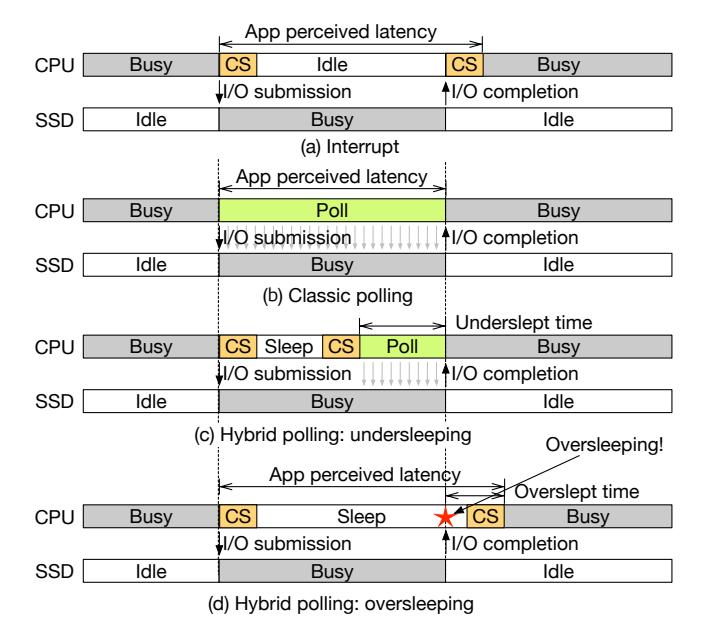

# Figure 1 - I/O completion method 비교

원본 그림:



Figure 1은 DPAS가 왜 필요한지 보여주는 출발점이다. 여기서는 I/O가 끝났다는 사실을 application이 어떻게 알게 되는지 비교한다. 핵심은 세 가지 방식이다.

- Interrupt
- Classic polling
- Hybrid polling

이 세 방식은 각각 장점이 있지만, 항상 좋은 방식은 없다. DPAS는 이 약점을 해결하려고 상황에 따라 방식을 바꾼다.

## 1. Interrupt

Interrupt 방식은 I/O가 끝났을 때 SSD나 controller가 CPU에게 "끝났다"고 알려주는 방식이다. CPU는 I/O가 진행되는 동안 다른 일을 할 수 있다.

```text
application submits I/O
        |
        v
CPU sleeps or runs other work
        |
        v
device completes I/O
        |
        v
interrupt fires
        |
        v
interrupt handler + context switch
        |
        v
application resumes
```

장점은 CPU를 계속 태우지 않는다는 점이다. I/O가 끝날 때까지 CPU가 completion queue를 계속 확인하지 않아도 된다.

단점은 latency가 늘어난다는 점이다. I/O가 이미 끝났더라도 interrupt handler 실행, scheduler 동작, context switch 비용을 거친 뒤에야 application이 다시 실행된다. SSD latency가 매우 짧아질수록 이 overhead가 상대적으로 커진다.

커널 포팅 관점에서는 interrupt mode가 되면 request가 polled I/O로 나가지 않아야 한다. 즉 `REQ_POLLED`를 붙일지 말지, poll queue를 쓸지 interrupt queue를 쓸지가 중요해진다.

## 2. Classic polling

Classic polling은 CPU가 I/O completion queue를 계속 확인하는 방식이다.

```text
application submits I/O
        |
        v
CPU keeps checking completion queue
        |
        |  poll, poll, poll, poll ...
        v
device completes I/O
        |
        v
CPU notices immediately
        |
        v
application resumes
```

장점은 I/O 완료를 매우 빠르게 감지할 수 있다는 점이다. interrupt handler나 context switch를 기다리지 않아도 된다.

단점은 CPU를 계속 점유한다는 점이다. I/O가 아직 끝나지 않았는데도 CPU는 계속 completion queue를 본다. CPU가 충분히 비어 있을 때는 좋지만, 다른 thread가 CPU를 필요로 하는 상황에서는 오히려 전체 성능이 나빠질 수 있다.

DPAS에서 classic polling은 낮은 contention, 특히 queue depth가 1에 가까운 상황에서 유리하다. 그래서 Figure 10에서 DPAS는 조건이 맞으면 PAS normal에서 classic polling으로 이동한다.

## 3. Hybrid polling

Hybrid polling은 interrupt와 classic polling의 중간 방식이다. 처음부터 계속 polling하지 않고, 먼저 조금 잔다. 그 뒤 깨어나서 polling한다.

```text
application submits I/O
        |
        v
CPU sleeps for predicted duration
        |
        v
CPU wakes up
        |
        v
CPU polls until completion
        |
        v
application resumes
```

목표는 "I/O가 끝나기 직전에 깨기"다. 그러면 CPU 낭비도 줄이고, interrupt보다 빠르게 완료를 감지할 수 있다.

문제는 sleep duration을 정확히 맞추기 어렵다는 점이다.

## 4. UNDER와 OVER

Hybrid polling에서는 두 가지 실패가 생긴다.

```text
UNDER: 너무 일찍 깨어남

submit       wake                complete
  |-----------|--------------------|
              <---- polling ------>

결과:
  - CPU를 오래 태움
  - classic polling과 비슷해짐
  - latency는 낮을 수 있지만 CPU 비용이 큼
```

```text
OVER: 너무 늦게 깨어남

submit              complete      wake
  |--------------------|-----------|
                       <--- lost --->

결과:
  - I/O는 이미 끝났는데 application은 아직 잠들어 있음
  - application-perceived latency가 증가함
  - 낮은 latency를 얻으려는 polling의 장점이 사라짐
```

논문에서는 oversleeping을 특히 위험하게 본다. CPU를 아끼려다가 latency를 크게 늘리면 polling을 쓰는 의미가 없어지기 때문이다.

## 5. Figure 1이 말하는 핵심

Figure 1의 핵심은 다음 문장으로 정리할 수 있다.

> Interrupt는 CPU를 아끼지만 느릴 수 있고, classic polling은 빠르지만 CPU를 많이 쓰며, hybrid polling은 둘 사이를 노리지만 sleep duration 예측이 틀리면 UNDER 또는 OVER가 생긴다.

즉 DPAS의 출발점은 "하나의 방식만 고정해서 쓰면 안 된다"는 문제의식이다.

## 6. Linux kernel hook 관점

Figure 1을 코드로 옮길 때 봐야 할 질문은 다음과 같다.

```text
I/O submit 시점:
  이 request를 polled I/O로 낼 것인가?
  아니면 interrupt completion으로 낼 것인가?

sleep 후 wake-up 시점:
  깨어났을 때 I/O가 아직 pending인가?
  이미 complete인가?

polling 시점:
  completion queue를 어디서 확인하는가?
```

후보 위치:

```text
block/blk-mq.c:
  blk_mq_submit_bio()
  blk_mq_poll()

block/blk-core.c:
  bio_poll()

drivers/nvme/host/pci.c:
  nvme_poll()

drivers/nvme/host/core.c:
  REQ_POLLED 설정 지점
```

Part 3에서는 이 함수들이 최신 커널에서 어떻게 바뀌었는지 확인해야 한다.
