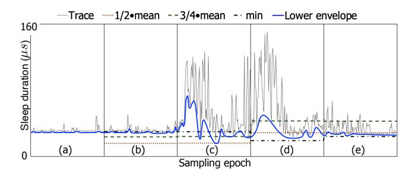

# Figure 2 - 기존 sleep estimation 방식의 한계

원본 그림:



Figure 2는 기존 hybrid polling이 sleep duration을 어떻게 정하는지 보여준다. 핵심 질문은 하나다.

> CPU가 얼마나 자고 일어나야 I/O completion 직전에 polling을 시작할 수 있는가?

이 질문에 기존 방식들은 과거 I/O latency 통계를 사용한다.

## 1. 기존 방식의 기본 아이디어

기존 Linux Hybrid Polling은 일정 시간 동안 I/O latency를 모아서 평균을 계산한다. 그리고 그 평균보다 짧게 잔다.

예를 들어 평균 latency가 40 us라면 다음처럼 정할 수 있다.

```text
1/2 mean:
  sleep = 40 us * 0.5 = 20 us

3/4 mean:
  sleep = 40 us * 0.75 = 30 us

min:
  sleep = last epoch의 최소 latency
```

왜 평균 그대로 40 us를 쓰지 않을까? 평균 그대로 자면 어떤 I/O에서는 completion보다 늦게 깨어날 수 있다. 즉 `OVER`가 생긴다. 그래서 일부러 안전 마진을 둔다.

## 2. Epoch 기반 업데이트

Figure 2에서 중요한 단어는 epoch다. 기존 방식은 매 I/O마다 sleep duration을 바꾸지 않고, 일정 주기마다 통계를 갱신한다.

```text
epoch 1        epoch 2        epoch 3
|-------------|-------------|-------------|
 collect stats update sleep  collect stats
```

이 방식은 latency가 안정적이면 나쁘지 않다. 하지만 갑자기 latency가 변하면 반응이 늦다.

```text
actual latency:

high  high  high  low  low  low  low
|-----|-----|-----|----|----|----|---->

epoch-based sleep:

old high estimate -----> updated later
```

실제 latency는 이미 낮아졌는데 sleep duration은 아직 높은 값을 유지할 수 있다. 그러면 oversleeping이 생긴다.

## 3. 1/2 mean의 문제

1/2 mean은 평균의 절반만 잔다.

```text
actual completion
        |
        v
submit ----------- complete
       ---- sleep
            wake ---- poll ---- complete
```

장점은 oversleeping을 피하기 쉽다는 것이다. 단점은 너무 일찍 깨어나는 경우가 많다는 것이다. 그러면 polling 시간이 길어진다.

```text
too early wake-up

submit      wake                    complete
  |----------|--------------------------|
             <---- long polling ------->
```

결국 CPU 사용량이 커진다.

## 4. 3/4 mean의 문제

3/4 mean은 1/2 mean보다 더 오래 잔다.

```text
sleep = mean * 0.75
```

장점은 polling 시간을 줄일 수 있다는 것이다. 단점은 latency가 흔들릴 때 oversleeping 위험이 커진다는 것이다.

```text
latency suddenly becomes shorter

submit       complete       wake
  |-------------|------------|
                <--- OVER --->
```

## 5. min 방식의 문제

min 방식은 지난 epoch에서 가장 짧았던 I/O latency를 기준으로 삼는다. oversleeping을 피하려는 목적은 강하다.

하지만 latency가 계속 변하면 min도 충분하지 않다. 지난 epoch의 minimum이 다음 epoch에서도 안전하다는 보장이 없다.

## 6. Figure 2가 말하는 핵심

Figure 2의 핵심은 기존 방식들이 모두 과거 통계를 사용한다는 점이다.

```text
past statistics
      |
      v
estimated sleep duration
      |
      v
future I/O behavior
```

문제는 future I/O behavior가 past statistics와 다를 수 있다는 것이다.

## 7. PAS로 이어지는 이유

PAS는 평균 latency를 직접 믿지 않는다. 대신 매 I/O마다 sleep result를 본다.

```text
old approach:
  average latency says sleep X us

PAS:
  I slept X us.
  Was it UNDER or OVER?
  Use that result for the next decision.
```

그래서 Figure 2는 Figure 3의 배경이다. Figure 2가 "기존 예측 방식이 느리고 부정확하다"를 보여주고, Figure 3이 "PAS는 binary result로 매번 조정한다"를 보여준다.

## 8. 커널 포팅 관점

Figure 2 자체는 직접 구현할 state machine은 아니다. 하지만 최신 커널을 읽을 때 다음을 확인해야 한다.

```text
Linux Hybrid Polling이 현재도 epoch/bucket 기반 통계를 쓰는가?
sleep duration은 어디에 저장되는가?
I/O size별 bucket 구조가 어디에 있는가?
io_poll_delay 같은 기존 sysfs knob가 어떤 역할을 하는가?
```

이 질문은 Part 3에서 기존 kernel polling path를 읽을 때 기준점이 된다.
