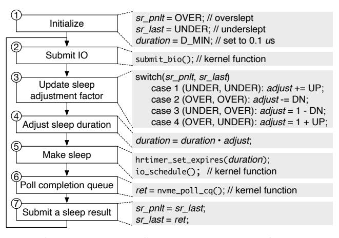

# Figure 3 - PAS 기본 workflow

원본 그림:



Figure 3은 PAS의 핵심 알고리즘을 보여준다. PAS는 Hybrid polling의 sleep duration을 더 똑똑하게 조정하려는 방법이다.

중요한 점은 PAS가 실제 I/O latency 평균을 직접 믿지 않는다는 것이다. 대신 "내가 자고 일어났을 때 I/O가 끝났는가?"라는 결과만 사용한다.

## 1. PAS가 보는 결과는 두 가지뿐이다

PAS는 sleep 후 poll을 했을 때 결과를 둘 중 하나로 분류한다.

```text
UNDER:
  깨어났는데 I/O가 아직 끝나지 않았다.
  => 너무 짧게 잤다.
  => 다음에는 sleep duration을 늘리는 방향이 필요하다.

OVER:
  깨어났을 때 I/O가 이미 끝나 있었다.
  => 너무 오래 잤다.
  => 다음에는 sleep duration을 줄이는 방향이 필요하다.
```

그림으로 보면 다음과 같다.

```text
UNDER

submit      wake                 complete
  |----------|----------------------|
             poll waits...
```

```text
OVER

submit                complete    wake
  |----------------------|----------|
                         latency wasted
```

## 2. 왜 두 개의 과거 결과를 보나?

PAS는 직전 결과 하나만 보지 않고, 직전 두 I/O의 sleep result를 본다.

```text
sr_pnlt = penultimate sleep result
sr_last = last sleep result
```

쉽게 말하면 다음과 같다.

```text
sr_pnlt: 바로 전전 I/O 결과
sr_last: 바로 전 I/O 결과
```

두 개를 보는 이유는 방향을 알기 위해서다. 예를 들어 `UNDER` 하나만 보면 "짧게 잤다"는 사실만 알 수 있다. 하지만 `(UNDER, OVER)`를 보면 sleep duration이 실제 latency 경계를 방금 지나쳤다는 것을 알 수 있다.

## 3. 네 가지 case

PAS의 기본 판단표는 다음과 같다.

```text
+----------------+----------------------------+--------------------------+
| previous pair  | 의미                       | 다음 조정 방향           |
+----------------+----------------------------+--------------------------+
| UNDER, UNDER   | 계속 너무 짧게 잔다        | duration을 늘린다        |
| OVER, OVER     | 계속 너무 길게 잔다        | duration을 줄인다        |
| UNDER, OVER    | 아래에서 위로 경계를 넘음   | 약간 줄여서 안정화한다   |
| OVER, UNDER    | 위에서 아래로 경계를 넘음   | 약간 늘려서 안정화한다   |
+----------------+----------------------------+--------------------------+
```

여기서 "경계"는 실제 I/O completion time 근처라고 보면 된다.

## 4. 핵심 변수

```text
duration:
  다음 I/O에서 얼마나 잘지 나타내는 값

adjust:
  duration에 곱할 조정 계수

UP:
  UNDER 방향으로 duration을 늘릴 때 쓰는 작은 증가량

DN:
  OVER 방향으로 duration을 줄일 때 쓰는 감소량

sr_pnlt, sr_last:
  최근 두 sleep result
```

논문에서 기본적으로 이해해야 할 값은 다음과 같다.

```text
D_MIN = 0.1 us
UP    = 0.01
DN    = 0.1
DN / UP = 10
```

DN이 UP보다 큰 이유는 oversleeping을 더 위험하게 보기 때문이다. 너무 일찍 깨면 CPU를 더 쓰는 문제지만, 너무 늦게 깨면 application latency가 직접 늘어난다.

## 5. PAS 흐름

PAS를 단순화하면 다음과 같다.

```text
             +------------------------+
             | previous sleep results |
             | sr_pnlt, sr_last       |
             +-----------+------------+
                         |
                         v
             +------------------------+
             | update adjust          |
             +-----------+------------+
                         |
                         v
             +------------------------+
             | duration *= adjust     |
             +-----------+------------+
                         |
                         v
             +------------------------+
             | sleep(duration)        |
             +-----------+------------+
                         |
                         v
             +------------------------+
             | poll completion        |
             +-----------+------------+
                         |
              +----------+----------+
              |                     |
              v                     v
          still pending         already done
              |                     |
              v                     v
            UNDER                 OVER
              |                     |
              +----------+----------+
                         |
                         v
             +------------------------+
             | shift result history   |
             | sr_pnlt = sr_last      |
             | sr_last = result       |
             +------------------------+
```

## 6. Pseudocode

```text
state:
  sr_pnlt = OVER
  sr_last = UNDER
  duration = D_MIN
  adjust = 1
  UP = 0.01
  DN = 0.1

on_io_submit():
  if sr_pnlt == UNDER and sr_last == UNDER:
    adjust = adjust + UP

  else if sr_pnlt == OVER and sr_last == OVER:
    adjust = adjust - DN

  else if sr_pnlt == UNDER and sr_last == OVER:
    adjust = 1 - DN

  else if sr_pnlt == OVER and sr_last == UNDER:
    adjust = 1 + UP

  duration = duration * adjust
  sleep(duration)

  if poll_completion() says I/O is still pending:
    result = UNDER
  else:
    result = OVER

  sr_pnlt = sr_last
  sr_last = result
```

## 7. Linux kernel hook 관점

Figure 3을 커널로 옮길 때 필요한 것은 크게 세 가지다.

```text
1. sleep duration을 저장할 state
2. sleep 후 poll 결과를 UNDER/OVER로 분류하는 지점
3. 다음 I/O submit 전에 duration을 갱신하는 지점
```

후보 위치:

```text
bio_poll():
  sleep 후 실제로 completion 여부를 확인하는 후보

blk_mq_poll():
  block layer polling 흐름의 중심 후보

blk_mq_submit_bio():
  다음 request의 정책과 sleep duration을 적용할 후보
```

Part 3에서는 "어디서 UNDER/OVER를 정확히 판별할 수 있는가"를 특히 확인해야 한다.
