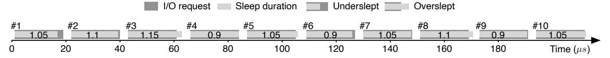

# Figure 4 - PAS sleep duration 조정 예시

원본 그림:



Figure 4는 Figure 3의 PAS 알고리즘이 실제로 duration을 어떻게 움직이는지 예시로 보여준다.

Figure 3이 규칙표라면, Figure 4는 그 규칙이 시간에 따라 어떻게 작동하는지 보여주는 그림이다.

## 1. PAS가 찾으려는 값

PAS가 찾으려는 것은 실제 I/O latency 근처의 sleep duration이다.

```text
ideal:

submit                 complete
  |-----------------------|
                          ^
                          wake near here
```

너무 일찍 깨면 CPU polling 시간이 길고, 너무 늦게 깨면 application latency가 늘어난다.

## 2. 처음에는 작게 시작한다

PAS는 처음 duration을 아주 작게 둔다.

```text
duration = D_MIN = 0.1 us
```

이유는 단순하다. 처음부터 크게 자면 oversleeping으로 latency를 망칠 수 있기 때문이다. 먼저 짧게 자고, `UNDER`를 보면서 점점 늘리는 편이 안전하다.

```text
start small

duration: 0.1 -> 0.2 -> 0.4 -> ...
result:   UNDER UNDER UNDER ...
```

## 3. UNDER가 반복되면 duration을 늘린다

`UNDER`는 아직 I/O가 끝나지 않았다는 뜻이다.

```text
submit      wake                  complete
  |----------|----------------------|
             still pending
```

그러면 PAS는 "너무 짧게 잤다"고 판단하고 duration을 늘린다.

```text
(UNDER, UNDER)
  => adjust += UP
  => duration grows faster
```

## 4. 처음 OVER가 나오면 경계를 지난 것이다

언젠가 duration이 실제 I/O latency보다 길어지는 순간이 온다.

```text
submit                complete    wake
  |----------------------|----------|
                         already done
```

이때 결과는 `OVER`다. 직전이 `UNDER`였고 지금이 `OVER`라면 `(UNDER, OVER)`가 된다.

이건 중요한 신호다.

```text
UNDER -> OVER

의미:
  sleep duration이 실제 latency 경계를 방금 넘어갔다.

대응:
  adjust = 1 - DN
  duration을 줄인다.
```

## 5. OVER가 반복되면 더 줄인다

`OVER`가 계속 나오면 계속 너무 오래 자는 것이다.

```text
(OVER, OVER)
  => adjust -= DN
  => duration decreases
```

PAS는 oversleeping을 더 위험하게 보므로 `DN`을 `UP`보다 크게 둔다.

```text
UP = 0.01
DN = 0.1
```

즉 늘릴 때는 조심스럽게, 줄일 때는 더 강하게 줄인다.

## 6. 전체 움직임

Figure 4를 단순화하면 다음 모양이다.

```text
duration
  ^
  |                         OVER
  |                       /\
  |                     /   \__
  |                   /
  |                 /
  |               /
  | UNDER UNDER
  +--------------------------------> I/O number

         actual latency boundary
         -----------------------
```

PAS는 실제 latency 경계를 한 번에 정확히 맞추지 않는다. 대신 `UNDER`와 `OVER`를 보면서 경계 주변으로 접근한다.

## 7. Figure 4가 중요한 이유

Figure 4는 PAS가 평균 latency를 예측하는 방식이 아니라 feedback control 방식이라는 점을 보여준다.

```text
sleep
  |
  v
observe UNDER/OVER
  |
  v
adjust duration
  |
  v
next sleep
```

이 구조 때문에 PAS는 기존 epoch 기반 방식보다 빠르게 반응할 수 있다.

## 8. 커널 포팅 관점

Figure 4를 구현하려면 request 단위로 다음 순서가 보장되어야 한다.

```text
1. 이전 result pair를 읽는다.
2. adjust를 계산한다.
3. duration을 갱신한다.
4. timer sleep을 수행한다.
5. poll 결과를 UNDER/OVER로 분류한다.
6. result pair를 갱신한다.
```

Part 3에서 확인할 질문:

```text
sleep은 어느 함수에서 걸 수 있는가?
sleep 후 poll 결과를 bio_poll()에서 알 수 있는가?
duration 갱신은 submit path에 둘지 poll path에 둘지?
```
