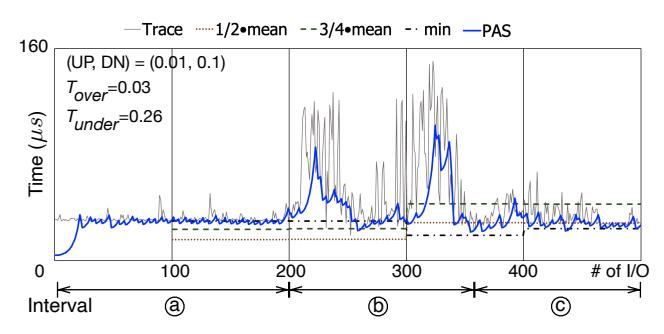

# Figure 5 - PAS와 기존 방식의 sleep duration 비교

원본 그림:



Figure 5는 PAS와 기존 hybrid polling 계열 방식들이 latency 변화에 어떻게 반응하는지 비교한다.

이 Figure는 "PAS가 왜 더 낫다고 주장하는가"를 직관적으로 보여준다.

## 1. 비교 대상

Figure 5에서 비교하는 대상은 대략 다음과 같이 이해하면 된다.

```text
LHP / 기존 방식:
  epoch 단위 통계로 sleep duration을 정함

PAS:
  매 I/O의 UNDER/OVER 결과로 sleep duration을 조정함
```

기존 방식은 과거 통계에 묶여 있고, PAS는 매 I/O마다 feedback을 받는다.

## 2. 안정적인 latency 구간

latency가 안정적이면 좋은 sleep duration은 거의 일정하다.

```text
actual latency:

  38  38  39  38  40  38  39
  --------------------------->

ideal sleep:

  actual latency보다 살짝 낮은 값
```

이때 PAS는 lower envelope 근처를 따라간다. lower envelope은 latency 값들 중 안전하게 따라갈 수 있는 아래쪽 경계라고 보면 된다.

```text
latency spikes:
      /\          /\
     /  \        /  \
----/----\------/----\------
   lower envelope
```

spike 하나하나를 그대로 따라가면 duration이 불안정해진다. PAS는 spike에 과하게 반응하지 않고, oversleeping을 피하면서 아래 경계를 따라가려 한다.

## 3. 갑작스러운 latency 변화

문제는 latency가 갑자기 바뀔 때다.

```text
actual latency:

high high high low low low low
|----|----|----|---|---|---|--->
```

기존 epoch 기반 방식은 다음 epoch가 올 때까지 예전 값을 유지할 수 있다.

```text
old estimate:

high estimate -----------------
                         update later
```

그러면 실제 latency가 낮아졌는데도 오래 자게 된다. 즉 oversleeping이 생긴다.

PAS는 매번 `OVER`를 감지하므로 더 빨리 duration을 줄일 수 있다.

```text
OVER detected
  |
  v
duration decreases quickly
```

## 4. 왜 lower envelope이 중요한가?

Hybrid polling의 목표는 평균 latency를 맞추는 것이 아니다. completion 직전에 깨는 것이다.

평균 latency를 따라가면 일부 빠른 I/O에서 oversleeping이 생긴다.

```text
latency samples:

fast  fast  slow  fast  fast
  |     |     |     |     |

mean:
        --------

problem:
  fast I/O에서는 mean이 너무 늦다.
```

그래서 PAS는 평균보다 lower envelope에 가까운 sleep duration을 선호한다.

## 5. Figure 5의 핵심

Figure 5는 다음 차이를 보여준다.

```text
existing epoch-based methods:
  - 반응이 늦다.
  - 통계가 갱신될 때까지 예전 sleep duration을 쓴다.
  - abrupt latency change에 약하다.

PAS:
  - 매 I/O마다 UNDER/OVER를 본다.
  - oversleeping이 보이면 빠르게 줄인다.
  - 안정적인 구간에서는 lower envelope을 따라간다.
```

## 6. 커널 포팅 관점

Figure 5 자체는 새로운 hook을 요구하지 않는다. 대신 PAS 구현이 제대로 되었는지 검증할 때 기준이 된다.

나중에 trace를 찍으면 다음을 보고 싶다.

```text
I/O number
actual latency
requested sleep duration
UNDER/OVER result
adjust
```

그리고 그래프를 그렸을 때 sleep duration이 latency lower envelope 근처를 따라가는지 확인해야 한다.

Part 3 이후 구현 검증용 trace 후보:

```text
tracepoint or debug log:
  request tag
  submit time
  wake time
  completion state at wake
  duration
  result UNDER/OVER
```
