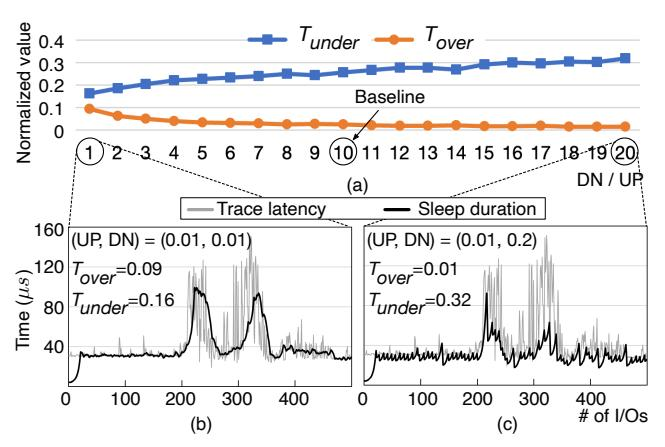

# Figure 6 - DN/UP ratio 민감도

원본 그림:



Figure 6은 PAS의 중요한 파라미터인 `UP`과 `DN`의 비율을 설명한다.

Figure 3에서 PAS는 `UNDER`가 반복되면 duration을 늘리고, `OVER`가 반복되면 duration을 줄인다. 이때 얼마나 늘리고 줄일지를 정하는 값이 `UP`과 `DN`이다.

## 1. UP과 DN

```text
UP:
  UNDER 방향에서 duration을 늘리는 증가량

DN:
  OVER 방향에서 duration을 줄이는 감소량
```

쉽게 말하면 다음과 같다.

```text
UNDER:
  너무 짧게 잤다.
  다음에는 조금 더 자자.
  => UP 사용

OVER:
  너무 오래 잤다.
  다음에는 덜 자자.
  => DN 사용
```

## 2. 왜 DN이 더 커야 하나?

PAS는 oversleeping을 더 위험하게 본다.

```text
UNDER:
  CPU를 더 쓴다.
  latency는 크게 늘지 않을 수 있다.

OVER:
  I/O가 이미 끝났는데 application이 아직 잠들어 있다.
  application latency가 직접 늘어난다.
```

그래서 duration을 늘릴 때는 천천히 늘리고, 줄일 때는 더 강하게 줄인다.

```text
UP = 0.01
DN = 0.1

DN / UP = 10
```

## 3. DN/UP ratio가 너무 작으면

DN과 UP이 비슷하면 oversleeping을 줄이는 힘이 약하다.

```text
UP = 0.01
DN = 0.01

UNDER일 때 늘리는 속도와
OVER일 때 줄이는 속도가 비슷함
```

이 경우 oversleeping이 발생해도 duration이 충분히 빨리 내려오지 않을 수 있다.

```text
OVER detected
  |
  v
duration decreases slowly
  |
  v
more OVER
```

## 4. DN/UP ratio가 너무 크면

반대로 DN이 너무 크면 oversleeping에는 빠르게 대응하지만, duration이 너무 많이 줄어들 수 있다.

```text
OVER detected
  |
  v
duration drops sharply
  |
  v
next I/O wakes too early
  |
  v
UNDER and long polling
```

즉 oversleeping은 줄지만 undersleeping으로 인한 CPU polling 시간이 늘어날 수 있다.

## 5. Figure 6의 결론

논문은 UP을 0.01로 고정하고 DN을 바꿔보면서 `Tunder`와 `Tover`를 본다.

```text
Tunder:
  undersleeping 때문에 생기는 polling CPU overhead

Tover:
  oversleeping 때문에 생기는 latency penalty
```

관찰 결과를 단순화하면 다음과 같다.

```text
DN/UP ratio increases:

Tover:
  처음에는 빠르게 줄어듦
  어느 지점 이후로는 큰 개선이 없음

Tunder:
  ratio가 커질수록 증가함
```

그래서 baseline으로 `UP = 0.01`, `DN = 0.1`을 선택한다. 비율은 1:10이다.

## 6. ASCII 직관

```text
DN/UP too small

duration
  ^
  |        OVER OVER OVER
  |       /-------------
  |      /
  +------------------------>
       slow decrease
```

```text
DN/UP too large

duration
  ^
  |       OVER
  |      /
  |     /\
  |    /  \____ too low -> UNDER
  +------------------------>
       sharp decrease
```

```text
DN/UP around 10

duration
  ^
  |       OVER
  |      /\
  |     /  \__
  |    /      \_ stabilizes
  +------------------------>
```

## 7. 커널 포팅 관점

Figure 6은 구현 위치보다 parameter 설계와 sysfs/debug knob에 더 관련이 있다.

확인할 질문:

```text
UP/DN은 compile-time constant로 둘 것인가?
sysfs로 바꿀 수 있게 할 것인가?
per-device parameter인가, per-core parameter인가?
UP/DN ratio를 항상 1:10으로 유지할 것인가?
```

나중에 실험을 하려면 다음 값을 노출하는 것이 유용할 수 있다.

```text
dpas_up
dpas_dn
dpas_count_under
dpas_count_over
dpas_duration
```
