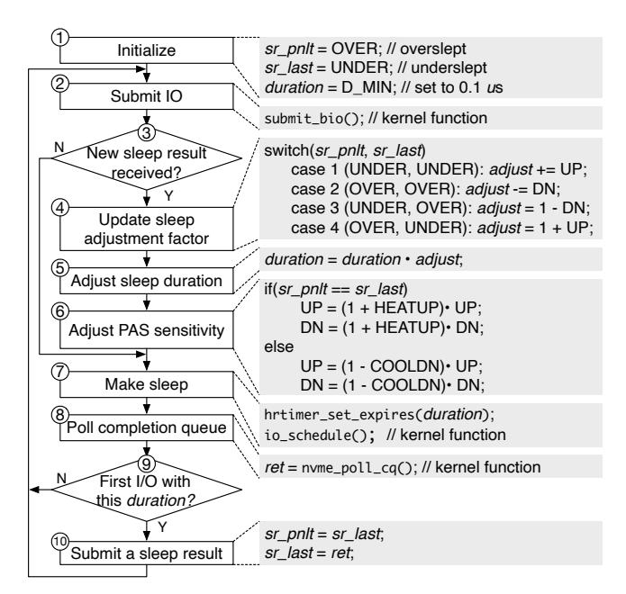

# Figure 7 - Extended PAS

원본 그림:



Figure 7은 Figure 3의 PAS를 실제 환경에 맞게 확장한 그림이다. 핵심 확장은 두 가지다.

- dynamic sensitivity adjustment
- concurrent I/O support

Figure 3이 "기본 PAS"라면, Figure 7은 "실제 커널에 넣으려면 필요한 PAS"에 가깝다.

## 1. 왜 Figure 3만으로는 부족한가?

Figure 3의 PAS는 `UP`과 `DN`을 고정값으로 쓴다.

```text
UP = 0.01
DN = 0.1
```

하지만 I/O latency는 항상 같은 방식으로 변하지 않는다.

```text
stable workload:
  latency 변화가 작음
  너무 민감하게 움직이면 오히려 흔들림

unstable workload:
  latency 변화가 큼
  너무 둔하게 움직이면 따라가지 못함
```

그래서 PAS는 상황에 따라 민감도를 바꿔야 한다.

## 2. Dynamic sensitivity

Figure 7의 첫 번째 확장은 `UP`과 `DN` 자체를 조정하는 것이다.

```text
최근 두 결과가 같다:
  (UNDER, UNDER) 또는 (OVER, OVER)

의미:
  같은 방향으로 계속 틀리고 있다.
  조정이 너무 느리다.

대응:
  UP과 DN을 키운다.
```

```text
최근 두 결과가 다르다:
  (UNDER, OVER) 또는 (OVER, UNDER)

의미:
  실제 latency 경계 근처에서 왔다 갔다 하고 있다.
  조정이 너무 민감할 수 있다.

대응:
  UP과 DN을 줄인다.
```

ASCII로 보면 다음과 같다.

```text
same result repeated

UNDER -> UNDER -> UNDER
   or
OVER  -> OVER  -> OVER

=> change is too slow
=> sensitivity up
=> UP, DN *= (1 + HEATUP)
```

```text
result alternates

UNDER -> OVER -> UNDER
   or
OVER  -> UNDER -> OVER

=> near the boundary
=> sensitivity down
=> UP, DN *= (1 - COOLDN)
```

논문에서 사용하는 기본값은 다음과 같다.

```text
HEATUP = 0.05
COOLDN = 0.1
UP:DN = 1:10 유지
UP range = [0.001, 0.01]
```

중요한 점은 `UP`과 `DN`의 비율은 유지한다는 것이다. oversleeping을 더 강하게 줄이려는 설계 의도는 그대로 유지한다.

## 3. Concurrent I/O 문제가 왜 생기나?

현실의 SSD는 I/O를 하나씩만 처리하지 않는다. 여러 I/O가 동시에 outstanding 상태일 수 있다.

단순 PAS는 이런 상황을 가정하지 않으면 문제가 생긴다.

```text
time --->

I/O #1: submit -------- complete
I/O #2:   submit ------------ complete
I/O #3:     submit ---------------- complete
I/O #4:       submit ------ complete

여러 completion이 섞이면:
  - 어떤 result를 duration 갱신에 써야 하는지 애매해짐
  - 늦게 끝난 I/O가 오래된 판단을 덮어쓸 수 있음
  - 여러 I/O가 같은 PAS state를 동시에 바꾸려 함
```

그래서 Figure 7은 concurrent I/O guard를 추가한다.

## 4. Concurrent I/O guard

핵심 아이디어는 "모든 I/O가 PAS state를 바꾸게 하지 않는다"이다.

```text
같은 duration을 사용한 I/O들:

I/O A ---- complete first
I/O B -------- complete later
I/O C ------ complete later

PAS result submission:
  I/O A만 대표로 result 제출
  B, C는 같은 duration 세대의 중복 결과로 본다
```

즉 다음 두 가지를 구분해야 한다.

```text
result_submission_owner:
  sleep result를 제출할 권한이 있는 I/O

duration_update_owner:
  다음 duration 갱신에 반영될 권한이 있는 I/O
```

이 guard가 없으면 PAS는 concurrent completion에 의해 방향 전환 신호를 잃거나, stale result를 사용하거나, lock contention을 만들 수 있다.

## 5. Figure 7을 module로 나누기

포팅 관점에서는 Figure 7을 다음처럼 나누는 것이 좋다.

```text
PAS core:
  update_adjust()
  update_duration()
  classify_sleep_result()

dynamic sensitivity:
  update_UP_DN()
  clamp_UP_range()
  keep_DN_to_UP_ratio()

concurrency guard:
  has_new_sleep_result
  first_io_with_this_duration
  result_submission_owner
  duration_update_owner
```

## 6. 전체 흐름

```text
submit I/O
   |
   v
check whether this I/O may update duration
   |
   v
update sensitivity from recent pattern
   |
   v
update adjust
   |
   v
duration = duration * adjust
   |
   v
sleep(duration)
   |
   v
poll completion
   |
   v
classify UNDER or OVER
   |
   v
if this I/O is result owner:
  update sr_pnlt, sr_last
else:
  ignore as duplicate/concurrent result
```

## 7. Linux kernel hook 관점

Figure 7을 커널로 옮기려면 단순히 `duration` 하나만 저장해서는 부족하다.

필요한 state:

```text
per-core or per-bucket PAS state:
  sr_pnlt
  sr_last
  duration
  adjust
  UP
  DN
  HEATUP
  COOLDN

concurrency guard state:
  duration generation id
  outstanding count
  first completion marker
  result owner marker
```

Part 3에서 확인할 질문:

```text
request마다 PAS generation id를 어디에 둘 수 있는가?
struct request에 임시 필드를 추가해야 하는가?
bio private field를 쓸 수 있는가?
completion 시점에서 "first I/O with this duration"을 판별할 수 있는가?
```

이 Figure는 나중에 코드 구현 난이도를 결정한다. Figure 3은 알고리즘이고, Figure 7은 그 알고리즘을 concurrent kernel hot path에서 깨지지 않게 만드는 부분이다.
