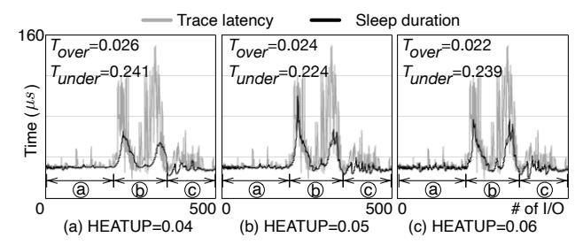

# Figure 8 - HEATUP 민감도 실험

원본 그림:



Figure 8은 Figure 7에서 나온 dynamic sensitivity가 어느 정도로 움직여야 하는지 보여준다.

핵심 파라미터는 `HEATUP`과 `COOLDN`이다.

```text
HEATUP:
  같은 sleep result가 반복될 때 UP/DN을 키우는 비율

COOLDN:
  sleep result가 번갈아 나올 때 UP/DN을 줄이는 비율
```

## 1. 왜 HEATUP이 필요한가?

PAS가 너무 둔하면 sudden latency change를 따라가지 못한다.

```text
actual latency jumps

latency
  ^
  |           ________
  |          |
  |__________|
  +-------------------->

PAS duration if too slow:
  _________/----------  slowly catches up
```

같은 결과가 반복된다는 것은 조정이 부족하다는 뜻이다.

```text
UNDER, UNDER:
  계속 너무 짧게 잔다.
  duration을 더 빠르게 늘려야 한다.

OVER, OVER:
  계속 너무 길게 잔다.
  duration을 더 빠르게 줄여야 한다.
```

그래서 `UP`과 `DN`을 키운다.

```text
UP = UP * (1 + HEATUP)
DN = DN * (1 + HEATUP)
```

## 2. 왜 COOLDN이 필요한가?

반대로 PAS가 너무 민감하면 경계 근처에서 흔들린다.

```text
UNDER -> OVER -> UNDER -> OVER
```

이런 패턴은 sleep duration이 실제 latency 근처에 있다는 뜻일 수 있다. 이때 너무 크게 조정하면 오히려 불안정해진다.

```text
UP = UP * (1 - COOLDN)
DN = DN * (1 - COOLDN)
```

## 3. HEATUP이 너무 작으면

HEATUP이 너무 작으면 PAS가 sluggish하게 움직인다.

```text
actual latency change:

low low low high high high

PAS duration:

low low low slowly... slowly...
```

장점은 안정적이라는 점이다. 단점은 갑작스러운 변화에 늦게 반응한다는 점이다.

## 4. HEATUP이 너무 크면

HEATUP이 너무 크면 PAS가 과하게 반응한다.

```text
one repeated signal
  |
  v
UP/DN grows too fast
  |
  v
duration jumps
  |
  v
UNDER/OVER oscillation
```

결과적으로 sleep duration이 latency 경계 주변에서 크게 출렁일 수 있다.

## 5. Figure 8의 결론

논문은 `COOLDN = 0.1`로 고정하고 여러 `HEATUP` 값을 비교한다.

결론은 `HEATUP = 0.05`가 균형점이라는 것이다.

```text
too low HEATUP:
  변화에 둔함

too high HEATUP:
  과민하게 흔들림

HEATUP = 0.05:
  반응성과 안정성 사이의 타협점
```

## 6. Figure 7과의 연결

Figure 8은 Figure 7의 dynamic sensitivity 부분을 검증하는 그림이다.

```text
Figure 7:
  sensitivity를 어떻게 바꿀지 알고리즘 제시

Figure 8:
  HEATUP 값을 어느 정도로 잡아야 하는지 실험적으로 설명
```

## 7. 커널 포팅 관점

Figure 8은 구현 검증과 parameter tuning에 중요하다.

확인할 질문:

```text
HEATUP과 COOLDN을 sysfs로 노출할 것인가?
UP clamp range를 어디서 강제할 것인가?
UP:DN = 1:10 비율 유지 코드를 어디에 둘 것인가?
workload별 tuning 없이 기본값으로 충분한가?
```

trace로 확인하고 싶은 값:

```text
I/O number
sr_pnlt
sr_last
UP
DN
duration
adjust
UNDER/OVER result
```

이 값들을 보면 PAS가 너무 둔한지, 너무 민감한지 판단할 수 있다.
