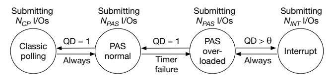

# Figure 10 - DPAS mode transition

원본 그림:



Figure 10은 DPAS의 전체 state machine이다. Figure 3과 Figure 7이 PAS 내부 알고리즘이라면, Figure 10은 DPAS가 completion method 자체를 언제 바꾸는지 설명한다.

DPAS는 하나의 방식을 고정하지 않는다.

```text
classic polling:
  빠르지만 CPU를 많이 쓴다.

PAS:
  sleep + polling으로 CPU 비용과 latency 사이를 조절한다.

interrupt:
  CPU를 아끼지만 context switch overhead가 있다.
```

DPAS는 현재 상황을 보고 이 세 방식을 오간다.

## 1. DPAS mode 목록

Figure 10에는 네 가지 mode가 나온다.

```text
PAS normal:
  기본 adaptive hybrid polling mode

Classic polling:
  CPU contention이 낮고 QD가 1일 때 쓰는 빠른 polling mode

PAS overloaded:
  timer failure가 발생한 뒤, CPU contention이 일시적인지 심각한지 판단하는 mode

Interrupt:
  CPU contention이 심할 때 polling 계열의 busy-wait 비용을 피하는 mode
```

여기서 PAS를 normal과 overloaded로 나눈 것이 중요하다. timer failure가 한 번 났다고 바로 interrupt로 가면 너무 민감하게 mode가 바뀔 수 있다. 그래서 PAS overloaded에서 한 번 더 상황을 확인한다.

## 2. 주요 parameter

```text
NPAS:
  PAS mode에서 상황을 판단하기 위해 관찰하는 I/O 개수
  default = 100

NCP:
  classic polling mode에서 유지할 I/O 개수
  default = 1000

NINT:
  interrupt mode에서 유지할 I/O 개수
  default = 10000

theta:
  interrupt mode로 갈지 판단하는 queue depth threshold
```

`NINT`가 `NCP`보다 큰 이유는 CPU contention이 심한 상황은 금방 풀리지 않을 가능성이 크기 때문이다. 너무 빨리 PAS로 돌아가면 다시 busy-wait loop에 빠질 수 있다.

## 3. QD가 왜 중요한가?

QD는 queue depth다. 쉽게 말하면 동시에 얼마나 많은 I/O가 outstanding 상태인지 보는 값이다.

```text
QD = 1:
  대체로 한 thread가 I/O를 내는 상황
  classic polling이 유리할 수 있음

QD > theta:
  여러 I/O가 쌓이고 있음
  CPU contention 또는 높은 동시성 가능성
  polling을 계속하면 CPU 낭비가 커질 수 있음
```

## 4. Timer failure란?

PAS는 sleep duration을 조정한다. 그런데 CPU가 너무 바쁘면 kernel timer가 원하는 시점에 thread를 깨우지 못할 수 있다.

이 경우 PAS는 sleep duration을 줄이는 방향으로 반응한다. 지속적인 contention 상황에서는 duration이 거의 0으로 내려가고, timer를 반복 호출하지만 실제로는 제대로 sleep하지 못하는 상태가 된다.

이 상태를 timer failure로 이해하면 된다.

```text
requested sleep duration becomes too small
        |
        v
timer call overhead remains
        |
        v
thread wakes late anyway due to CPU contention
        |
        v
PAS keeps reducing duration
        |
        v
busy-wait-like high overhead loop
```

이때 DPAS는 "PAS만 계속하면 안 된다"고 판단하고 PAS overloaded로 이동한다.

## 5. State transition table

```text
+----------------+------------------------------+------------------+--------------------------+
| current mode   | observed signal              | next mode        | action                   |
+----------------+------------------------------+------------------+--------------------------+
| PAS normal     | QD = 1 after NPAS I/Os        | Classic polling  | issue NCP polled I/Os    |
| Classic polling| NCP expired                  | PAS normal       | re-check environment     |
| PAS normal     | timer failure                | PAS overloaded   | measure QD again         |
| PAS overloaded | QD = 1 after NPAS I/Os        | PAS normal       | recover to PAS           |
| PAS overloaded | QD > theta after NPAS I/Os    | Interrupt        | issue NINT interrupt I/Os|
| Interrupt      | NINT expired                 | PAS overloaded   | re-check contention      |
+----------------+------------------------------+------------------+--------------------------+
```

## 6. ASCII state machine

```text
                      QD = 1 after NPAS
              +--------------------------------+
              |                                v
        +-------------+    NCP expired   +-------------+
        | PAS normal  | <--------------- | Classic     |
        |             |                  | polling     |
        +------+------+                  +-------------+
               |
               | timer failure
               v
        +-------------+
        | PAS         |
        | overloaded  |
        +------+------+
               |
       +-------+----------------+
       |                        |
       | QD = 1                 | QD > theta
       v                        v
 +-------------+          +-------------+
 | PAS normal  |          | Interrupt   |
 +-------------+          +------+------+
                               |
                               | NINT expired
                               v
                         +-------------+
                         | PAS         |
                         | overloaded  |
                         +-------------+
```

## 7. 왜 바로 interrupt로 가지 않나?

timer failure가 한 번 발생했다고 해서 CPU contention이 지속된다고 단정할 수 없다. 잠깐 scheduler가 늦게 깨웠을 수도 있다.

그래서 DPAS는 다음처럼 한 번 더 확인한다.

```text
timer failure
  |
  v
PAS overloaded
  |
  +-- QD가 낮다 -> 일시적 문제였음 -> PAS normal
  |
  +-- QD가 높다 -> 지속적 contention 가능성 -> Interrupt
```

이 설계는 mode thrashing을 줄인다. mode thrashing은 mode가 너무 자주 바뀌어서 오히려 성능이 불안정해지는 상황이다.

## 8. Linux kernel hook 관점

Figure 10을 포팅하려면 다음 state가 필요하다.

```text
mode:
  PAS_NORMAL
  CLASSIC_POLLING
  PAS_OVERLOADED
  INTERRUPT

counters:
  npas_count
  ncp_count
  nint_count

signals:
  queue depth
  timer failure detected
  current request completion method

parameters:
  NPAS
  NCP
  NINT
  theta
```

핵심 질문은 "mode 전환이 request submit 전에 결정되어야 하는가, poll/completion 이후에 결정되어도 되는가"다.

특히 interrupt mode로 바꾸려면 request가 polled queue로 나가면 안 된다. 그러므로 completion path만 바꾸는 것으로 충분하지 않을 수 있다.

Part 3에서 확인할 후보:

```text
blk_mq_submit_bio():
  request가 만들어질 때 mode에 따라 REQ_POLLED 여부를 결정할 수 있는지 확인

drivers/nvme/host/core.c:
  HCTX_TYPE_POLL request에 REQ_POLLED가 붙는 흐름 확인

nvme_pci_map_queues():
  poll queue와 interrupt queue mapping 확인

blk_mq_poll() / nvme_poll():
  PAS normal / classic polling / timer failure 감지 위치 확인
```

Figure 10의 핵심은 다음 한 문장이다.

> DPAS는 PAS를 기본으로 쓰되, QD가 낮으면 classic polling으로 빠르게 가고, timer failure와 높은 QD가 보이면 interrupt로 피신한 뒤 다시 PAS overloaded에서 상황을 확인한다.
